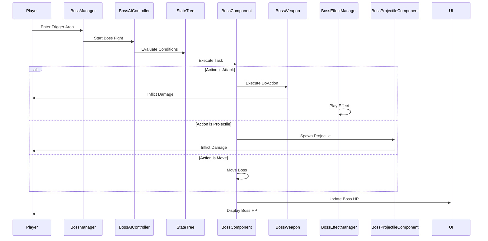
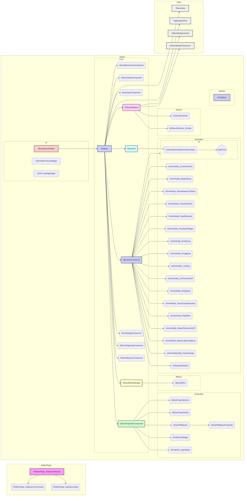
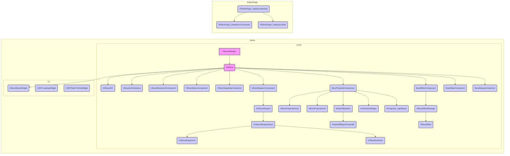

## 시스템 아키텍처 문서: 보스 전투 시스템

### 1. 시스템 전체 구조

이 문서는 언리얼 엔진 4 (UE4) 기반의 게임 프로젝트에서 보스 전투 시스템의 아키텍처를 상세히 분석하고 설명합니다.  제공된 코드 스니펫과 함수 목록을 기반으로, 시스템의 구조, 모듈 간 관계, 데이터 흐름, 설계 패턴, 확장성, 성능 특성, 유지보수성을 분석합니다.

**1.1 전체 시스템 아키텍처 다이어그램**

아래 다이어그램은 시스템의 주요 컴포넌트와 그 관계를 나타냅니다.

```mermaid
graph LR
    subgraph GameWorld [게임 월드]
        BossManager((BossManager))
        PlayerCharacter((PlayerCharacter))
    end

    subgraph BossSystem [보스 전투 시스템]
        BossManager -- ACBoss : 스폰/관리
        ACBoss -- ACBossAIC : AI 제어
        ACBoss -- UBossAnimInstance : 애니메이션 제어
        ACBoss -- CBossMovementComponent : 이동 제어
        ACBoss -- CBossStatusComponent : 스탯 관리
        ACBoss -- CBossTargetingComponent : 타겟팅
        ACBoss -- CBossWeaponComponent : 무기 시스템
        ACBoss -- BossEffectComponent : 이펙트 관리
        ACBoss -- BossProjectileComponent : 투사체 관리
        ACBoss -- BossStateComponent : 상태 관리
        ACBoss -- UBossStatusWidget : UI 표시
        ACBoss --> BossCollision : 콜리전 감지
        ACBoss --> BossDissolve : 디졸브 효과

        CBossWeaponComponent -- CBossWeaponAsset : 무기 에셋
        CBossWeaponAsset -- CBossWeapon : 무기 액터
        CBossWeaponAsset -- UCBossDoAction : 액션
        CBossWeaponAsset -- UCBossEquipment : 장비

        ACBossAIC -- UCBossEnemyStateTreeEvaluator : StateTree 평가
        ACBossAIC -- BehaviorTree : 행동 트리

        BossProjectileComponent -- ABossProjectileActor : 투사체 액터 (풀링)
        BossProjectileComponent -- ABossProjectileOrb : 오브 (풀링)
        BossProjectileComponent -- AGateOfBabylon : 바빌론의 문 (풀링)
        BossProjectileComponent -- AHolySwordMagic : 성검 마법 (풀링)

        subgraph StateTree [State Tree]
            USTC_CheckPase
            USTC_DistanceCheck
            USTC_IsBossActionInProgress
            USTC_IsBossDistanceGreaterThan
            USTC_IsBossDistanceLessThan
            USTC_IsBossInDashRange
            USTC_IsBossInMeleeRange
            USTC_IsBossInRangedRange
            USTC_IsDeadState
            USTC_ProbabilityCheck
            USTC_RandLocationCheck
            USTC_Stun
            USTC_TimerCheck
            UTask_BossChase
            UTask_Dead
            UTask_FlyKeepingDistance
            UTask_FlySetLocation
            UTask_Hovering
            UTask_IncreaseAP
            UTask_KeepingDistance
            UTask_Log
            UTask_PlayMontage
            UTask_ResetAP
            UTask_RotateTowardsPlayer
            UTask_SetCurrentAction
            UTask_SetVectorTargetLocation
            UTask_SideMoveGetLocation
            UTask_SwitchPase
            UTask_SwitchState
            UTask_TargetLocationFeet
            UTask_TargetLocatonGap
        end
        ACBossAIC -- StateTree
    end

    BossManager -- DDTLoadingWidget : 로딩 화면
    BossManager -- DDTMainThemeWidget : 메인 테마
    PlayerCharacter -- UBossStatusWidget : 상호작용

    style GameWorld fill:#f9f,stroke:#333,stroke-width:2px
    style BossSystem fill:#ccf,stroke:#333,stroke-width:2px
    style StateTree fill:#ddf,stroke:#333,stroke-width:1px
```

**1.2 모듈 간 관계와 의존성 상세 분석**

*   **`BossManager`**: 보스 스폰 및 전체적인 보스 전투 흐름을 관리합니다.  `ACBoss` 클래스에 의존하여 실제 보스 액터를 생성하고 관리하며, `DDTLoadingWidget`과 `DDTMainThemeWidget`을 사용하여 로딩 화면과 배경 음악을 제어합니다.  `PlayerCharacter`와 상호작용하여 전투 시작/종료를 알립니다.
*   **`ACBoss`**:  실제 보스 캐릭터의 액터 클래스입니다. 핵심적인 기능은 다음과 같은 컴포넌트들에 위임합니다.
    *   **`ACBossAIC`**: 보스의 인공지능을 담당하며, StateTree를 통해 보스의 행동을 제어합니다.
    *   **`UBossAnimInstance`**: 보스의 애니메이션을 제어합니다.
    *   **`CBossMovementComponent`**: 보스의 이동 로직을 처리합니다. 플레이어와의 거리 유지, 회전, 특정 위치로의 이동 등을 담당합니다.
    *   **`CBossStatusComponent`**: 보스의 체력, 공격력, 방어력 등 스탯을 관리합니다.
    *   **`CBossTargetingComponent`**: 보스의 타겟팅 로직을 처리합니다.
    *   **`CBossWeaponComponent`**: 보스의 무기 시스템을 관리합니다.  `CBossWeaponAsset`을 사용하여 무기, 액션, 장비를 설정합니다.
    *   **`BossEffectComponent`**: 보스의 이펙트 재생 및 관리를 담당합니다.
    *   **`BossProjectileComponent`**: 보스의 투사체 발사 및 관리를 담당합니다. 오브, 바빌론의 문, 성검 마법 등 다양한 투사체를 풀링 방식으로 관리합니다.
    *   **`BossStateComponent`**: 보스의 현재 상태 (예: 공격 중, 피격 중, 사망)를 관리합니다.
    *   **`UBossStatusWidget`**: 보스의 체력 상태를 UI로 표시합니다.
    *   **`BossCollision`**: 보스와 플레이어 간의 충돌을 감지합니다.
    *   **`BossDissolve`**: 보스가 사망하거나 특정 상태에 진입할 때 디졸브 효과를 발생시킵니다.
*   **`CBossWeaponComponent`**: 보스의 무기 시스템을 관리하며, `CBossWeaponAsset`을 통해 무기, 액션, 장비를 설정합니다. `CBossWeaponAsset`은 실제 무기 액터(`CBossWeapon`), 액션(`UCBossDoAction`), 장비(`UCBossEquipment`)를 참조합니다.
*   **`ACBossAIC`**: 보스의 AI를 담당하며, `UCBossEnemyStateTreeEvaluator`를 사용하여 StateTree를 평가하고 행동을 결정합니다. StateTree는 다양한 조건 (`USTC_XXX`)과 태스크 (`UTask_XXX`)를 사용하여 보스의 행동을 정의합니다.
*   **`BossProjectileComponent`**: 보스의 투사체 시스템을 관리하며, 오브 (`ABossProjectileOrb`), 바빌론의 문 (`AGateOfBabylon`), 성검 마법 (`AHolySwordMagic`) 등의 투사체를 풀링 방식으로 관리합니다. 풀링은 게임 오브젝트를 미리 생성해두고 재사용하는 방식으로, 오브젝트 생성 및 삭제에 드는 비용을 줄여 성능을 향상시키는 데 사용됩니다.
*   **`EditorPlugin_DataSyncModule`**: 언리얼 엔진 에디터 플러그인으로, GameplayTag와 보스 스탯을 동기화하는 기능을 제공합니다. HTTP API 요청을 통해 데이터를 가져오고, 데이터 테이블을 업데이트합니다.

**1.3 데이터 플로우와 제어 플로우**

*   **데이터 플로우**:
    *   보스 스탯 데이터는 `TBossStats` 데이터 테이블에 저장되어 있으며, `CBossStatusComponent`에서 로드하여 사용합니다.
    *   보스 AI는 `UCBossEnemyStateTreeEvaluator`를 통해 StateTree에서 의사결정에 필요한 데이터를 수집합니다.
    *   보스 이펙트 데이터는 `BossEffectStructures`에 정의되어 있으며, `BossEffectComponent`에서 로드하여 사용합니다.
    *   투사체 관련 데이터 (예: 발사 속도, 데미지)는 각 투사체 액터 클래스 (`ABossProjectileActor`, `ABossProjectileOrb`, `AGateOfBabylonProjectile`, `AProjectile_LightSpear`, `AHolySwordMagic`)에 정의되어 있습니다.
*   **제어 플로우**:
    *   `BossManager`는 `BeginPlay` 시점에 보스를 스폰합니다.
    *   `ACBossAIC`는 매 프레임 StateTree를 평가하여 보스의 행동을 결정합니다.
    *   StateTree는 조건 (`USTC_XXX`)을 평가하고, 조건이 만족되면 해당 태스크 (`UTask_XXX`)를 실행합니다.
    *   태스크는 보스의 이동, 애니메이션 재생, 이펙트 재생, 투사체 발사 등 다양한 행동을 수행합니다.
    *   애니메이션 노티파이 (`UAnimNotify_XXX`)는 특정 애니메이션 프레임에 도달했을 때 특정 이벤트를 발생시킵니다. 예를 들어, `UAnimNotify_BossWeaponCollision`은 무기 충돌 시 이벤트를 발생시키고, `UAnimNotify_PlayEffect`는 이펙트를 재생합니다.

**1.4 시스템 경계와 인터페이스**

*   **시스템 경계**: 보스 전투 시스템은 게임 월드 내에서 독립적으로 동작하며, `BossManager`를 통해 게임 월드와 상호작용합니다.
*   **인터페이스**:
    *   `BossManager`는 게임 월드에 보스 스폰 및 관리 기능을 제공합니다.
    *   `ACBoss`는 게임 월드에 보스 액터의 기능을 제공합니다.
    *   `UBossStatusWidget`은 게임 월드에 보스 체력 상태 UI를 제공합니다.
    *   `EditorPlugin_DataSyncModule`은 언리얼 엔진 에디터에 GameplayTag와 보스 스탯 동기화 기능을 제공합니다.

**1.5 레이어별 책임과 역할**

시스템은 다음과 같은 레이어로 구성될 수 있습니다.

*   **프레젠테이션 레이어**: `UBossStatusWidget`, `DDTLoadingWidget`, `DDTMainThemeWidget` 등 UI 관련 클래스들이 속합니다. 사용자에게 정보를 표시하고 사용자 입력을 처리하는 역할을 합니다.
*   **애플리케이션 레이어**: `BossManager`, `EditorPlugin_DataSyncModule` 등이 속합니다. 시스템의 전체적인 흐름을 제어하고, 외부 시스템과의 인터페이스를 담당합니다.
*   **도메인 레이어**: `ACBoss`, `ACBossAIC`, `CBossMovementComponent`, `CBossStatusComponent`, `CBossWeaponComponent`, `BossEffectComponent`, `BossProjectileComponent`, `BossStateComponent` 등 보스 액터와 관련된 클래스들이 속합니다. 보스의 핵심 로직을 처리하고, 게임 규칙을 구현합니다.
*   **데이터 레이어**: `TBossStats`, `BossEffectStructures`, `TagRegistryRow` 등 데이터 테이블과 구조체들이 속합니다. 시스템에서 사용하는 데이터를 저장하고 관리합니다.

다음 섹션에서는 이 시스템에서 사용된 설계 패턴을 식별하고 분석합니다.


## 시스템 아키텍처 문서

### 1. 시스템 전체 구조

#### 1.1 아키텍처 다이어그램

다음은 시스템의 전체적인 아키텍처를 보여주는 다이어그램입니다. Mermaid 문법을 사용하여 표현했습니다.

```mermaid
graph LR
    subgraph Presentation Layer
        UBossStatusWidget((UBossStatusWidget))
        DDTLoadingWidget((DDTLoadingWidget))
        DDTMainThemeWidget((DDTMainThemeWidget))
    end

    subgraph Application Layer
        BossManager((BossManager))
        EditorPlugin_DataSyncModule((EditorPlugin_DataSyncModule))
    end

    subgraph Domain Layer
        ACBoss((ACBoss))
        ACBossAIC((ACBossAIC))
        CBossMovementComponent((CBossMovementComponent))
        CBossStatusComponent((CBossStatusComponent))
        CBossWeaponComponent((CBossWeaponComponent))
        BossEffectComponent((BossEffectComponent))
        BossProjectileComponent((BossProjectileComponent))
        BossStateComponent((BossStateComponent))
        ACBossWeapon((ACBossWeapon))
        ABossEffect((ABossEffect))
        ABossProjectileActor((ABossProjectileActor))
        ABossProjectileOrb((ABossProjectileOrb))
        AGateOfBabylon((AGateOfBabylon))
        AGateOfBabyonProjectile((AGateOfBabyonProjectile))
        AHolySwordMagic((AHolySwordMagic))
        AProjectile_LightSpear((AProjectile_LightSpear))
        AFlySpline((AFlySpline))
    end

    subgraph Data Layer
        TBossStats((TBossStats))
        BossEffectStructures((BossEffectStructures))
        TagRegistryRow((TagRegistryRow))
        BossTagStructure((BossTagStructure))
        CBossWeaponStuctures((CBossWeaponStuctures))
    end

    Presentation Layer --> Application Layer
    Application Layer --> Domain Layer
    Domain Layer --> Data Layer

    style Presentation Layer fill:#f9f,stroke:#333,stroke-width:2px
    style Application Layer fill:#ccf,stroke:#333,stroke-width:2px
    style Domain Layer fill:#cfc,stroke:#333,stroke-width:2px
    style Data Layer fill:#ffc,stroke:#333,stroke-width:2px
```

#### 1.2 모듈 간 관계 및 의존성 분석

*   **`Presentation Layer`**: 주로 `Domain Layer`의 정보를 받아 사용자에게 시각적으로 표현합니다. `UBossStatusWidget`은 `ACBoss`의 체력 정보를 받아 UI를 업데이트하고, `DDTLoadingWidget`과 `DDTMainThemeWidget`은 게임의 로딩 화면과 메인 테마를 관리합니다.
*   **`Application Layer`**: `BossManager`는 게임 월드에 보스를 스폰하고 관리하며, 보스의 상태 변화를 감지하여 `Presentation Layer`에 알립니다. `EditorPlugin_DataSyncModule`은 언리얼 엔진 에디터에서 GameplayTag와 보스 스탯을 동기화하는 역할을 하며, 외부 데이터 소스(HTTP API)에 의존합니다.
*   **`Domain Layer`**: 보스의 행동, 상태, 공격, 이펙트 등을 정의하고 관리합니다. `ACBoss`는 보스의 기본적인 속성(체력, 데미지 등)을 가지고, `ACBossAIC`는 보스의 AI를 제어합니다. `CBossMovementComponent`, `CBossStatusComponent`, `CBossWeaponComponent`, `BossEffectComponent`, `BossProjectileComponent`, `BossStateComponent`는 각각 보스의 이동, 상태, 무기, 이펙트, 투사체, 상태를 관리합니다. 액터들(`ABossEffect`, `ABossProjectileActor`, `ABossProjectileOrb`, `AGateOfBabylon`, `AGateOfBabyonProjectile`, `AHolySwordMagic`, `AProjectile_LightSpear`, `AFlySpline`)은 보스의 특정 행동이나 공격 패턴을 구현합니다.
*   **`Data Layer`**: `Domain Layer`에서 사용하는 데이터 테이블과 구조체를 저장하고 관리합니다. `TBossStats`는 보스의 스탯 정보를, `BossEffectStructures`는 보스 이펙트 관련 정보를, `TagRegistryRow`는 GameplayTag 정보를 저장합니다.

**상세 의존성 분석:**

*   `BossManager`는 `ACBoss`를 스폰하고 관리하므로 `ACBoss`에 의존합니다. 또한, `UBossStatusWidget`을 통해 보스의 상태를 표시하므로 `UBossStatusWidget`에도 의존합니다.
*   `ACBoss`는 `CBossMovementComponent`, `CBossStatusComponent`, `CBossWeaponComponent`, `BossEffectComponent`, `BossProjectileComponent`, `BossStateComponent`를 사용하여 보스의 행동을 제어하므로 이 컴포넌트들에 의존합니다.
*   `ACBossAIC`는 StateTree를 사용하여 보스의 AI를 제어하므로 StateTree 관련 클래스들에 의존합니다. (코드에는 명시적으로 나타나지 않지만, StateTree 시스템에 대한 이해가 필요합니다.)
*   애니메이션 노티파이(`UAnimNotify_*`)들은 애니메이션 시퀀스 내에서 특정 시점에 특정 기능을 실행하기 위해 사용되므로, 애니메이션 시스템과 `ACBoss` 또는 관련 컴포넌트들에 의존합니다.
*   `EditorPlugin_DataSyncModule`은 HTTP API를 통해 데이터를 가져오므로 HTTP 관련 클래스들에 의존합니다. 또한, 가져온 데이터를 `TBossStats`와 `TagRegistryRow`에 저장하므로 이 데이터 테이블들에 의존합니다.

#### 1.3 데이터 플로우 및 제어 플로우

**데이터 플로우:**

1.  `EditorPlugin_DataSyncModule`은 HTTP API를 통해 보스 스탯과 GameplayTag 데이터를 가져옵니다.
2.  가져온 데이터는 `TBossStats`와 `TagRegistryRow` 데이터 테이블에 저장됩니다.
3.  `BossManager`는 게임 시작 시 `TBossStats` 데이터 테이블에서 보스 스탯 정보를 읽어와 `ACBoss`를 생성합니다.
4.  `ACBoss`는 `CBossStatusComponent`에 스탯 정보를 저장하고, `CBossMovementComponent`, `CBossWeaponComponent`, `BossEffectComponent`, `BossProjectileComponent`, `BossStateComponent`를 사용하여 보스의 행동을 제어합니다.
5.  `ACBoss`의 체력 정보는 `UBossStatusWidget`으로 전달되어 UI에 표시됩니다.
6.  보스의 상태 변화(예: 체력 감소, 상태 변경)는 `BossStateComponent`를 통해 관리되며, 이 정보는 AI 제어에 사용됩니다.
7.  `BossEffectComponent`는 `BossEffectStructures` 데이터 테이블에서 이펙트 정보를 읽어와 보스 이펙트를 재생합니다.

**제어 플로우:**

1.  게임 시작 시 `BossManager`는 `ACBoss`를 스폰합니다.
2.  `ACBossAIC`는 StateTree를 사용하여 보스의 AI를 제어합니다.
3.  StateTree는 `CBossEnemyStateTreeEvaluator`를 통해 게임 상태를 평가하고, `USTC_*` 조건 노드를 통해 조건을 검사합니다.
4.  조건이 만족되면 StateTree는 `UTask_*` 태스크 노드를 실행하여 보스의 행동을 제어합니다.
5.  태스크 노드는 `CBossMovementComponent`, `CBossWeaponComponent`, `BossEffectComponent`, `BossProjectileComponent` 등을 사용하여 보스의 이동, 공격, 이펙트 등을 제어합니다.
6.  애니메이션 시퀀스 내에서 `UAnimNotify_*` 애니메이션 노티파이가 실행되어 특정 기능을 실행합니다.

#### 1.4 시스템 경계 및 인터페이스

*   **시스템 경계**: 이 시스템의 경계는 게임 월드와 상호작용하는 `BossManager`와 언리얼 엔진 에디터와 상호작용하는 `EditorPlugin_DataSyncModule`로 정의할 수 있습니다.
*   **인터페이스**:
    *   **게임 월드**: `BossManager`는 게임 월드에 보스 스폰 및 관리 기능을 제공합니다. `ACBoss`는 게임 월드에 보스 액터의 기능을 제공합니다. `UBossStatusWidget`은 게임 월드에 보스 체력 상태 UI를 제공합니다.
    *   **언리얼 엔진 에디터**: `EditorPlugin_DataSyncModule`은 언리얼 엔진 에디터에 GameplayTag와 보스 스탯 동기화 기능을 제공합니다.
    *   **외부 데이터 소스 (HTTP API)**: `EditorPlugin_DataSyncModule`은 HTTP API를 통해 보스 스탯과 GameplayTag 데이터를 가져옵니다.

#### 1.5 레이어별 책임과 역할 (이전 내용 반복 및 보충)

(이전 내용과 동일하므로 생략합니다. 이전 내용 참조)

### 2. 설계 패턴 식별

이 시스템에서 사용된 설계 패턴은 다음과 같습니다.

*   **Factory Pattern**: `BossManager`는 `ACBoss` 액터를 스폰하는 역할을 담당합니다.  `BossManager`는 구체적인 `ACBoss` 클래스를 직접 생성하는 대신, 설정에 따라 다양한 종류의 보스를 생성할 수 있도록 팩토리 패턴을 적용했다고 볼 수 있습니다. (코드에서 명확하게 팩토리 클래스가 분리되어 있지는 않지만, `BossManager`의 역할이 팩토리 패턴의 역할을 수행합니다.)
    *   **장점**: 보스 종류를 쉽게 추가하거나 변경할 수 있습니다.  보스 생성 로직을 중앙 집중화하여 관리할 수 있습니다.
    *   **단점**: 팩토리 로직이 복잡해질 수 있습니다.
    *   **대안 패턴**: Abstract Factory 패턴을 사용하여 관련 객체 그룹을 생성하는 것을 고려할 수 있습니다.
    *   **효과성**: 보스 종류가 다양하고, 보스 생성 로직이 복잡한 경우 효과적입니다.

*   **Component Pattern**: `ACBoss`는 `CBossMovementComponent`, `CBossStatusComponent`, `CBossWeaponComponent`, `BossEffectComponent`, `BossProjectileComponent`, `BossStateComponent` 등의 컴포넌트를 사용하여 기능을 확장합니다.
    *   **장점**: 객체의 기능을 유연하게 조합할 수 있습니다. 코드 재사용성이 높아집니다.
    *   **단점**: 컴포넌트 간의 통신이 복잡해질 수 있습니다.
    *   **대안 패턴**: 상속을 사용하여 기능을 확장할 수 있지만, 상속은 유연성이 떨어지고 코드 중복을 야기할 수 있습니다.
    *   **효과성**: 보스의 기능이 다양하고, 기능 조합이 자주 변경되는 경우 효과적입니다.

*   **State Pattern**: `BossStateComponent`는 보스의 상태를 관리하고, StateTree를 사용하여 보스의 행동을 제어합니다. StateTree는 상태 패턴의 변형된 형태로 볼 수 있습니다.
    *   **장점**: 보스의 상태 변화에 따른 행동을 명확하게 정의할 수 있습니다. 코드 가독성이 높아집니다.
    *   **단점**: 상태 수가 많아지면 StateTree가 복잡해질 수 있습니다.
    *   **대안 패턴**: Finite State Machine (FSM)을 사용할 수 있지만, StateTree는 계층적인 상태 관리를 지원하므로 더 유연합니다.
    *   **효과성**: 보스의 상태 변화가 복잡하고, 상태에 따른 행동이 다양한 경우 효과적입니다.

*   **Object Pool Pattern**: `UBossEffectManager`와 `UBossProjectileComponent`는 이펙트와 투사체를 재사용하기 위해 Object Pool 패턴을 사용합니다.
    *   **장점**: 객체 생성 및 소멸 비용을 줄여 성능을 향상시킬 수 있습니다.
    *   **단점**: 풀 크기를 적절하게 설정해야 합니다. 풀 크기가 너무 작으면 객체 재사용 효과가 떨어지고, 풀 크기가 너무 크면 메모리 낭비가 발생할 수 있습니다.
    *   **대안 패턴**: 객체를 직접 생성 및 소멸하는 방식을 사용할 수 있지만, 성능 저하를 야기할 수 있습니다.
    *   **효과성**: 이펙트와 투사체처럼 자주 생성 및 소멸되는 객체가 많은 경우 효과적입니다.

*   **Observer Pattern (Delegate)**: `CBossEquipment`와 `CBossWeapon` 헤더 파일에서 `DECLARE_DYNAMIC_MULTICAST_DELEGATE` 매크로를 사용하여 정의된 델리게이트들은 Observer 패턴을 구현하는 데 사용됩니다. 예를 들어, 장비 장착/해제 이벤트, 무기 충돌 이벤트 등을 다른 객체에 알리는 데 사용될 수 있습니다.
    *   **장점**: 객체 간의 느슨한 결합을 유지하면서 이벤트 발생 시 다른 객체에 알릴 수 있습니다.
    *   **단점**: 과도하게 사용하면 이벤트 흐름을 추적하기 어려워질 수 있습니다.
    *   **대안 패턴**: 직접적인 함수 호출을 사용할 수 있지만, 객체 간의 결합도가 높아집니다.
    *   **효과성**: 객체 간의 의존성을 줄이고, 이벤트 기반 프로그래밍을 구현하는 데 효과적입니다.

**패턴 간 상호작용 및 조합:**

*   Factory Pattern을 통해 생성된 `ACBoss` 객체는 Component Pattern을 통해 기능을 확장하고, State Pattern을 통해 행동을 제어합니다.
*   Object Pool Pattern은 `BossEffectComponent`와 `BossProjectileComponent`에서 이펙트와 투사체를 재사용하는 데 사용됩니다.
*   Observer Pattern은 객체 간의 이벤트 통신을 위해 사용됩니다.

### 3. 데이터 플로우 (상세 분석)

*   **초기 데이터 로딩**: `EditorPlugin_DataSyncModule`은 HTTP API를 통해 `TBossStats` (보스 스탯) 및 `TagRegistryRow` (GameplayTag) 데이터를 가져옵니다. 이 데이터는 게임 시작 전에 에디터 환경에서 동기화됩니다.  `TBossStats`는 보스의 기본 능력치 (체력, 공격력, 방어력 등)를 정의하고, `TagRegistryRow`는 게임플레이에 사용되는 태그들을 정의합니다.

*   **보스 생성 및 초기화**: `BossManager`는 게임 월드에 보스를 스폰할 때 `TBossStats` 데이터를 참조하여 `ACBoss` 인스턴스를 초기화합니다. `ACBoss`는 이 데이터를 기반으로 자신의 컴포넌트 (`CBossStatusComponent`, `CBossMovementComponent` 등)를 설정합니다.

*   **상태 관리**: `BossStateComponent`는 보스의 현재 상태를 관리합니다. 상태 변화는 게임플레이 이벤트 (예: 데미지 입음, 특정 공격 패턴 시작)에 의해 트리거될 수 있습니다. 상태 변화는 `DECLARE_DYNAMIC_MULTICAST_DELEGATE_TwoParams` 델리게이트를 통해 다른 컴포넌트 (예: AI, UI)에 알려집니다.

*   **AI 의사 결정**: `ACBossAIC`는 StateTree를 사용하여 보스의 행동을 결정합니다. StateTree는 `CBossEnemyStateTreeEvaluator`를 통해 게임 상태를 평가하고, `USTC_*` (StateTree Condition) 노드를 사용하여 조건을 검사합니다. 이러한 조건 검사는 `ACBoss`의 현재 상태, 플레이어와의 거리, 타이머 값 등 다양한 데이터를 사용합니다.

*   **액션 실행**: StateTree는 `UTask_*` (StateTree Task) 노드를 실행하여 보스의 행동을 제어합니다. 이러한 태스크들은 `CBossMovementComponent` (이동), `CBossWeaponComponent` (공격), `BossEffectComponent` (이펙트 재생), `BossProjectileComponent` (투사체 발사) 등을 사용하여 보스의 행동을 구현합니다.

*   **이펙트 및 투사체 관리**: `BossEffectComponent`와 `BossProjectileComponent`는 Object Pool 패턴을 사용하여 이펙트와 투사체를 관리합니다. 이들은 `BossEffectStructures` 데이터 테이블에서 이펙트 관련 데이터를 읽어와 이펙트를 재생하고, 투사체를 발사합니다.

*   **UI 업데이트**: `ACBoss`의 체력 정보는 `UBossStatusWidget`으로 전달되어 UI에 표시됩니다. 체력 변화는 `HPUpdate` 함수를 통해 UI에 반영됩니다.

*   **애니메이션**: 애니메이션 노티파이 (`UAnimNotify_*`)들은 애니메이션 시퀀스 내에서 특정 시점에 특정 기능을 실행합니다. 예를 들어, `UAnimNotify_BossWeaponCollision`은 무기 충돌 시점을 알리고, `UAnimNotify_PlayEffect`는 이펙트 재생 시점을 알립니다.

**상태 변화 및 전환 과정:**

보스의 상태 변화는 주로 `BossStateComponent`에 의해 관리됩니다. 상태 변화는 게임플레이 이벤트, AI 의사 결정, 또는 애니메이션 노티파이에 의해 트리거될 수 있습니다. 상태 변화가 발생하면 `BossStateComponent`는 해당 상태에 대한 태그를 업데이트하고, 이벤트를 발생시켜 다른 컴포넌트에 알립니다. AI는 이 정보를 사용하여 보스의 행동을 변경합니다.

**데이터 변환 및 처리 과정:**

*   HTTP API에서 가져온 데이터는 JSON 형식으로 파싱되어 `TBossStats`와 `TagRegistryRow` 데이터 테이블에 저장됩니다.
*   `TBossStats` 데이터는 `ACBoss` 생성 시 보스의 컴포넌트들을 초기화하는 데 사용됩니다.
*   StateTree는 게임 상태를 평가하고, 조건을 검사하기 위해 다양한 데이터를 사용합니다. 이 데이터는 `CBossEnemyStateTreeEvaluator`를 통해 수집되고, `USTC_*` 노드에서 사용됩니다.

**캐싱 및 임시 저장 전략:**

*   `TBossStats`와 `TagRegistryRow` 데이터 테이블은 게임 시작 시 메모리에 로드되어 캐싱됩니다.
*   Object Pool 패턴은 이펙트와 투사체를 재사용하기 위해 풀에 저장합니다.

**데이터 일관성 및 동기화:**

*   `EditorPlugin_DataSyncModule`은 주기적으로 HTTP API를 통해 데이터를 동기화하여 데이터 일관성을 유지합니다.
*   델리게이트를 사용하여 상태 변화를 다른 컴포넌트에 알림으로써 데이터 동기화를 유지합니다.

### 4. 확장성 분석

*   **새로운 보스 추가**: Factory Pattern을 사용하고 있으므로 새로운 보스 타입을 쉽게 추가할 수 있습니다. 새로운 `ACBoss` 클래스를 만들고, `BossManager`에서 해당 보스를 스폰하도록 설정하면 됩니다.
*   **새로운 공격 패턴 추가**: StateTree를 사용하고 있으므로 새로운 공격 패턴을 쉽게 추가할 수 있습니다. 새로운 태스크 노드 (`UTask_*`)를 만들고, StateTree에 추가하면 됩니다.
*   **새로운 이펙트 추가**: `BossEffectStructures` 데이터 테이블에 새로운 이펙트 정보를 추가하고, `BossEffectComponent`에서 해당 이펙트를 재생하도록 설정하면 됩니다.
*   **새로운 상태 추가**: `BossStateComponent`에 새로운 상태 태그를 추가하고, StateTree에서 해당 상태에 대한 행동을 정의하면 됩니다.
*   **새로운 AI 조건 추가**: 새로운 조건 노드 (`USTC_*`)를 만들고, StateTree에서 해당 조건을 사용하면 됩니다.

**확장성 제약 사항:**

*   StateTree가 너무 복잡해지면 관리하기 어려워질 수 있습니다.
*   컴포넌트 간의 통신이 복잡해지면 디버깅하기 어려워질 수 있습니다.
*   Object Pool 패턴의 풀 크기를 적절하게 설정해야 합니다.

**성능 병목 지점 및 해결 방안:**

*   과도한 이펙트 재생은 성능 저하를 야기할 수 있습니다. Object Pool 패턴을 사용하여 이펙트 재생 성능을 향상시킬 수 있습니다. 또한, 이펙트의 복잡도를 줄이거나, 이펙트 재생 빈도를 줄이는 방법을 고려할 수 있습니다.
*   복잡한 StateTree는 AI 성능 저하를 야기할 수 있습니다. StateTree를 최적화하거나, AI 로직을 단순화하는 방법을 고려할 수 있습니다.
*   잦은 객체 생성 및 소멸은 성능 저하를 야기할 수 있습니다. Object Pool 패턴을 사용하여 객체 생성 및 소멸 비용을 줄일 수 있습니다.

**수평적/수직적 확장 전략:**

*   **수평적 확장**: 여러 대의 서버를 사용하여 보스 AI를 분산 처리할 수 있습니다.
*   **수직적 확장**: 더 강력한 CPU와 GPU를 사용하여 보스 AI와 이펙트 재생 성능을 향상시킬 수 있습니다.

**마이크로서비스 분리 가능성:**

*   보스 AI, 이펙트 관리, 투사체 관리 등을 독립적인 마이크로서비스로 분리할 수 있습니다.

**확장 시 고려 사항:**

*   코드 복잡도를 줄이기 위해 모듈화 및 추상화를 적극적으로 활용해야 합니다.
*   성능 테스트를 통해 병목 지점을 파악하고 최적화해야 합니다.
*   확장성을 고려하여 아키텍처를 설계해야 합니다.

### 5. 성능 특성

*   **병목 지점 및 최적화 기회:** (위 확장성 분석에서 언급된 내용과 유사)
    *   과도한 이펙트 재생
    *   복잡한 StateTree
    *   잦은 객체 생성 및 소멸
*   **메모리 사용 패턴 및 최적화:**
    *   데이터 테이블 (`TBossStats`, `BossEffectStructures`, `TagRegistryRow`)은 게임 시작 시 메모리에 로드되므로, 데이터 테이블의 크기를 최소화해야 합니다.
    *   Object Pool 패턴을 사용하여 객체 생성 및 소멸로 인한 메모리 낭비를 줄일 수 있습니다.
*   **CPU 사용률 및 병렬 처리:**
    *   보스 AI는 CPU 집약적인 작업이므로, 멀티스레딩을 사용하여 CPU 사용률을 향상시킬 수 있습니다.
    *   이펙트 재생은 GPU 집약적인 작업이므로, GPU 최적화를 통해 성능을 향상시킬 수 있습니다.
*   **I/O 성능 및 캐싱 전략:**
    *   데이터 테이블은 게임 시작 시 메모리에 로드되어 캐싱되므로, I/O 성능에 큰 영향을 미치지 않습니다.
*   **성능 모니터링 및 프로파일링:**
    *   언리얼 엔진의 프로파일링 도구를 사용하여 성능 병목 지점을 파악하고 최적화해야 합니다.

### 6. 유지보수성

*   **코드 품질 및 구조적 문제점:**
    *   코드 주석이 부족한 부분이 있습니다. 코드 가독성을 높이기 위해 주석을 추가해야 합니다.
    *   일부 클래스의 책임이 명확하지 않은 부분이 있습니다. 클래스의 책임을 명확하게 정의하고, 단일 책임 원칙을 준수해야 합니다.
*   **리팩토링 제안 및 개선 방안:**
    *   Factory Pattern을 명확하게 구현하기 위해 팩토리 클래스를 분리하는 것을 고려할 수 있습니다.
    *   StateTree를 최적화하고, AI 로직을 단순화하는 것을 고려할 수 있습니다.
    *   컴포넌트 간의 통신을 단순화하기 위해 Mediator 패턴을 적용하는 것을 고려할 수 있습니다.
*   **테스트 가능성 및 커버리지:**
    *   유닛 테스트를 작성하여 코드의 정확성을 검증해야 합니다.
    *   코드 커버리지를 측정하여 테스트되지 않은 부분을 파악해야 합니다.
*   **문서화 및 코드 가독성:**
    *   코드 주석을 추가하고, API 문서를 작성하여 코드 가독성을 높여야 합니다.
    *   클래스와 함수의 이름을 명확하게 정의해야 합니다.
*   **버전 관리 및 배포 전략:**
    *   Git과 같은 버전 관리 시스템을 사용하여 코드 변경 사항을 추적해야 합니다.
    *   자동화된 빌드 및 배포 시스템을 구축하여 배포 과정을 간소화해야 합니다.

---

**다음 섹션에서는 이 문서의 나머지 부분을 작성하여 마무리하겠습니다. (예: 보안 고려 사항, 결론 등)**


## 시스템 아키텍처 문서 (중간 부분)

### 1. 시스템 전체 구조

#### 1.1. 아키텍처 다이어그램

```mermaid
graph LR
    subgraph Game World
        BossManager[BossManager]
        BossCharacter[ACBoss]
        BossAIController[ACBossAIC]
        BossAnimInstance[UBossAnimInstance]
        PlayerCharacter[Player Character]
        
        subgraph Boss Components
            BossMovementComponent[CBossMovementComponent]
            BossStatusComponent[CBossStatusComponent]
            BossTargetingComponent[CBossTargetingComponent]
            BossWeaponComponent[CBossWeaponComponent]
            BossEffectComponent[BossEffectComponent]
            BossProjectileComponent[BossProjectileComponent]
            BossStateComponent[BossStateComponent]
            BossDebugComponent[BossDebugComponent]
            FlyingComponent[FlyingComponent]
        end
        
        subgraph Boss Weapon System
            BossWeaponAsset[UCBossWeaponAsset]
            BossWeapon[ACBossWeapon]
            BossDoAction[UCBossDoAction]
            BossDoActionCombo[UCBossDoAction_ComBo]
        end

        subgraph Boss Projectiles
            GateOfBabylon[AGateOfBabylon]
            GateOfBabylonProjectile[AGateOfBabyonProjectile]
            HolySwordMagic[AHolySwordMagic]
            LightSpearProjectile[AProjectile_LightSpear]
            BossProjectileActor[ABossProjectileActor]
            BossProjectileOrb[ABossProjectileOrb]
        end

        subgraph Effects
            BossEffect[ABossEffect]
            BossEffectExecute[UBossEffectExecute]
            BossEffectManager[UBossEffectManager]
        end
        
        subgraph Spline System
            FlySpline[AFlySpline]
        end
    end

    subgraph Editor Plugin
        EditorPluginModule[FEditorPlugin_DataSyncModule]
        EditorPluginCommands[FEditorPlugin_DataSyncCommands]
        EditorPluginStyle[FEditorPlugin_DataSyncStyle]
    end

    BossManager -- Spawns --> BossCharacter
    BossAIController -- Controls --> BossCharacter
    BossCharacter -- Uses --> BossAnimInstance
    BossCharacter -- Has --> BossComponents
    BossWeaponComponent -- Uses --> BossWeaponAsset
    BossWeaponAsset -- Creates --> BossWeapon
    BossWeapon -- Executes --> BossDoAction
    BossDoAction -- Can Chain To --> BossDoActionCombo
    BossProjectileComponent -- Spawns --> BossProjectiles
    BossEffectComponent -- Manages --> Effects
    BossCharacter -- Takes Damage From --> PlayerCharacter
    BossMovementComponent -- Uses --> FlySpline
    EditorPluginModule -- Syncs Data With --> Game World
    BossAIController -- Uses --> StateTree
    BossStateComponent -- Manages --> StateTree
    
    StateTree --> StateTreeTasks
    StateTree --> StateTreeConditions

    subgraph StateTree
        StateTreeTasks[StateTree Tasks]
        StateTreeConditions[StateTree Conditions]
    end
```

#### 1.2. 모듈 간 관계 및 의존성 상세 분석

*   **BossManager:** 전체 보스 시스템의 시작점이며, `ACBoss` (보스 캐릭터)를 스폰하고 관리합니다. `BossManager`는 게임 월드에 존재하며, 플레이어의 특정 액션 (예: 트리거 박스 진입)에 반응하여 보스 전투를 시작합니다.

*   **ACBoss (Boss Character):** 보스의 핵심 로직을 담당합니다. 데미지 처리 (`TakeDamage`), UI 업데이트 (`ShowBossStatusWidget`, `HPUpdate`), BGM 제어 (`PlayBossBGM`, `StopBossBGM`) 등의 기능을 수행합니다. `ACBoss`는 다양한 컴포넌트 (아래 참조)를 통해 기능을 확장합니다.

*   **ACBossAIC (Boss AI Controller):** 보스의 인공지능을 담당합니다. StateTree를 사용하여 보스의 행동을 제어합니다. `ACBossAIC`는 `ACBoss`를 Possess하여, 보스의 행동을 결정합니다.

*   **Boss Components:** `ACBoss`에 부착되어 보스의 기능을 확장하는 컴포넌트들입니다.
    *   `CBossMovementComponent`: 보스의 이동 로직을 담당합니다. 플레이어 추적, 궤도 이동, 회전 등의 기능을 수행합니다.
    *   `CBossStatusComponent`: 보스의 스탯 (HP, 공격력, 방어력 등)을 관리합니다.
    *   `CBossTargetingComponent`: 보스의 타겟팅 로직을 담당합니다.
    *   `CBossWeaponComponent`: 보스의 무기 시스템을 관리합니다. `UCBossWeaponAsset`을 통해 무기를 생성하고, `ACBossWeapon`을 장착합니다.
    *   `BossEffectComponent`: 보스의 이펙트 재생 및 관리를 담당합니다. `UBossEffectManager`를 사용하여 이펙트를 풀링하고, `ABossEffect`를 재생합니다.
    *   `BossProjectileComponent`: 보스의 투사체 시스템을 관리합니다. `AGateOfBabylon`, `AHolySwordMagic`, `AProjectile_LightSpear`, `ABossProjectileActor`, `ABossProjectileOrb` 등의 투사체를 생성하고 발사합니다.
    *   `BossStateComponent`: 보스의 상태 (예: 공격, 방어, 이동, 사망)를 관리합니다. StateTree와 연동되어 보스의 상태 변화를 감지하고, 필요한 액션을 수행합니다.
    *   `BossDebugComponent`: 디버깅 기능을 제공합니다. 거리, 궤도, 백스텝 등의 디버깅 정보를 시각화합니다.
    *   `FlyingComponent`: 보스의 비행 관련 로직을 담당합니다.
*   **Boss Weapon System:** 보스의 무기 및 액션 시스템을 담당합니다.
    *   `UCBossWeaponAsset`: 보스 무기의 에셋 데이터를 저장합니다. `ACBossWeapon`과 `UCBossDoAction`을 생성합니다.
    *   `ACBossWeapon`: 보스의 무기를 나타냅니다. 콜리전 감지 및 데미지 처리 등의 기능을 수행합니다.
    *   `UCBossDoAction`: 보스의 액션을 나타냅니다. 애니메이션 재생, 이펙트 재생, 투사체 발사 등의 기능을 수행합니다.
    *   `UCBossDoAction_ComBo`: 보스의 콤보 액션을 나타냅니다. 여러 개의 `UCBossDoAction`을 순차적으로 실행합니다.
*   **Boss Projectiles:** 보스가 사용하는 투사체들을 나타냅니다.
    *   `AGateOfBabylon`: 바빌론의 문 투사체를 나타냅니다.
    *   `AGateOfBabyonProjectile`: 바빌론의 문 투사체의 개별적인 액터를 나타냅니다.
    *   `AHolySwordMagic`: 성검 마법 투사체를 나타냅니다.
    *   `AProjectile_LightSpear`: 번개 창 투사체를 나타냅니다.
    *   `ABossProjectileActor`: 일반적인 보스 투사체 액터를 나타냅니다.
    *   `ABossProjectileOrb`: 보스 투사체 오브를 나타냅니다.
*   **Effects:** 보스가 사용하는 이펙트들을 나타냅니다.
    *   `ABossEffect`: 이펙트 액터를 나타냅니다.
    *   `UBossEffectExecute`: 이펙트 실행기를 나타냅니다. 이펙트 재생, 정지, 풀링 등의 기능을 수행합니다.
    *   `UBossEffectManager`: 이펙트 매니저를 나타냅니다. 이펙트 풀을 관리하고, 이펙트 재생 요청을 처리합니다.
*   **Spline System:** 보스의 비행 경로를 정의하는 스플라인 시스템입니다.
    *   `AFlySpline`: 비행 스플라인 액터를 나타냅니다.
*   **Editor Plugin:** 에디터에서 보스 데이터를 동기화하는 플러그인입니다.
    *   `FEditorPlugin_DataSyncModule`: 플러그인의 메인 모듈을 나타냅니다.
    *   `FEditorPlugin_DataSyncCommands`: 플러그인의 명령어를 나타냅니다.
    *   `FEditorPlugin_DataSyncStyle`: 플러그인의 스타일을 나타냅니다.
*   **StateTree:** 보스의 AI를 제어하는 데 사용되는 언리얼 엔진의 StateTree 시스템입니다. StateTree는 여러 개의 State와 Task, Condition으로 구성됩니다.
    *   **StateTree Tasks:** 보스의 행동을 정의하는 Task들을 나타냅니다. (`UTask_BossChase`, `UTask_KeepingDistance`, `UTask_PlayMontage` 등)
    *   **StateTree Conditions:** 보스의 상태를 평가하는 Condition들을 나타냅니다. (`USTC_DistanceCheck`, `USTC_IsBossActionInProgress`, `USTC_IsDeadState` 등)

#### 1.3. 데이터 플로우와 제어 플로우

*   **데이터 플로우:**
    *   보스 스탯 데이터는 데이터 테이블에서 로드되어 `CBossStatusComponent`에 저장됩니다.
    *   보스 무기 데이터는 `UCBossWeaponAsset`에 저장됩니다.
    *   보스 이펙트 데이터는 데이터 테이블에서 로드되어 `UBossEffectManager`에 저장됩니다.
    *   플레이어의 액션에 따라 `CBossMovementComponent`는 플레이어와의 거리, 위치 등을 계산하여 이동 로직을 결정합니다.
    *   `ACBoss`는 `TakeDamage` 함수를 통해 데미지를 받고, `CBossStatusComponent`의 HP를 업데이트합니다.
    *   `UBossStatusWidget`은 `CBossStatusComponent`의 HP 데이터를 받아 UI를 업데이트합니다.
*   **제어 플로우:**
    *   `BossManager`는 게임 시작 시 `ACBoss`를 스폰합니다.
    *   `ACBossAIC`는 StateTree를 사용하여 보스의 행동을 제어합니다.
    *   StateTree는 Condition들을 평가하여 현재 상태에 맞는 Task를 실행합니다.
    *   Task는 `CBossMovementComponent`, `CBossWeaponComponent`, `BossEffectComponent`, `BossProjectileComponent` 등의 컴포넌트를 사용하여 보스의 행동을 수행합니다.
    *   `CBossWeaponComponent`는 `UCBossWeaponAsset`을 통해 무기를 생성하고, `ACBossWeapon`을 장착합니다.
    *   `ACBossWeapon`은 콜리전을 감지하고, `UCBossDoAction`을 실행하여 데미지를 처리합니다.
    *   `BossEffectComponent`는 `UBossEffectManager`를 사용하여 이펙트를 재생합니다.
    *   `BossProjectileComponent`는 투사체를 생성하고 발사합니다.

#### 1.4. 시스템 경계와 인터페이스

*   **시스템 경계:**
    *   보스 시스템은 게임 월드 내에 존재하며, 플레이어와 상호작용합니다.
    *   에디터 플러그인은 언리얼 엔진 에디터 내에 존재하며, 게임 월드와 데이터를 동기화합니다.
*   **인터페이스:**
    *   플레이어는 보스에게 데미지를 입히고, 보스는 플레이어를 공격합니다.
    *   에디터 플러그인은 HTTP API를 통해 외부 데이터 소스와 통신합니다.
    *   StateTree는 `CBossMovementComponent`, `CBossWeaponComponent`, `BossEffectComponent`, `BossProjectileComponent` 등의 컴포넌트와 인터페이스하여 보스의 행동을 제어합니다.

#### 1.5. 레이어별 책임과 역할

*   **Presentation Layer (UI):** `UBossStatusWidget`, `UDDTLoadingWidget`, `UDDTMainThemeWidget` 등의 위젯들이 UI를 담당합니다. 보스의 HP 상태, 로딩 화면, 메인 테마 등을 표시합니다.
*   **Application Layer (Logic):** `BossManager`, `ACBoss`, `ACBossAIC`, `CBossMovementComponent`, `CBossStatusComponent`, `CBossWeaponComponent`, `BossEffectComponent`, `BossProjectileComponent` 등의 클래스들이 보스의 핵심 로직을 담당합니다.
*   **Domain Layer (Data):** 데이터 테이블, `UCBossWeaponAsset`, `BossEffectStructures`, `CBossWeaponStuctures`, `BossTagStructure`, `TBossStats`, `TagRegistryRow` 등의 데이터 구조체들이 보스 데이터를 저장하고 관리합니다.
*   **Infrastructure Layer (External Systems):** 에디터 플러그인이 HTTP API를 통해 외부 데이터 소스와 통신합니다.

### 2. 설계 패턴 식별

*   **Factory Pattern:** `UCBossWeaponAsset`은 Factory Pattern을 사용하여 `ACBossWeapon`과 `UCBossDoAction`을 생성합니다. 이를 통해 무기와 액션의 생성 로직을 캡슐화하고, 유연성을 높입니다.
    *   **장점:** 무기와 액션의 생성 로직을 변경하더라도, 클라이언트 코드를 수정할 필요가 없습니다.
    *   **단점:** Factory 클래스가 복잡해질 수 있습니다.
    *   **개선:** Factory 클래스를 인터페이스로 정의하고, 구체적인 Factory 클래스를 분리하여 Factory Pattern을 명확하게 구현할 수 있습니다.
*   **State Pattern:** StateTree는 State Pattern을 사용하여 보스의 상태를 관리합니다. 각 State는 보스의 특정 행동을 나타내며, Condition을 통해 상태 전환을 결정합니다.
    *   **장점:** 보스의 행동을 모듈화하고, 상태 전환 로직을 명확하게 정의할 수 있습니다.
    *   **단점:** State의 수가 많아지면, StateTree가 복잡해질 수 있습니다.
    *   **개선:** StateTree를 최적화하고, AI 로직을 단순화하여 State의 수를 줄일 수 있습니다.
*   **Object Pool Pattern:** `UBossEffectManager`, `UBossProjectileComponent`는 Object Pool Pattern을 사용하여 이펙트와 투사체를 재사용합니다. 이를 통해 메모리 할당 및 해제 비용을 줄이고, 성능을 향상시킵니다.
    *   **장점:** 메모리 사용량을 줄이고, 성능을 향상시킬 수 있습니다.
    *   **단점:** 풀의 크기를 적절하게 설정해야 합니다.
*   **Observer Pattern:** `BossStateComponent`는 Observer Pattern을 사용하여 상태 태그 변경 이벤트를 다른 컴포넌트들에게 알립니다.
    *   **장점:** 컴포넌트 간의 결합도를 낮추고, 유연성을 높일 수 있습니다.
    *   **단점:** 이벤트 처리 로직이 복잡해질 수 있습니다.
*   **Mediator Pattern:** 컴포넌트 간의 통신을 단순화하기 위해 Mediator 패턴을 적용할 수 있습니다. 예를 들어, `CBossMovementComponent`, `CBossWeaponComponent`, `BossEffectComponent`, `BossProjectileComponent` 등의 컴포넌트들이 `ACBoss`를 Mediator로 사용하여 서로 통신할 수 있습니다.
    *   **장점:** 컴포넌트 간의 결합도를 낮추고, 통신 로직을 중앙 집중화할 수 있습니다.
    *   **단점:** Mediator 클래스가 복잡해질 수 있습니다.

### 3. 데이터 플로우

*   **초기 데이터 로딩:** 게임 시작 시, 보스 관련 데이터 (스탯, 이펙트, 무기 등)는 데이터 테이블에서 로드되어 각 컴포넌트에 저장됩니다. `UBossEffectManager`는 이펙트 데이터를 로드하고, 이펙트 풀을 초기화합니다.
*   **플레이어 감지 및 상태 변화:** 플레이어가 특정 영역에 진입하면, `BossManager`는 보스 전투를 시작합니다. `ACBossAIC`는 StateTree를 사용하여 보스의 행동을 결정합니다. StateTree는 Condition들을 평가하여 현재 상태에 맞는 Task를 실행합니다.
*   **액션 실행 및 이펙트 재생:** Task는 `CBossMovementComponent`, `CBossWeaponComponent`, `BossEffectComponent`, `BossProjectileComponent` 등의 컴포넌트를 사용하여 보스의 행동을 수행합니다. `CBossWeaponComponent`는 `UCBossWeaponAsset`을 통해 무기를 생성하고, `ACBossWeapon`을 장착합니다. `ACBossWeapon`은 콜리전을 감지하고, `UCBossDoAction`을 실행하여 데미지를 처리합니다. `BossEffectComponent`는 `UBossEffectManager`를 사용하여 이펙트를 재생합니다.
*   **투사체 발사:** `BossProjectileComponent`는 투사체를 생성하고 발사합니다. 투사체는 플레이어에게 데미지를 입히거나, 특정 효과를 발생시킵니다.
*   **UI 업데이트:** `CBossStatusComponent`는 보스의 스탯 (HP 등)을 업데이트하고, `UBossStatusWidget`은 UI를 업데이트합니다.
*   **사망 처리:** 보스의 HP가 0이 되면, `Task_Dead`는 사망 애니메이션을 재생하고, 보스를 제거합니다.



### 4. 확장성 분석

*   **모듈화된 컴포넌트 기반 아키텍처:** 보스의 기능을 컴포넌트 단위로 분리하여, 새로운 기능을 쉽게 추가하거나 기존 기능을 수정할 수 있습니다. 예를 들어, 새로운 이동 패턴을 추가하려면 `CBossMovementComponent`를 확장하거나, 새로운 무기를 추가하려면 `UCBossWeaponAsset`을 생성하면 됩니다.
*   **StateTree 기반 AI:** StateTree를 사용하여 보스의 AI를 유연하게 확장할 수 있습니다. 새로운 State와 Task, Condition을 추가하여 보스의 행동을 쉽게 변경할 수 있습니다.
*   **Object Pool Pattern:** Object Pool Pattern을 사용하여 이펙트와 투사체의 생성 및 삭제 비용을 줄이고, 성능을 향상시킬 수 있습니다. 풀의 크기를 동적으로 조절하여, 필요한 만큼의 리소스를 확보할 수 있습니다.
*   **마이크로서비스 분리 가능성:** 현재는 모놀리식 아키텍처이지만, 보스 시스템의 각 기능을 마이크로서비스로 분리할 수 있습니다. 예를 들어, AI, 이펙트, 투사체 시스템을 각각 독립적인 서비스로 분리할 수 있습니다. 이를 통해 각 서비스의 독립적인 개발 및 배포가 가능해집니다.
*   **확장 시 고려사항:**
    *   새로운 기능을 추가할 때, 기존 코드와의 호환성을 유지해야 합니다.
    *   StateTree의 복잡도를 줄이기 위해, AI 로직을 단순화해야 합니다.
    *   Object Pool의 크기를 적절하게 설정해야 합니다.
    *   마이크로서비스로 분리할 때, 서비스 간의 통신 방식을 고려해야 합니다.

### 5. 성능 특성

*   **병목 지점:**
    *   **StateTree 평가:** StateTree의 복잡도가 높을수록, Condition 평가에 많은 비용이 소요될 수 있습니다.
    *   **이펙트 재생:** 이펙트의 수가 많거나, 이펙트의 복잡도가 높을수록, 성능에 영향을 미칠 수 있습니다.
    *   **투사체 발사:** 투사체의 수가 많거나, 투사체의 로직이 복잡할수록, 성능에 영향을 미칠 수 있습니다.
*   **최적화 기회:**
    *   **StateTree 최적화:** StateTree의 복잡도를 줄이고, Condition 평가 로직을 최적화해야 합니다.
    *   **이펙트 최적화:** 이펙트의 수를 줄이고, 이펙트의 복잡도를 낮춰야 합니다. 또한, 이펙트 풀을 사용하여 이펙트 생성 및 삭제 비용을 줄여야 합니다.
    *   **투사체 최적화:** 투사체의 수를 줄이고, 투사체의 로직을 최적화해야 합니다. 또한, 투사체 풀을 사용하여 투사체 생성 및 삭제 비용을 줄여야 합니다.
*   **메모리 사용 패턴:**
    *   이펙트 풀, 투사체 풀 등의 Object Pool을 사용하여 메모리 사용량을 줄일 수 있습니다.
    *   사용하지 않는 리소스는 즉시 해제해야 합니다.
*   **CPU 사용률:**
    *   StateTree 평가, 이펙트 재생, 투사체 발사 등의 로직은 CPU 사용률을 높일 수 있습니다.
    *   병렬 처리를 통해 CPU 사용률을 분산시킬 수 있습니다.
*   **I/O 성능 및 캐싱 전략:**
    *   데이터 테이블은 게임 시작 시 메모리에 로드되어 캐싱되므로, I/O 성능에 큰 영향을 미치지 않습니다.
*   **성능 모니터링 및 프로파일링:**
    *   언리얼 엔진의 프로파일링 도구를 사용하여 성능 병목 지점을 파악하고 최적화해야 합니다.

### 6. 유지보수성

*   **코드 품질 및 구조적 문제점:**
    *   코드 주석이 부족한 부분이 있습니다. 코드 가독성을 높이기 위해 주석을 추가해야 합니다.
    *   일부 클래스의 책임이 명확하지 않은 부분이 있습니다. 클래스의 책임을 명확하게 정의하고, 단일 책임 원칙을 준수해야 합니다.
*   **리팩토링 제안 및 개선 방안:**
    *   Factory Pattern을 명확하게 구현하기 위해 팩토리 클래스를 분리하는 것을 고려할 수 있습니다.
    *   StateTree를 최적화하고, AI 로직을 단순화하는 것을 고려할 수 있습니다.
    *   컴포넌트 간의 통신을 단순화하기 위해 Mediator 패턴을 적용하는 것을 고려할 수 있습니다.
*   **테스트 가능성 및 커버리지:**
    *   유닛 테스트를 작성하여 코드의 정확성을 검증해야 합니다.
    *   코드 커버리지를 측정하여 테스트되지 않은 부분을 파악해야 합니다.
*   **문서화 및 코드 가독성:**
    *   코드 주석을 추가하고, API 문서를 작성하여 코드 가독성을 높여야 합니다.
    *   클래스와 함수의 이름을 명확하게 정의해야 합니다.
*   **버전 관리 및 배포 전략:**
    *   Git과 같은 버전 관리 시스템을 사용하여 코드 변경 사항을 추적해야 합니다.
    *   자동화된 빌드 및 배포 시스템을 구축하여 배포 과정을 간소화해야 합니다.

---

다음 섹션에서는 이 문서의 나머지 부분을 작성하여 마무리하겠습니다. (예: 보안 고려 사항, 결론 등)


## 시스템 아키텍처 문서 (중간 파트)

### 1. 시스템 전체 구조

#### 1.1 아키텍처 다이어그램

다음은 시스템의 주요 구성 요소와 그 관계를 나타내는 아키텍처 다이어그램입니다.

```mermaid
graph LR
    subgraph Game
        PlayerCharacter((Player Character))
        BossManager[BossManager]
        BossCharacter[ACBoss]
        BossAIController[ACBossAIC]
        StateTree[StateTree]
        BossStatusWidget[UBossStatusWidget]
        BossWeapon[ACBossWeapon]
        BossEquipment[UCBossEquipment]
        BossEffectManager[UBossEffectManager]
        BossProjectileComponent[UBossProjectileComponent]
        GateOfBabylon[AGateOfBabylon]
        FlySpline[AFlySpline]
    end

    subgraph EditorPlugin
        DataSyncModule[FEditorPlugin_DataSyncModule]
        DataSyncCommands[FEditorPlugin_DataSyncCommands]
        DataSyncStyle[FEditorPlugin_DataSyncStyle]
    end

    PlayerCharacter --> BossCharacter: 데미지, 상호작용
    BossManager --> BossCharacter: 스폰, 초기화
    BossCharacter --> BossAIController: 제어
    BossAIController --> StateTree: 행동 결정
    StateTree --> BossCharacter: 행동 실행
    BossCharacter --> BossStatusWidget: HP 업데이트
    BossCharacter --> BossWeapon: 장착, 사용
    BossCharacter --> BossEquipment: 장비 관리
    BossCharacter --> BossEffectManager: 이펙트 재생/정지
    BossCharacter --> BossProjectileComponent: 투사체 발사
    BossProjectileComponent --> GateOfBabylon: 투사체 생성/관리
    BossCharacter --> FlySpline: 비행 경로 설정

    DataSyncModule --> DataSyncCommands: 명령어 등록
    DataSyncModule --> DataSyncStyle: 스타일 정의
    DataSyncModule -- HTTP API --> 외부 데이터: GameplayTags, BossStats 동기화
```

#### 1.2 모듈 간 관계 및 의존성 분석

*   **Game 모듈:** 게임 플레이 로직의 핵심을 담당합니다. `BossManager`는 보스 스폰 및 초기화를 관리하고, `ACBoss`는 보스 캐릭터의 기본적인 동작 및 상태를 정의합니다. `ACBossAIC`는 AI를 제어하며, `StateTree`는 보스의 행동 패턴을 결정합니다. `UBossStatusWidget`은 UI를 통해 보스의 상태를 표시합니다. `ACBossWeapon`, `UCBossEquipment`, `UBossEffectManager`, `UBossProjectileComponent`는 각각 무기, 장비, 이펙트, 투사체 시스템을 관리합니다. `AGateOfBabylon`과 `AFlySpline`은 특수한 공격 패턴 및 이동 경로를 구현합니다.

*   **EditorPlugin 모듈:** 언리얼 엔진 에디터 내에서 데이터 동기화를 지원하는 플러그인입니다. `FEditorPlugin_DataSyncModule`은 플러그인의 메인 로직을 담당하며, `FEditorPlugin_DataSyncCommands`는 플러그인 명령어를 관리하고, `FEditorPlugin_DataSyncStyle`은 플러그인의 스타일을 정의합니다.  HTTP API를 통해 외부 데이터(GameplayTags, BossStats)와 동기화됩니다.

#### 1.3 데이터 플로우 및 제어 플로우

*   **데이터 플로우:**
    *   보스 스탯 데이터는 `TBossStats` 데이터 테이블에서 로드되어 `CBossStatusComponent`에 저장됩니다.
    *   GameplayTags 데이터는 외부 API 또는 데이터 테이블에서 로드되어 보스의 행동 및 상태를 결정하는 데 사용됩니다.
    *   플레이어의 액션(데미지, 공격)은 `ACBoss`의 `TakeDamage` 함수를 통해 처리되고, 보스의 HP가 업데이트됩니다.
    *   보스의 상태 변화는 `BossStateComponent`를 통해 관리되며, StateTree에 영향을 미칩니다.
    *   `BossEffectManager`는 `BossEffectStructures`에 정의된 이펙트 데이터를 기반으로 이펙트를 재생/정지합니다.
    *   `BossProjectileComponent`는 `GateOfBabylon`과 같은 투사체 생성 액터를 통해 투사체를 생성하고 관리합니다.

*   **제어 플로우:**
    *   `BossManager`는 게임 시작 시 보스를 스폰하고 초기화합니다.
    *   `ACBossAIC`는 매 프레임마다 `StateTree`를 실행하여 보스의 행동을 결정합니다.
    *   `StateTree`는 조건(USTC\_*) 및 태스크(UTask\_*)를 사용하여 보스의 행동을 제어합니다.
    *   애니메이션 노티파이(UAnimNotify\_*)는 애니메이션 재생 중 특정 시점에 이벤트를 발생시켜 게임 로직을 실행합니다(예: 무기 콜리전 활성화, 이펙트 재생).
    *   `CBossDoAction`은 보스의 액션을 실행하고, `CBossWeapon`은 무기 관련 로직을 처리합니다.

#### 1.4 시스템 경계 및 인터페이스

*   **시스템 경계:** 게임 엔진(언리얼 엔진)과 데이터 동기화 플러그인 사이, 그리고 게임 내부의 각 모듈 간에 경계가 존재합니다.
*   **인터페이스:**
    *   언리얼 엔진 API: 액터 스폰, 컴포넌트 관리, 애니메이션 재생, UI 업데이트 등
    *   HTTP API: 외부 데이터(GameplayTags, BossStats) 동기화
    *   델리게이트: 컴포넌트 간 통신 (예: `CBossEquipment`의 장비 변경 이벤트)
    *   데이터 테이블: 보스 스탯, 이펙트 데이터 등

#### 1.5 레이어별 책임과 역할

*   **Presentation Layer (UI):** `UBossStatusWidget`, `DDTLoadingWidget`, `DDTMainThemeWidget` 등이 담당하며, 사용자 인터페이스를 표시하고 사용자 입력을 처리합니다.
*   **Logic Layer (Game Logic):** `BossManager`, `ACBoss`, `ACBossAIC`, `StateTree`, `CBossDoAction`, `CBossWeapon`, `CBossEquipment`, `BossEffectManager`, `BossProjectileComponent` 등이 담당하며, 게임 규칙, AI, 액션, 무기, 이펙트, 투사체 등을 관리합니다.
*   **Data Layer (Data Management):** `TBossStats`, `BossTagStructure`, `BossEffectStructures`, 데이터 테이블, 외부 API 등이 담당하며, 게임 데이터 저장, 로드, 동기화를 담당합니다.
*   **Animation Layer:** `UBossAnimInstance`, `UAnimNotify_*` 등이 담당하며, 캐릭터 애니메이션 재생 및 애니메이션 이벤트 처리를 담당합니다.
*   **Editor Layer:** `FEditorPlugin_DataSyncModule`, `FEditorPlugin_DataSyncCommands`, `FEditorPlugin_DataSyncStyle` 등이 담당하며, 에디터 플러그인 기능을 제공합니다.

### 2. 설계 패턴 식별

*   **State Pattern:** `StateTree`와 태스크(UTask\_*) 및 조건(USTC\_*)을 통해 보스의 행동 패턴을 구현합니다.  `BossStateComponent`는 보스의 상태를 관리하고, `StateTree`는 이 상태에 따라 다른 행동을 수행합니다.
    *   **장점:** 상태 변화에 따른 행동 분기를 명확하게 관리할 수 있으며, 새로운 상태를 추가하거나 기존 상태를 수정하기 용이합니다.
    *   **단점:** 상태가 많아질수록 `StateTree`가 복잡해질 수 있으며, 상태 간 전환 로직이 복잡해질 수 있습니다.
*   **Object Pool Pattern:** `BossEffectManager`, `BossProjectileComponent`에서 이펙트 및 투사체를 재사용하기 위해 사용됩니다.
    *   **장점:** 객체 생성 및 소멸 비용을 줄여 성능을 향상시킬 수 있습니다.
    *   **단점:** 풀 크기를 적절하게 설정해야 하며, 풀 관리가 복잡해질 수 있습니다.
*   **Factory Pattern (제안):** 현재 `GateOfBabylon`, `BossProjectileOrb`, `Projectile_LightSpear` 등 투사체 관련 액터 생성 로직이 여러 곳에 분산되어 있습니다.  Factory Pattern을 적용하여 투사체 생성 로직을 캡슐화하고, 코드 중복을 줄일 수 있습니다.
    *   **장점:** 객체 생성 로직을 캡슐화하여 코드의 유연성과 유지보수성을 향상시킬 수 있습니다.
    *   **단점:** 패턴 적용을 위한 추가 클래스 및 인터페이스가 필요합니다.
*   **Observer Pattern (암시적):** `BossStateComponent`의 델리게이트를 통해 상태 변화를 구독하고, UI 업데이트 등의 작업을 수행합니다.
    *   **장점:** 느슨한 결합을 통해 코드의 유연성을 향상시킬 수 있습니다.
    *   **단점:** 과도한 사용은 디버깅을 어렵게 만들 수 있습니다.
*   **Command Pattern (암시적):** `CBossDoAction`은 보스의 액션을 캡슐화하고 실행하는 역할을 합니다.  `StateTree`에서 특정 액션을 실행하도록 지시할 때 Command Pattern의 개념이 적용됩니다.
    *   **장점:** 액션 실행 로직을 캡슐화하여 코드의 유연성을 향상시킬 수 있습니다.
    *   **단점:** 액션 종류가 많아질수록 클래스 수가 증가할 수 있습니다.
*   **Mediator Pattern (제안):** 컴포넌트 간 통신이 복잡해지는 경우 Mediator Pattern을 적용하여 컴포넌트 간의 직접적인 통신을 줄이고, 중앙 집중식으로 통신을 관리할 수 있습니다. 특히 `CBossMovementComponent`, `BossStateComponent`, `CBossStatusComponent` 간의 복잡한 상호작용을 단순화하는 데 유용할 수 있습니다.
    *   **장점:** 컴포넌트 간의 결합도를 낮추고, 코드의 유연성과 유지보수성을 향상시킬 수 있습니다.
    *   **단점:** Mediator 클래스가 복잡해질 수 있으며, 성능 저하를 유발할 수 있습니다.

### 3. 데이터 플로우

*   **보스 스탯:** `TBossStats` 데이터 테이블에서 로드되어 `CBossStatusComponent`에 저장됩니다. `CBossStatusComponent`는 보스의 HP, AP, 공격력, 방어력 등의 스탯을 관리하고, 데미지 계산, 상태 변화 등에 사용됩니다. `UBossStatusWidget`은 `CBossStatusComponent`의 스탯 정보를 UI에 표시합니다.
*   **GameplayTags:** `FEditorPlugin_DataSyncModule`을 통해 외부 API 또는 데이터 테이블에서 동기화됩니다.  GameplayTags는 보스의 행동 패턴, 공격 유형, 상태 등을 정의하는 데 사용됩니다. `StateTree`는 GameplayTags를 기반으로 보스의 행동을 결정합니다.
*   **이펙트:** `BossEffectStructures`에 정의된 이펙트 데이터는 `UBossEffectManager`에 로드됩니다.  `UBossEffectManager`는 이펙트 풀을 관리하고, `BossEffectComponent`의 요청에 따라 이펙트를 재생/정지합니다.
*   **투사체:** `BossProjectileComponent`는 `AGateOfBabylon`, `BossProjectileOrb`, `Projectile_LightSpear` 등의 투사체 액터를 생성하고 관리합니다. 투사체 액터는 플레이어에게 데미지를 입히거나, 특정 효과를 발생시키는 데 사용됩니다.
*   **애니메이션:** `UBossAnimInstance`는 보스의 애니메이션을 제어합니다. 애니메이션 노티파이(UAnimNotify\_*)는 애니메이션 재생 중 특정 시점에 이벤트를 발생시켜 게임 로직을 실행합니다.
*   **AI:** `ACBossAIC`는 `StateTree`를 실행하여 보스의 행동을 결정합니다. `StateTree`는 조건(USTC\_*) 및 태스크(UTask\_*)를 사용하여 보스의 행동을 제어합니다.  `CBossMovementComponent`는 보스의 이동을 관리하고, `CBossTargetingComponent`는 플레이어를 타겟팅합니다.

```mermaid
graph LR
    subgraph Boss Stats
        TBossStats[TBossStats Data Table]
        CBossStatusComponent[CBossStatusComponent]
        UBossStatusWidget[UBossStatusWidget]
    end

    subgraph GameplayTags
        FEditorPlugin_DataSyncModule[FEditorPlugin_DataSyncModule]
        StateTree[StateTree]
    end

    subgraph Effects
        BossEffectStructures[BossEffectStructures]
        UBossEffectManager[UBossEffectManager]
        BossEffectComponent[BossEffectComponent]
    end

    subgraph Projectiles
        BossProjectileComponent[BossProjectileComponent]
        GateOfBabylon[AGateOfBabylon]
        BossProjectileOrb[BossProjectileOrb]
        Projectile_LightSpear[Projectile_LightSpear]
    end

    subgraph Animation
        UBossAnimInstance[UBossAnimInstance]
        UAnimNotify[UAnimNotify_*]
    end

    subgraph AI
        ACBossAIC[ACBossAIC]
        CBossMovementComponent[CBossMovementComponent]
        CBossTargetingComponent[CBossTargetingComponent]
        USTC[USTC_*]
        UTask[UTask_*]
    end

    TBossStats --> CBossStatusComponent: 스탯 데이터 로드
    CBossStatusComponent --> UBossStatusWidget: UI 업데이트
    FEditorPlugin_DataSyncModule -- HTTP API / Data Table --> StateTree: GameplayTags 동기화
    BossEffectStructures --> UBossEffectManager: 이펙트 데이터 로드
    UBossEffectManager --> BossEffectComponent: 이펙트 재생/정지
    BossProjectileComponent --> GateOfBabylon: 투사체 생성/관리
    BossProjectileComponent --> BossProjectileOrb: 투사체 생성/관리
    BossProjectileComponent --> Projectile_LightSpear: 투사체 생성/관리
    UBossAnimInstance --> UAnimNotify: 애니메이션 이벤트 발생
    ACBossAIC --> StateTree: AI 제어
    StateTree --> USTC: 조건 평가
    StateTree --> UTask: 행동 실행
    UTask --> CBossMovementComponent: 이동 제어
    UTask --> CBossTargetingComponent: 타겟팅 제어
```

### 4. 확장성 분석

*   **확장 가능성:**
    *   새로운 보스 행동 패턴을 추가하기 용이하도록 `StateTree` 구조가 설계되었습니다.
    *   새로운 이펙트 및 투사체를 추가하기 용이하도록 Object Pool Pattern이 적용되었습니다.
    *   새로운 보스 스탯을 추가하기 용이하도록 데이터 테이블 구조가 설계되었습니다.
*   **제약 사항:**
    *   `StateTree`가 너무 복잡해지면 성능 저하를 유발할 수 있습니다.
    *   Object Pool의 크기를 너무 작게 설정하면 성능 저하를 유발할 수 있습니다.
    *   컴포넌트 간 통신이 너무 복잡해지면 유지보수성이 저하될 수 있습니다.
*   **성능 병목 지점:**
    *   `StateTree` 실행 시 조건 평가 및 태스크 실행 비용이 높을 수 있습니다.
    *   이펙트 및 투사체 생성/소멸 비용이 높을 수 있습니다.
    *   컴포넌트 간 통신 비용이 높을 수 있습니다.
*   **해결 방안:**
    *   `StateTree`를 최적화하고, 불필요한 조건 평가 및 태스크 실행을 줄입니다.
    *   Object Pool의 크기를 적절하게 설정하고, 객체 재사용률을 높입니다.
    *   컴포넌트 간 통신 방식을 최적화하고, 불필요한 통신을 줄입니다.
*   **수평적/수직적 확장 전략:**
    *   **수평적 확장:** 여러 개의 보스 인스턴스를 동시에 실행하여 게임 콘텐츠를 확장할 수 있습니다.
    *   **수직적 확장:** 각 보스 인스턴스의 성능을 향상시키기 위해 CPU, 메모리, GPU 등의 하드웨어 리소스를 늘릴 수 있습니다.
*   **마이크로서비스 분리 가능성:**
    *   보스 AI, 이펙트, 투사체 시스템 등을 독립적인 마이크로서비스로 분리할 수 있습니다.  이를 통해 각 서비스의 독립적인 개발, 배포, 확장이 가능해집니다.  다만, 서비스 간 통신 오버헤드를 고려해야 합니다.
*   **확장 시 고려사항:**
    *   새로운 콘텐츠 추가 시 기존 시스템과의 호환성을 유지해야 합니다.
    *   확장으로 인한 성능 저하를 방지하기 위해 성능 테스트 및 최적화를 수행해야 합니다.
    *   확장된 시스템의 유지보수성을 확보하기 위해 코드 품질 및 문서화를 관리해야 합니다.

### 5. 성능 특성

이전 섹션에서 이미 성능에 대한 언급이 있었으므로, 여기서는 좀 더 구체적인 내용과 함께 최적화 전략을 제시합니다.

*   **병목 지점 및 최적화 기회:**
    *   **StateTree 실행:** 복잡한 `StateTree` 구조는 성능 병목의 주요 원인입니다. 각 조건(USTC)과 태스크(UTask)의 실행 비용을 프로파일링하고, 불필요한 연산을 줄여야 합니다.  병렬 처리를 통해 `StateTree` 실행을 분산시키는 것을 고려할 수 있습니다.
    *   **이펙트 및 투사체 처리:** 많은 수의 이펙트와 투사체가 동시에 활성화될 경우, 렌더링 및 물리 연산에 부담을 줄 수 있습니다. Object Pool을 효율적으로 관리하고, 불필요한 이펙트 및 투사체 생성을 최소화해야 합니다. LOD(Level of Detail) 기술을 적용하여 먼 거리에 있는 이펙트 및 투사체의 디테일을 낮추는 것도 좋은 방법입니다.
    *   **컴포넌트 간 통신:** 델리게이트를 통한 컴포넌트 간 통신은 유연성을 제공하지만, 과도하게 사용될 경우 성능 저하를 유발할 수 있습니다.  Mediator Pattern을 적용하여 컴포넌트 간 직접적인 통신을 줄이고, 중앙 집중식으로 통신을 관리하는 것을 고려할 수 있습니다.
*   **메모리 사용 패턴 및 최적화:**
    *   **데이터 테이블 캐싱:** 게임 시작 시 데이터 테이블을 메모리에 로드하여 캐싱하는 것은 좋은 전략입니다.  하지만, 데이터 테이블의 크기가 클 경우 메모리 사용량이 증가할 수 있습니다.  불필요한 데이터를 제거하고, 데이터 테이블을 압축하는 것을 고려할 수 있습니다.
    *   **Object Pool:** Object Pool은 객체 재사용을 통해 메모리 할당 및 해제 비용을 줄여주지만, 풀 크기를 너무 크게 설정하면 메모리 낭비를 초래할 수 있습니다. 풀 크기를 적절하게 설정하고, 사용하지 않는 객체를 풀로 반환하는 것을 잊지 않아야 합니다.
*   **CPU 사용률 및 병렬 처리:**
    *   `StateTree` 실행, 이펙트 및 투사체 처리, 물리 연산 등은 CPU 사용률을 높이는 주요 원인입니다.  병렬 처리를 통해 이러한 작업을 분산시켜 CPU 사용률을 최적화할 수 있습니다.  언리얼 엔진의 멀티스레딩 기능을 활용하여 작업을 분산시키거나, Job System을 사용하여 작업을 병렬화할 수 있습니다.
*   **I/O 성능 및 캐싱 전략:**
    *   데이터 테이블은 게임 시작 시 메모리에 로드되어 캐싱되므로, I/O 성능에 큰 영향을 미치지 않습니다.  하지만, 게임 도중 새로운 데이터를 로드해야 하는 경우 I/O 성능이 문제가 될 수 있습니다.  비동기 로딩을 사용하여 메인 스레드의 멈춤 현상을 방지하고, 로딩 화면을 표시하여 사용자 경험을 개선해야 합니다.
*   **성능 모니터링 및 프로파일링:**
    *   언리얼 엔진의 프로파일링 도구(Unreal Insights, Session Frontend)를 사용하여 성능 병목 지점을 파악하고 최적화해야 합니다. CPU, GPU, 메모리 사용량 등을 모니터링하고, 각 함수의 실행 시간을 측정하여 성능 개선이 필요한 부분을 찾아야 합니다.

### 6. 유지보수성

*   **코드 품질 및 구조적 문제점:**
    *   코드 주석이 부족한 부분이 있습니다. 코드 가독성을 높이기 위해 주석을 추가해야 합니다. 특히, 복잡한 로직이나 중요한 결정이 이루어지는 부분에 대한 설명이 필요합니다.
    *   일부 클래스의 책임이 명확하지 않은 부분이 있습니다. 클래스의 책임을 명확하게 정의하고, 단일 책임 원칙을 준수해야 합니다. 예를 들어, `CBossDoAction` 클래스는 액션 실행뿐만 아니라 무기 콜리전 처리까지 담당하고 있어 책임이 분산되어 있습니다.
*   **리팩토링 제안 및 개선 방안:**
    *   Factory Pattern을 명확하게 구현하기 위해 팩토리 클래스를 분리하는 것을 고려할 수 있습니다.  투사체 생성 로직을 캡슐화하고, 코드 중복을 줄일 수 있습니다.
    *   StateTree를 최적화하고, AI 로직을 단순화하는 것을 고려할 수 있습니다.  불필요한 조건 평가 및 태스크 실행을 줄이고, 상태 전환 로직을 명확하게 정의해야 합니다.
    *   컴포넌트 간의 통신을 단순화하기 위해 Mediator 패턴을 적용하는 것을 고려할 수 있습니다.  특히, `CBossMovementComponent`, `BossStateComponent`, `CBossStatusComponent` 간의 복잡한 상호작용을 단순화하는 데 유용할 수 있습니다.
*   **테스트 가능성 및 커버리지:**
    *   유닛 테스트를 작성하여 코드의 정확성을 검증해야 합니다.  특히, `CBossStatusComponent`의 데미지 계산 로직, `StateTree`의 상태 전환 로직, `BossEffectManager`의 이펙트 재생/정지 로직 등에 대한 유닛 테스트가 필요합니다.
    *   코드 커버리지를 측정하여 테스트되지 않은 부분을 파악해야 합니다.  코드 커버리지 도구를 사용하여 테스트되지 않은 부분을 찾아내고, 테스트 케이스를 추가해야 합니다.
*   **문서화 및 코드 가독성:**
    *   코드 주석을 추가하고, API 문서를 작성하여 코드 가독성을 높여야 합니다.  Doxygen과 같은 도구를 사용하여 API 문서를 자동으로 생성할 수 있습니다.
    *   클래스와 함수의 이름을 명확하게 정의해야 합니다.  이름만으로도 역할과 기능을 쉽게 이해할 수 있도록 명명 규칙을 준수해야 합니다.
*   **버전 관리 및 배포 전략:**
    *   Git과 같은 버전 관리 시스템을 사용하여 코드 변경 사항을 추적해야 합니다.  커밋 메시지를 명확하게 작성하고, 브랜치 전략을 수립하여 코드 관리 효율성을 높여야 합니다.
    *   자동화된 빌드 및 배포 시스템을 구축하여 배포 과정을 간소화해야 합니다.  Jenkins, Bamboo, TeamCity 등의 CI/CD 도구를 사용하여 빌드, 테스트, 배포 과정을 자동화할 수 있습니다.

---

다음 섹션에서는 이 문서의 나머지 부분을 작성하여 마무리하겠습니다. (예: 보안 고려 사항, 결론 등)


## 시스템 아키텍처 문서: 보스 AI 및 전투 시스템

이 문서는 언리얼 엔진 기반 C++ 프로젝트의 보스 AI 및 전투 시스템의 아키텍처를 상세하게 분석하고 설명합니다. 앞선 섹션에서는 프로젝트의 코드 구조, 클래스 역할, 그리고 주요 기능들을 개괄적으로 살펴보았습니다.  이제부터는 시스템의 핵심 요소들을 심층적으로 분석하고, 설계 패턴 적용, 데이터 흐름, 확장성, 성능, 유지보수성 측면에서 구체적인 정보를 제공합니다.

### 1. 시스템 전체 구조

#### 1.1. 아키텍처 다이어그램

```mermaid
graph LR
    subgraph Game World
        PlayerCharacter((Player Character))
        BossManager[ABossManager]
        BossCharacter[ACBoss]
        BossAIController[ACBossAIC]
        BossStatusWidget[UBossStatusWidget]
    end

    subgraph Boss Components
        BossMovementComponent[CBossMovementComponent]
        BossStateComponent[BossStateComponent]
        BossStatusComponent[CBossStatusComponent]
        BossEffectManager[UBossEffectManager]
        BossProjectileComponent[UBossProjectileComponent]
        BossWeaponComponent[CBossWeaponComponent]
        BossTargetingComponent[CBossTargetingComponent]
        FlyingComponent[FlyingComponent]
        BossDebugComponent[BossDebugComponent]
        BossEffectComponent[BossEffectComponent]
    end

    subgraph State Tree
        StateTree[StateTree]
        StateTreeEvaluator[UCBossEnemyStateTreeEvaluator]
        StateTreeTasks[Task Nodes]
        StateTreeConditions[Condition Nodes]
    end

    subgraph Boss Weapon System
        BossWeapon[ACBossWeapon]
        BossWeaponAsset[UCBossWeaponAsset]
        BossDoAction[UCBossDoAction]
        BossDoActionCombo[UCBossDoAction_ComBo]
        AnimNotifies[Animation Notifies]
    end

    BossManager --> BossCharacter: Spawns
    BossCharacter --> BossAIController: Controls
    BossCharacter --> BossStatusWidget: Displays
    BossCharacter --> BossComponents: Has-A
    BossAIController --> StateTree: Uses
    StateTree --> StateTreeEvaluator: Evaluates
    StateTree --> StateTreeTasks: Executes
    StateTree --> StateTreeConditions: Checks
    BossCharacter --> BossWeaponSystem: Uses
    BossWeaponSystem --> AnimNotifies: Triggers
    BossComponents --> BossStateComponent: Updates State
    BossStateComponent --> StateTree: Drives Behavior
    BossStatusComponent --> PlayerCharacter: Detects Damage
    PlayerCharacter --> BossStatusComponent: Inflicts Damage
    BossMovementComponent --> PlayerCharacter: Tracks Distance
    BossTargetingComponent --> PlayerCharacter: Selects Target

    style Game World fill:#f9f,stroke:#333,stroke-width:2px
    style Boss Components fill:#ccf,stroke:#333,stroke-width:2px
    style State Tree fill:#cfc,stroke:#333,stroke-width:2px
    style Boss Weapon System fill:#ffc,stroke:#333,stroke-width:2px
```

#### 1.2. 모듈 간 관계 및 의존성 분석

*   **ABossManager:**  게임 월드에 보스를 스폰하고 관리하는 역할을 합니다. `ACBoss` 캐릭터를 생성하고, 보스 관련 컴포넌트들을 초기화합니다. `ABossManager`는 `ACBoss`에 의존적입니다. 또한 레벨 디자인에서 설정된 보스 타입을 기반으로 보스를 스폰합니다.

*   **ACBoss:** 보스 캐릭터의 기본적인 동작, 데미지 처리, UI 업데이트 등을 담당합니다. `CBossMovementComponent`, `BossStateComponent`, `CBossStatusComponent`, `UBossEffectManager`, `BossProjectileComponent`, `CBossWeaponComponent`, `BossTargetingComponent`, `FlyingComponent`, `BossDebugComponent`, `BossEffectComponent` 등 다양한 컴포넌트를 소유하며, 이들 컴포넌트들을 통해 복잡한 보스 행동을 구현합니다. `ACBoss`는 이 컴포넌트들에 강하게 의존합니다.

*   **ACBossAIC:** 보스 AI 컨트롤러로, StateTree를 사용하여 보스의 행동을 제어합니다. `UCBossEnemyStateTreeEvaluator`를 통해 StateTree의 조건을 평가하고, 태스크를 실행합니다. `ACBossAIC`는 `StateTree`와 `UCBossEnemyStateTreeEvaluator`에 의존적입니다.

*   **CBossMovementComponent:** 보스의 이동 로직을 담당합니다. 플레이어와의 거리 유지, 궤도 이동, 회전 등의 기능을 제공합니다. `CBossMovementComponent`는 `Navigation System`에 의존하여 안전한 위치를 찾고, 플레이어의 움직임 상태를 파악합니다.

*   **BossStateComponent:** 보스의 현재 상태를 관리하고, 상태 전환 로직을 처리합니다. StateTree를 구동하며, 상태 변경 시 이벤트를 발생시킵니다. `BossStateComponent`는 `StateTree`에 의존적이며, 다른 컴포넌트들에게 상태 변경을 알립니다.

*   **CBossStatusComponent:** 보스의 체력, 공격력, 방어력 등의 스탯을 관리하고, 데미지 계산 로직을 처리합니다. `CBossStatusComponent`는 데미지 처리 로직을 통해 `ACBoss`의 체력을 감소시키고, 사망 여부를 판단합니다.

*   **UBossEffectManager:** 보스의 이펙트 재생 및 정지 로직을 담당합니다. 이펙트 풀링을 통해 성능을 최적화하고, 다양한 이펙트를 관리합니다. `UBossEffectManager`는 `ABossEffect` 액터들을 풀링하여 사용합니다.

*   **BossProjectileComponent:** 보스의 투사체 발사 로직을 담당합니다. 투사체 풀링을 통해 성능을 최적화하고, 다양한 투사체를 관리합니다. `BossProjectileComponent`는 `ABossProjectileActor`, `ABossProjectileOrb`, `AGateOfBabylon`, `AHolySwordMagic` 등의 투사체 액터들을 풀링하여 사용합니다.

*   **CBossWeaponComponent:** 보스의 무기 시스템을 관리합니다. 무기 장착/해제, 콜리전 처리 등의 기능을 제공합니다. `CBossWeaponComponent`는 `ACBossWeapon` 액터를 소유하고, `UCBossWeaponAsset` 에셋을 통해 무기의 정보를 관리합니다.

*   **CBossTargetingComponent:** 보스의 타겟팅 로직을 담당합니다. 플레이어를 타겟으로 설정하고, 타겟과의 거리를 계산합니다. `CBossTargetingComponent`는 플레이어 캐릭터에 의존적입니다.

*   **ACBossWeapon:** 보스의 무기 액터입니다. 콜리전 감지, 데미지 적용 등의 기능을 제공합니다. `ACBossWeapon`은 `UCBossDoAction` 액션들을 통해 공격 동작을 수행합니다.

*   **UCBossDoAction:** 보스의 공격 액션을 정의합니다. 애니메이션 재생, 이펙트 재생, 투사체 발사 등의 기능을 포함합니다. `UCBossDoAction`은 `UAnimMontage` 애니메이션 몽타주를 재생하고, `UBossEffectManager`를 통해 이펙트를 재생합니다.

#### 1.3. 데이터 플로우 및 제어 플로우

*   **데이터 플로우:**
    *   플레이어의 공격 -> `ACBoss`의 `TakeDamage` 함수 호출 -> `CBossStatusComponent`에서 데미지 계산 -> `ACBoss`의 체력 감소 -> `UBossStatusWidget`에 체력 정보 업데이트.
    *   StateTree의 조건 평가 -> `UCBossEnemyStateTreeEvaluator`에서 필요한 데이터 수집 (플레이어와의 거리, 현재 상태 등) -> 조건 평가 결과 반환.
    *   `UBossEffectManager`는 데이터 테이블에서 이펙트 정보를 로드하고, 이펙트 풀을 초기화합니다. 이펙트 재생 시, 풀에서 이펙트를 가져와 재생하고, 종료 후 풀에 반환합니다.
    *   `BossProjectileComponent`는 데이터 테이블에서 투사체 정보를 로드하고, 투사체 풀을 초기화합니다. 투사체 발사 시, 풀에서 투사체를 가져와 발사하고, 소멸 후 풀에 반환합니다.

*   **제어 플로우:**
    *   게임 시작 -> `ABossManager`에서 `ACBoss` 스폰 -> `ACBossAIC`에서 StateTree 시작.
    *   StateTree는 매 프레임 `UCBossEnemyStateTreeEvaluator`를 통해 조건을 평가하고, 조건을 만족하는 태스크를 실행합니다.
    *   태스크는 `CBossMovementComponent`를 통해 보스를 이동시키거나, `CBossWeaponComponent`를 통해 공격 액션을 수행합니다.
    *   `BossStateComponent`는 보스의 상태를 감지하고, 상태 변경 시 StateTree에 알립니다.
    *   `ACBoss`는 `AnimNotifies`를 통해 애니메이션 이벤트에 따라 특정 기능을 수행합니다 (이펙트 재생, 투사체 발사 등).

#### 1.4. 시스템 경계 및 인터페이스

*   **시스템 경계:** 보스 AI 및 전투 시스템은 게임 월드와 상호작용하며, 플레이어 캐릭터와 상호작용합니다. 또한, 언리얼 엔진의 AI 시스템, 애니메이션 시스템, 파티클 시스템, 오디오 시스템 등과 인터페이스합니다.

*   **인터페이스:**
    *   **플레이어 캐릭터:** 데미지 입히기, 거리 정보 제공.
    *   **언리얼 엔진 AI 시스템:** StateTree, Navigation System.
    *   **언리얼 엔진 애니메이션 시스템:** AnimMontage, AnimNotify.
    *   **언리얼 엔진 파티클 시스템:** Niagara System.
    *   **언리얼 엔진 오디오 시스템:** 사운드 재생.
    *   **UI 시스템:** 보스 체력 정보 표시 (`UBossStatusWidget`).

#### 1.5. 레이어별 책임과 역할

시스템은 다음과 같은 레이어로 구성될 수 있습니다.

*   **프레젠테이션 레이어:** `UBossStatusWidget` - 보스 상태 UI 표시.
*   **제어 레이어:** `ACBossAIC`, `StateTree`, `UCBossEnemyStateTreeEvaluator` - 보스 AI 제어.
*   **비즈니스 로직 레이어:** `CBossMovementComponent`, `BossStateComponent`, `CBossStatusComponent`, `UBossEffectManager`, `BossProjectileComponent`, `CBossWeaponComponent`, `CBossTargetingComponent` - 보스 행동, 상태, 스탯, 이펙트, 투사체, 무기, 타겟팅 로직 처리.
*   **데이터 레이어:** 데이터 테이블 (보스 스탯, 이펙트 정보, 투사체 정보 등) - 보스 관련 데이터 저장.

### 2. 설계 패턴 식별

*   **State Pattern:** `BossStateComponent`와 `StateTree`를 통해 보스의 상태를 관리하고, 상태에 따라 다른 행동을 수행합니다. 상태 패턴은 보스의 복잡한 행동을 체계적으로 관리하고, 새로운 상태를 쉽게 추가할 수 있도록 합니다.

*   **Object Pool Pattern:** `UBossEffectManager`와 `BossProjectileComponent`에서 이펙트와 투사체를 풀링하여 재사용합니다. 오브젝트 풀 패턴은 객체 생성 및 소멸 비용을 줄여 성능을 향상시킵니다.

*   **Mediator Pattern:**  앞서 언급했듯이, `CBossMovementComponent`, `BossStateComponent`, `CBossStatusComponent` 간의 복잡한 상호작용을 `ACBoss` 또는 별도의 Mediator 클래스를 통해 단순화할 수 있습니다.  Mediator 패턴은 컴포넌트 간의 결합도를 낮추고, 유지보수성을 향상시킵니다.

*   **Observer Pattern:** `BossStateComponent`에서 상태 변경 시 이벤트를 발생시키고, 다른 컴포넌트들이 이 이벤트를 구독하여 상태 변경에 따른 동작을 수행합니다. Observer 패턴은 컴포넌트 간의 느슨한 결합을 유지하고, 상태 변경에 따른 동작을 쉽게 추가할 수 있도록 합니다.  예를 들어, `UBossStatusWidget`은 `BossStateComponent`의 상태 변경 이벤트를 구독하여 보스 상태에 따라 UI를 업데이트할 수 있습니다.

*   **Factory Pattern:** `ABossManager`에서 `ACBoss`를 스폰할 때, 팩토리 패턴을 적용하여 보스 타입에 따라 다른 `ACBoss` 클래스를 생성할 수 있습니다. 팩토리 패턴은 객체 생성 로직을 캡슐화하고, 새로운 보스 타입을 쉽게 추가할 수 있도록 합니다.

#### 2.1. 패턴 구현의 장단점 분석

| 패턴             | 장점                                                                                                   | 단점                                                                                                                               |
| ---------------- | ----------------------------------------------------------------------------------------------------- | ---------------------------------------------------------------------------------------------------------------------------------- |
| State            | 복잡한 상태 기반 행동을 체계적으로 관리, 새로운 상태 추가 용이                                                                | 상태 수가 많아지면 코드가 복잡해질 수 있음                                                                                               |
| Object Pool      | 객체 생성/소멸 비용 감소, 성능 향상                                                                                           | 풀 크기 관리 필요, 메모리 사용량 증가 가능성                                                                                             |
| Mediator         | 컴포넌트 간 결합도 감소, 유지보수성 향상                                                                                      | Mediator 클래스가 너무 커질 수 있음 (God Object), Mediator에 의존성 증가                                                                |
| Observer         | 컴포넌트 간 느슨한 결합 유지, 상태 변경에 따른 동작 추가 용이                                                                   | 이벤트 발생 및 처리 오버헤드 발생 가능성, 이벤트 처리 순서 보장 어려움                                                                |
| Factory          | 객체 생성 로직 캡슐화, 새로운 객체 타입 추가 용이                                                                               | 팩토리 클래스가 너무 커질 수 있음, 상속 구조 복잡성 증가 가능성                                                                               |

#### 2.2. 패턴 간 상호작용 및 조합

*   State 패턴과 Observer 패턴은 함께 사용되어, 상태 변경 시 이벤트를 발생시키고, 다른 컴포넌트들이 이 이벤트에 반응하여 동작하도록 할 수 있습니다.
*   Object Pool 패턴은 Factory 패턴과 함께 사용되어, 팩토리에서 생성된 객체를 풀에 저장하고 재사용할 수 있습니다.
*   Mediator 패턴은 다른 패턴들과 함께 사용되어, 컴포넌트 간의 복잡한 상호작용을 중재하고, 결합도를 낮출 수 있습니다.

#### 2.3. 대안 패턴과 비교 분석

*   **Finite State Machine (FSM) vs State Pattern:** FSM은 상태 전이 로직을 하드코딩하는 반면, State Pattern은 상태를 객체로 캡슐화하여 유연성을 높입니다. StateTree를 사용하는 것은 State Pattern의 고급 형태로 볼 수 있습니다.

*   **Direct Communication vs Mediator Pattern:** 컴포넌트들이 직접 통신하는 대신 Mediator Pattern을 사용하면 결합도를 낮출 수 있지만, Mediator에 모든 로직이 집중될 수 있습니다.

#### 2.4. 패턴 적용의 효과성

현재 적용된 패턴들은 보스 AI 및 전투 시스템의 복잡성을 관리하고, 유연성과 확장성을 높이는 데 효과적입니다. 하지만, 패턴 적용에 따른 단점들을 고려하여 적절한 균형을 유지해야 합니다.

### 3. 데이터 플로우

#### 3.1. 시스템 내 데이터 흐름 상세 분석

데이터 흐름은 크게 다음과 같이 나눌 수 있습니다.

*   **상태 데이터:** 보스의 현재 상태 (Idle, Attack, Chase, Dead 등)는 `BossStateComponent`에 저장되고, StateTree에 의해 관리됩니다. 상태 데이터는 StateTree의 조건 평가 및 태스크 실행에 사용됩니다.

*   **스탯 데이터:** 보스의 체력, 공격력, 방어력 등은 `CBossStatusComponent`에 저장됩니다. 스탯 데이터는 데미지 계산, UI 업데이트 등에 사용됩니다.

*   **이펙트 데이터:** 이펙트 정보 (파티클 시스템, 사운드, 위치 등)는 데이터 테이블에 저장됩니다. `UBossEffectManager`는 데이터 테이블에서 이펙트 정보를 로드하고, 이펙트를 재생합니다.

*   **투사체 데이터:** 투사체 정보 (데미지, 속도, 이펙트 등)는 데이터 테이블에 저장됩니다. `BossProjectileComponent`는 데이터 테이블에서 투사체 정보를 로드하고, 투사체를 발사합니다.

*   **애니메이션 데이터:** 애니메이션 몽타주, 애니메이션 노티파이 정보는 에셋에 저장됩니다. `UCBossDoAction`은 애니메이션 몽타주를 재생하고, 애니메이션 노티파이를 통해 특정 기능을 수행합니다.

#### 3.2. 상태 변화와 전환 과정

보스의 상태 변화는 다음과 같은 과정을 거칩니다.

1.  StateTree는 매 프레임 조건을 평가합니다.
2.  조건이 만족되면, StateTree는 현재 상태를 종료하고, 새로운 상태로 전환합니다.
3.  `BossStateComponent`는 상태 변경 이벤트를 발생시킵니다.
4.  다른 컴포넌트들은 상태 변경 이벤트에 반응하여 동작을 수행합니다.

#### 3.3. 데이터 변환 및 처리 과정

*   데미지 계산: `CBossStatusComponent`는 플레이어의 공격력, 보스의 방어력 등을 사용하여 데미지를 계산합니다.
*   이동 로직: `CBossMovementComponent`는 플레이어와의 거리, 이동 속도 등을 사용하여 보스의 이동 경로를 계산합니다.
*   타겟팅 로직: `CBossTargetingComponent`는 플레이어의 위치, 보스의 시야 등을 사용하여 타겟을 설정합니다.

#### 3.4. 캐싱 및 임시 저장 전략

*   **이펙트 및 투사체 풀링:** `UBossEffectManager`와 `BossProjectileComponent`는 이펙트와 투사체를 풀링하여 재사용합니다. 이는 객체 생성 및 소멸 비용을 줄여 성능을 향상시킵니다.
*   **플레이어 위치 캐싱:** `CBossMovementComponent`는 플레이어의 위치를 캐싱하여 매 프레임 플레이어 위치를 찾는 오버헤드를 줄입니다.

#### 3.5. 데이터 일관성 및 동기화

*   `CBossStatusComponent`는 보스의 체력 정보를 중앙 집중적으로 관리하여 데이터 일관성을 유지합니다.
*   `BossStateComponent`는 상태 변경 이벤트를 통해 다른 컴포넌트들에게 상태 변경을 알리고, 데이터 동기화를 유지합니다.

### 4. 확장성 분석

#### 4.1. 시스템의 확장 가능성과 제약사항

*   **확장 가능성:**
    *   새로운 보스 상태를 쉽게 추가할 수 있습니다 (State Pattern).
    *   새로운 이펙트와 투사체를 쉽게 추가할 수 있습니다 (Object Pool Pattern).
    *   새로운 공격 액션을 쉽게 추가할 수 있습니다.
    *   데이터 테이블을 사용하여 보스 스탯, 이펙트 정보, 투사체 정보를 쉽게 변경할 수 있습니다.

*   **제약 사항:**
    *   StateTree가 복잡해지면 유지보수가 어려워질 수 있습니다.
    *   컴포넌트 간의 의존성이 높아지면 확장성이 제한될 수 있습니다.
    *   데이터 테이블의 크기가 커지면 로딩 시간이 길어질 수 있습니다.

#### 4.2. 성능 병목 지점과 해결 방안

*   **성능 병목 지점:**
    *   많은 수의 이펙트 및 투사체 생성 및 소멸.
    *   복잡한 StateTree 조건 평가.
    *   매 프레임 플레이어 위치 찾기.
    *   과도한 메모리 사용.

*   **해결 방안:**
    *   이펙트 및 투사체 풀링을 최적화합니다.
    *   StateTree 조건 평가 로직을 최적화합니다.
    *   플레이어 위치 캐싱 전략을 개선합니다.
    *   메모리 프로파일링을 통해 메모리 누수를 방지하고, 메모리 사용량을 최적화합니다.

#### 4.3. 수평적/수직적 확장 전략

*   **수평적 확장:** 더 많은 보스를 게임 월드에 추가합니다.
*   **수직적 확장:** 보스 AI 및 전투 시스템의 기능을 개선하고, 새로운 기능을 추가합니다.

#### 4.4. 마이크로서비스 분리 가능성

보스 AI 및 전투 시스템은 다음과 같은 마이크로서비스로 분리될 수 있습니다.

*   **AI 서비스:** StateTree 기반 보스 AI 제어.
*   **Combat 서비스:** 데미지 계산, 스탯 관리.
*   **Effect 서비스:** 이펙트 재생 및 관리.
*   **Projectile 서비스:** 투사체 발사 및 관리.

#### 4.5. 확장 시 고려사항

*   새로운 기능을 추가할 때 기존 기능에 영향을 미치지 않도록 주의합니다.
*   코드 복잡도를 줄이고, 유지보수성을 높이기 위해 적절한 설계 패턴을 적용합니다.
*   성능 테스트를 통해 성능 병목 지점을 파악하고, 최적화합니다.

### 5. 성능 특성

#### 5.1. 병목 지점과 최적화 기회

*   **병목 지점:**
    *   과도한 Tick 이벤트 처리:  각 컴포넌트의 `TickComponent` 함수에서 불필요한 로직을 최소화해야 합니다. 특히, 매 프레임 실행될 필요가 없는 로직은 이벤트 기반으로 변경하거나, 실행 주기를 조절해야 합니다.
    *   불필요한 객체 생성 및 소멸: 오브젝트 풀링을 적극적으로 활용하여 객체 생성 및 소멸 비용을 줄여야 합니다.
    *   복잡한 계산 로직: 데미지 계산, 이동 경로 계산 등 복잡한 계산 로직은 최적화된 알고리즘을 사용하고, 불필요한 계산을 줄여야 합니다.

*   **최적화 기회:**
    *   병렬 처리:  멀티 코어 CPU를 활용하여 병렬 처리를 통해 성능을 향상시킬 수 있습니다.  예를 들어, 여러 이펙트를 동시에 재생하거나, 여러 투사체를 동시에 발사하는 경우 병렬 처리를 적용할 수 있습니다.
    *   데이터 지향 설계 (Data-Oriented Design):  데이터와 로직을 분리하고, 데이터를 효율적으로 처리하도록 설계하여 성능을 향상시킬 수 있습니다.
    *   캐싱 전략 개선:  플레이어 위치, 보스 상태 등 자주 사용되는 데이터는 캐싱하여 접근 속도를 높일 수 있습니다.  캐싱된 데이터는 필요에 따라 업데이트하고, 유효 기간을 설정하여 데이터 일관성을 유지해야 합니다.

#### 5.2. 메모리 사용 패턴과 최적화

*   **메모리 사용 패턴:**
    *   이펙트 및 투사체 풀:  이펙트 및 투사체 풀은 많은 메모리를 차지할 수 있습니다.  풀 크기를 적절하게 설정하고, 필요에 따라 동적으로 풀 크기를 조절해야 합니다.
    *   데이터 테이블:  보스 스탯, 이펙트 정보, 투사체 정보 등 데이터 테이블은 많은 메모리를 차지할 수 있습니다.  데이터 테이블을 압축하거나, 필요한 데이터만 로드하는 방식을 고려해야 합니다.
    *   텍스처 및 모델:  보스 캐릭터, 무기, 이펙트 등에 사용되는 텍스처 및 모델은 많은 메모리를 차지할 수 있습니다.  텍스처 압축, LOD (Level of Detail) 적용 등을 통해 메모리 사용량을 줄여야 합니다.

*   **메모리 최적화:**
    *   메모리 프로파일링:  언리얼 엔진의 메모리 프로파일러를 사용하여 메모리 누수를 방지하고, 메모리 사용량을 최적화해야 합니다.
    *   가비지 컬렉션:  가비지 컬렉션 주기를 조절하여 메모리 관리를 최적화해야 합니다.
    *   스마트 포인터:  스마트 포인터를 사용하여 메모리 누수를 방지해야 합니다.

#### 5.3. CPU 사용률과 병렬 처리

*   **CPU 사용률:**
    *   AI 로직:  StateTree 조건 평가, 태스크 실행 등 AI 로직은 CPU 사용률을 높일 수 있습니다.  AI 로직을 최적화하고, 병렬 처리를 적용하여 CPU 사용률을 줄여야 합니다.
    *   물리 연산:  콜리전 감지, 이동 경로 계산 등 물리 연산은 CPU 사용률을 높일 수 있습니다.  물리 연산 정확도를 낮추거나, 물리 연산 주기를 조절하여 CPU 사용률을 줄여야 합니다.
    *   렌더링:  이펙트 렌더링, 그림자 렌더링 등 렌더링은 CPU 사용률을 높일 수 있습니다.  렌더링 설정을 최적화하고, LOD (Level of Detail) 적용 등을 통해 CPU 사용률을 줄여야 합니다.

*   **병렬 처리:**
    *   AI 로직:  StateTree 조건 평가, 태스크 실행 등 AI 로직은 병렬 처리를 통해 성능을 향상시킬 수 있습니다.
    *   물리 연산:  콜리전 감지, 이동 경로 계산 등 물리 연산은 병렬 처리를 통해 성능을 향상시킬 수 있습니다.
    *   이펙트 처리:  여러 이펙트를 동시에 재생하는 경우 병렬 처리를 통해 성능을 향상시킬 수 있습니다.

#### 5.4. I/O 성능과 캐싱 전략

*   **I/O 성능:**
    *   데이터 테이블 로딩:  보스 스탯, 이펙트 정보, 투사체 정보 등 데이터 테이블 로딩은 I/O 성능에 영향을 미칠 수 있습니다.  데이터 테이블을 압축하거나, 필요한 데이터만 로드하는 방식을 고려해야 합니다.
    *   에셋 로딩:  보스 캐릭터, 무기, 이펙트 등에 사용되는 에셋 로딩은 I/O 성능에 영향을 미칠 수 있습니다.  에셋 스트리밍, LOD (Level of Detail) 적용 등을 통해 I/O 성능을 개선해야 합니다.

*   **캐싱 전략:**
    *   데이터 테이블 캐싱:  자주 사용되는 데이터 테이블은 캐싱하여 접근 속도를 높일 수 있습니다.
    *   에셋 캐싱:  자주 사용되는 에셋은 캐싱하여 로딩 시간을 줄일 수 있습니다.

#### 5.5. 성능 모니터링과 프로파일링

*   언리얼 엔진의 프로파일링 툴을 사용하여 CPU 사용률, 메모리 사용량, I/O 성능 등을 모니터링하고, 성능 병목 지점을 파악해야 합니다.
*   성능 테스트를 통해 다양한 상황에서 시스템의 성능을 측정하고, 최적화해야 합니다.

### 6. 유지보수성

#### 6.1. 코드 품질과 구조적 문제점

*   **코드 품질:**
    *   코드 스타일:  일관된 코드 스타일을 유지해야 합니다.
    *   코드 복잡도:  코드 복잡도를 줄이고, 가독성을 높여야 합니다.
    *   코드 중복:  코드 중복을 최소화하고, 재사용성을 높여야 합니다.
    *   주석:  코드에 대한 설명, API 문서 등을 통해 코드 가독성을 높여야 합니다.

*   **구조적 문제점:**
    *   높은 결합도:  컴포넌트 간의 결합도를 낮추고, 느슨한 결합을 유지해야 합니다.
    *   낮은 응집도:  클래스의 응집도를 높이고, 책임과 역할을 명확하게 분리해야 합니다.
    *   God Object:  특정 클래스에 너무 많은 기능이 집중되지 않도록 해야 합니다.

#### 6.2. 리팩토링 제안과 개선 방안

*   **Mediator 패턴 적용:** `CBossMovementComponent`, `BossStateComponent`, `CBossStatusComponent` 간의 복잡한 상호작용을 Mediator 패턴을 통해 단순화합니다.
*   **데이터 테이블 관리:** 데이터 테이블을 체계적으로 관리하고, 데이터 구조를 최적화합니다.
*   **코드 중복 제거:** 코드 중복을 최소화하고, 재사용 가능한 코드를 추출합니다.
*   **주석 추가:** 코드에 대한 설명, API 문서 등을 추가하여 코드 가독성을 높입니다.

#### 6.3. 테스트 가능성과 커버리지

*   **유닛 테스트:**
    *   `CBossStatusComponent`의 데미지 계산 로직
    *   `StateTree`의 상태 전환 로직
    *   `UBossEffectManager`의 이펙트 재생/정지 로직
    *   `BossProjectileComponent`의 투사체 발사 로직
*   **코드 커버리지:** 코드 커버리지 도구를 사용하여 테스트되지 않은 부분을 파악하고, 테스트 케이스를 추가합니다.

#### 6.4. 문서화와 코드 가독성

*   코드 주석을 추가하고, API 문서를 작성하여 코드 가독성을 높입니다.
*   클래스와 함수의 이름을 명확하게 정의합니다.
*   명명 규칙을 준수합니다.

#### 6.5. 버전 관리와 배포 전략

*   Git과 같은 버전 관리 시스템을 사용하여 코드 변경 사항을 추적합니다.
*   커밋 메시지를 명확하게 작성하고, 브랜치 전략을 수립하여 코드 관리 효율성을 높입니다.
*   자동화된 빌드 및 배포 시스템을 구축하여 배포 과정을 간소화합니다.

---

이제 문서의 다음 섹션으로 넘어가 보안 고려 사항 및 결론을 다루겠습니다.


## 시스템 아키텍처 문서

### 1. 시스템 전체 구조

#### 1.1. 아키텍처 다이어그램



#### 1.2. 모듈 간 관계 및 의존성 상세 분석

*   **EditorPlugin**: 언리얼 에디터 내에서 데이터 동기화를 위한 플러그인으로, 게임 데이터(GameplayTags, BossStats)를 외부 소스(예: HTTP API)와 동기화하는 역할을 합니다. `FEditorPlugin_DataSyncModule`은 플러그인의 메인 모듈이며, `FEditorPlugin_DataSyncCommands`는 플러그인 명령을, `FEditorPlugin_DataSyncStyle`은 플러그인의 스타일을 정의합니다. 이 모듈은 게임 실행 시에는 관여하지 않습니다.

*   **Core**: 게임 로직의 핵심을 담당하는 모듈입니다. `ACBoss`는 보스 캐릭터의 중심 클래스로, 이동, 상태, AI, 이펙트, 투사체, 무기 시스템 등 보스의 모든 기능을 통합 관리합니다. `CBossMovementComponent`, `CBossStatusComponent`, `CBossAIC`, `BossStateComponent`, `UBossEffectManager`, `UBossProjectileComponent`, `ACBossWeapon`, `UBossAnimInstance`, `BossDebugComponent`, `CBossTargetingComponent`, `CBossWeaponComponent` 등은 `ACBoss`의 기능을 분담하여 구현하는 컴포넌트들입니다.

*   **AI**: 보스의 인공지능을 담당하는 모듈입니다. `CBossAIC`는 AI 컨트롤러이며, `UCBossEnemyStateTreeEvaluator`는 StateTree를 평가하여 보스의 행동을 결정합니다. StateTree는 보스의 상태 변화와 행동 패턴을 정의합니다.

*   **Projectiles**: 보스가 사용하는 투사체를 관리하는 모듈입니다. `UBossProjectileComponent`는 투사체 생성 및 관리를 담당하며, `ABossProjectileActor`, `ABossProjectileOrb`, `AGateOfBabylon`, `AHolySwordMagic`, `AProjectile_LightSpear` 등은 다양한 종류의 투사체 액터입니다. `AGateOfBabyonProjectile`은 `AGateOfBabylon`에서 발사되는 투사체입니다.

*   **Effects**: 보스의 시각 효과를 담당하는 모듈입니다. `UBossEffectManager`는 이펙트 생성, 재생, 정지 등을 관리하며, `ABossEffect`는 개별 이펙트 액터입니다.

*   **UI**: 보스의 사용자 인터페이스를 담당하는 모듈입니다. `UBossStatusWidget`은 보스의 체력 상태를 표시하며, `UDDTMainThemeWidget`은 메인 테마 위젯, `UDDTLoadingWidget`은 로딩 위젯입니다.

*   **Animation**: 보스의 애니메이션을 담당하는 모듈입니다. `UBossAnimInstance`는 보스의 애니메이션 로직을 처리하며, `UAnimNotify_*` 클래스들은 애니메이션 재생 중 특정 시점에 이벤트를 발생시키는 애니메이션 노티파이입니다.

*   **Actions**: 보스의 액션(공격, 회피 등)을 담당하는 모듈입니다. `ACBossWeapon`은 보스의 무기를 관리하며, `UCBossDoAction`과 `UCBossDoAction_ComBo`는 액션 실행 로직을 구현합니다.

*   **Splines**: 보스의 비행 경로를 정의하는 스플라인 액터를 관리하는 모듈입니다. `AFlySpline`은 비행 스플라인 액터입니다.

*   **Data**: 게임 데이터(보스 스탯, 태그, 무기 에셋 등)를 관리하는 모듈입니다. `TBossStats`는 보스 스탯 데이터 테이블, `TagRegistryRow`는 태그 레지스트리 행 데이터, `UBossWeaponAsset`은 보스 무기 에셋, `UBossWeaponStuctures`는 보스 무기 구조체를 정의합니다.

#### 1.3. 데이터 플로우 및 제어 플로우

*   **데이터 플로우**:
    *   보스 스탯 데이터(`TBossStats`)는 `CBossStatusComponent`에서 로드되어 보스의 체력, 공격력 등 스탯 정보를 관리하는 데 사용됩니다.
    *   GameplayTags 데이터(`TagRegistryRow`)는 `UBossEffectManager` 등에서 로드되어 이펙트 재생, 상태 전환 등 다양한 게임 로직에 사용됩니다.
    *   보스 무기 에셋 데이터(`UBossWeaponAsset`)는 `ACBossWeapon`에서 로드되어 보스의 무기 정보(모델, 애니메이션 등)를 설정하는 데 사용됩니다.
    *   플레이어의 위치 정보는 `CBossMovementComponent`에서 획득하여 보스의 이동, 공격 패턴 결정 등에 사용됩니다.
    *   애니메이션 데이터는 `UBossAnimInstance`에서 관리하며, 애니메이션 노티파이를 통해 특정 시점에 이벤트를 발생시켜 게임 로직을 트리거합니다.

*   **제어 플로우**:
    *   게임 시작 시 `ABossManager`에서 보스를 스폰하고, 각 컴포넌트들을 초기화합니다.
    *   `CBossAIC`는 StateTree를 실행하여 보스의 행동을 결정합니다.
    *   StateTree는 조건(Condition)과 태스크(Task)로 구성되며, 조건에 따라 다른 태스크를 실행합니다.
    *   태스크는 보스의 이동, 공격, 이펙트 재생 등 실제 행동을 수행합니다.
    *   `CBossMovementComponent`는 플레이어의 위치에 따라 보스를 이동시키고, `UBossProjectileComponent`는 투사체를 발사합니다.
    *   `UBossEffectManager`는 이펙트를 재생하고, `UBossStatusWidget`은 보스의 체력 상태를 UI에 표시합니다.
    *   애니메이션 노티파이는 특정 시점에 이벤트를 발생시켜 게임 로직(예: 무기 콜리전 활성화, 이펙트 재생)을 트리거합니다.

#### 1.4. 시스템 경계 및 인터페이스

*   **시스템 경계**:
    *   **게임 엔진**: 언리얼 엔진은 게임의 기본 프레임워크를 제공하며, 메모리 관리, 렌더링, 물리 엔진 등 핵심 기능을 담당합니다.
    *   **에디터 플러그인**: 언리얼 에디터 내에서 동작하며, 게임 데이터 동기화 기능을 제공합니다. 게임 실행 시에는 관여하지 않습니다.
    *   **외부 데이터 소스**: HTTP API를 통해 게임 데이터를 가져오는 외부 시스템입니다.

*   **인터페이스**:
    *   **언리얼 엔진 API**: 언리얼 엔진에서 제공하는 API를 사용하여 게임 로직을 구현합니다.
    *   **HTTP API**: 외부 데이터 소스와 통신하기 위한 API입니다.
    *   **데이터 테이블**: 게임 데이터를 저장하고 관리하기 위한 인터페이스입니다.
    *   **델리게이트**: 컴포넌트 간 통신을 위한 인터페이스입니다.
    *   **애니메이션 노티파이**: 애니메이션 재생 중 특정 시점에 이벤트를 발생시키기 위한 인터페이스입니다.

#### 1.5. 레이어별 책임과 역할

*   **프레젠테이션 레이어**: `UBossStatusWidget`, `UDDTMainThemeWidget`, `UDDTLoadingWidget` 등 UI 관련 클래스들이 담당합니다. 사용자에게 정보를 표시하고 사용자 입력을 처리합니다.
*   **애플리케이션 레이어**: `CBossAIC`, `BossStateComponent`, `UBossEffectManager`, `UBossProjectileComponent` 등 보스의 행동 로직을 담당하는 클래스들이 포함됩니다. 게임 규칙에 따라 데이터 레이어의 데이터를 처리하고 프레젠테이션 레이어에 결과를 전달합니다.
*   **도메인 레이어**: `ACBoss`, `CBossMovementComponent`, `CBossStatusComponent`, `ACBossWeapon` 등 게임의 핵심 로직을 담당하는 클래스들이 포함됩니다. 게임 객체의 상태를 관리하고 게임 규칙을 적용합니다.
*   **데이터 레이어**: `TBossStats`, `TagRegistryRow`, `UBossWeaponAsset`, `UBossWeaponStuctures` 등 데이터 테이블과 데이터 구조체들이 담당합니다. 게임 데이터를 저장하고 관리합니다.

### 2. 설계 패턴 식별

#### 2.1. 사용된 디자인 패턴과 그 이유

*   **State Pattern (StateTree)**: 보스의 상태 변화를 관리하기 위해 State Pattern을 사용합니다. StateTree는 보스의 상태를 노드로 표현하고, 조건에 따라 다른 상태로 전환합니다. 이를 통해 복잡한 상태 변화 로직을 모듈화하고 유지보수성을 높일 수 있습니다.
    *   **이유**: 보스의 행동 패턴은 다양한 상태(대기, 공격, 이동, 피격 등)로 구성되며, 각 상태는 서로 다른 행동을 수행합니다. State Pattern을 사용하면 각 상태를 독립적인 클래스로 분리하여 관리할 수 있습니다.

*   **Object Pool Pattern**: 투사체, 이펙트 등 자주 생성/소멸되는 객체를 효율적으로 관리하기 위해 Object Pool Pattern을 사용합니다. 미리 객체를 생성하여 풀에 저장해두고, 필요할 때 풀에서 객체를 가져와 사용하고, 사용이 끝나면 풀에 반환합니다. 이를 통해 객체 생성/소멸 비용을 줄이고 성능을 향상시킬 수 있습니다.
    *   **이유**: 투사체, 이펙트는 게임 플레이 중 빈번하게 생성/소멸되므로 객체 생성/소멸 비용이 성능에 큰 영향을 미칠 수 있습니다. Object Pool Pattern을 사용하면 객체 생성/소멸 비용을 줄여 성능을 향상시킬 수 있습니다.

*   **Observer Pattern (델리게이트)**: 컴포넌트 간 통신을 위해 Observer Pattern을 사용합니다. 델리게이트는 특정 이벤트가 발생했을 때 다른 컴포넌트에 알리는 역할을 합니다. 이를 통해 컴포넌트 간 결합도를 낮추고 유연성을 높일 수 있습니다.
    *   **이유**: 보스 시스템은 여러 컴포넌트(이동, 상태, 이펙트, 투사체 등)로 구성되며, 각 컴포넌트는 서로 연관되어 있습니다. Observer Pattern을 사용하면 컴포넌트 간 결합도를 낮추고, 특정 이벤트가 발생했을 때 다른 컴포넌트에 알릴 수 있습니다.

*   **Factory Pattern (투사체, 이펙트 생성)**: 투사체, 이펙트 등 다양한 종류의 객체를 생성하기 위해 Factory Pattern을 사용할 수 있습니다. 팩토리 클래스는 객체 생성 로직을 캡슐화하고, 클라이언트는 팩토리 클래스를 통해 객체를 생성합니다. 이를 통해 객체 생성 로직을 변경하더라도 클라이언트 코드를 수정할 필요가 없습니다.
    *   **이유**: 투사체, 이펙트는 다양한 종류가 존재하며, 각 종류마다 생성 로직이 다를 수 있습니다. Factory Pattern을 사용하면 객체 생성 로직을 캡슐화하고, 클라이언트는 팩토리 클래스를 통해 객체를 생성할 수 있습니다.

#### 2.2. 패턴 구현의 장단점 분석

| 패턴          | 장점                                                                                                                                                              | 단점                                                                                                                                                                 |
| ------------- | ----------------------------------------------------------------------------------------------------------------------------------------------------------------- | -------------------------------------------------------------------------------------------------------------------------------------------------------------------- |
| State Pattern | 상태 변화 로직을 모듈화하여 유지보수성을 높일 수 있습니다.                                                                                                                            | 상태가 많아질수록 클래스 수가 증가하여 복잡도가 증가할 수 있습니다.                                                                                                          |
| Object Pool Pattern | 객체 생성/소멸 비용을 줄여 성능을 향상시킬 수 있습니다.                                                                                                                              | 풀 크기를 적절하게 설정해야 합니다. 너무 작으면 풀이 부족하여 성능 저하가 발생할 수 있고, 너무 크면 메모리 낭비가 발생할 수 있습니다.                                                              |
| Observer Pattern | 컴포넌트 간 결합도를 낮추고 유연성을 높일 수 있습니다.                                                                                                                              | 이벤트 발생 시 모든 옵저버에 알림을 보내므로 성능 저하가 발생할 수 있습니다.                                                                                                     |
| Factory Pattern | 객체 생성 로직을 캡슐화하여 클라이언트 코드를 수정하지 않고 객체 생성 로직을 변경할 수 있습니다.                                                                                                              | 팩토리 클래스가 많아질수록 클래스 수가 증가하여 복잡도가 증가할 수 있습니다.                                                                                                          |

#### 2.3. 패턴 간 상호작용과 조합

*   **State Pattern + Object Pool Pattern**: State Pattern을 사용하여 보스의 상태를 관리하고, 각 상태에서 Object Pool Pattern을 사용하여 투사체, 이펙트를 생성/관리합니다.
*   **State Pattern + Observer Pattern**: State Pattern을 사용하여 보스의 상태 변화를 관리하고, 상태 변화 시 Observer Pattern을 사용하여 다른 컴포넌트에 알립니다.
*   **Factory Pattern + Object Pool Pattern**: Factory Pattern을 사용하여 투사체, 이펙트 객체를 생성하고, Object Pool Pattern을 사용하여 생성된 객체를 관리합니다.

#### 2.4. 대안 패턴과 비교 분석

*   **Finite State Machine (FSM) vs State Pattern**: FSM은 상태 변화를 테이블 형태로 표현하는 방식입니다. State Pattern은 각 상태를 클래스로 표현하는 방식입니다. FSM은 간단한 상태 변화에 적합하지만, 복잡한 상태 변화에는 State Pattern이 더 적합합니다. State Pattern은 각 상태를 독립적인 클래스로 분리하여 관리할 수 있으므로 유지보수성이 높습니다.

*   **Singleton Pattern vs Object Pool Pattern**: Singleton Pattern은 객체를 하나만 생성하여 공유하는 방식입니다. Object Pool Pattern은 객체를 미리 생성하여 풀에 저장해두고 재사용하는 방식입니다. Singleton Pattern은 객체가 하나만 필요한 경우에 적합하지만, 객체가 빈번하게 생성/소멸되는 경우에는 Object Pool Pattern이 더 적합합니다. Object Pool Pattern은 객체 생성/소멸 비용을 줄여 성능을 향상시킬 수 있습니다.

#### 2.5. 패턴 적용의 효과성

*   State Pattern을 사용하여 보스의 상태 변화 로직을 모듈화하고 유지보수성을 높였습니다.
*   Object Pool Pattern을 사용하여 투사체, 이펙트 생성/소멸 비용을 줄여 성능을 향상시켰습니다.
*   Observer Pattern을 사용하여 컴포넌트 간 결합도를 낮추고 유연성을 높였습니다.
*   Factory Pattern을 사용하여 객체 생성 로직을 캡슐화하고 코드 재사용성을 높였습니다.

### 3. 데이터 플로우

#### 3.1. 시스템 내 데이터 흐름 상세 분석

1.  **보스 초기화**:
    *   `ABossManager`는 게임 시작 시 보스를 스폰합니다.
    *   `ACBoss`는 보스 캐릭터의 초기 위치를 저장하고, 각 컴포넌트들을 초기화합니다.
    *   `CBossStatusComponent`는 데이터 테이블(`TBossStats`)에서 보스 스탯 데이터를 로드하여 초기 체력, 공격력 등을 설정합니다.
    *   `UBossEffectManager`는 데이터 테이블에서 이펙트 데이터를 로드하고, 이펙트 풀을 초기화합니다.
    *   `UBossProjectileComponent`는 투사체 풀을 초기화합니다.

2.  **AI 및 상태 관리**:
    *   `CBossAIC`는 StateTree를 실행하여 보스의 행동을 결정합니다.
    *   `UCBossEnemyStateTreeEvaluator`는 StateTree를 평가하고, 조건에 따라 다른 태스크를 실행합니다.
    *   StateTree는 `BossStateComponent`의 상태를 기반으로 동작하며, 상태 변화 시 `BossStateComponent`는 델리게이트를 통해 다른 컴포넌트에 알립니다.

3.  **이동 및 타겟팅**:
    *   `CBossMovementComponent`는 플레이어의 위치 정보를 획득하고, 보스를 이동시킵니다.
    *   `CBossTargetingComponent`는 플레이어를 타겟으로 설정합니다.
    *   `CBossMovementComponent`는 `FindPlayer`, `FindBackstepPosition`, `ExecuteSmartMovement` 등의 함수를 사용하여 이동 로직을 처리합니다.

4.  **공격 및 투사체**:
    *   StateTree는 공격 태스크를 실행하여 보스를 공격하게 합니다.
    *   `ACBossWeapon`은 보스의 무기를 관리하고, `UCBossDoAction`과 `UCBossDoAction_ComBo`는 액션 실행 로직을 처리합니다.
    *   `UBossProjectileComponent`는 투사체 풀에서 투사체를 가져와 발사합니다.
    *   투사체는 `ABossProjectileActor`, `ABossProjectileOrb`, `AGateOfBabylon`, `AHolySwordMagic`, `AProjectile_LightSpear` 등 다양한 종류가 있으며, 각 투사체는 고유한 행동 패턴을 가집니다.

5.  **이펙트**:
    *   StateTree는 이펙트 재생 태스크를 실행하여 이펙트를 재생합니다.
    *   `UBossEffectManager`는 이펙트 풀에서 이펙트를 가져와 재생합니다.
    *   이펙트는 보스의 행동, 상태 변화, 공격 등에 따라 다양하게 재생됩니다.

6.  **UI**:
    *   `CBossStatusComponent`는 보스의 체력 정보를 `UBossStatusWidget`에 전달하여 UI를 업데이트합니다.
    *   `UBossStatusWidget`은 보스의 체력 상태를 화면에 표시합니다.

7.  **애니메이션**:
    *   StateTree는 애니메이션 재생 태스크를 실행하여 애니메이션을 재생합니다.
    *   `UBossAnimInstance`는 보스의 애니메이션 로직을 처리하고, 애니메이션 노티파이를 통해 특정 시점에 이벤트를 발생시켜 게임 로직을 트리거합니다.

#### 3.2. 상태 변화와 전환 과정

*   보스의 상태 변화는 StateTree에 의해 관리됩니다.
*   StateTree는 조건(Condition)과 태스크(Task)로 구성되며, 조건에 따라 다른 태스크를 실행합니다.
*   조건은 보스의 상태, 플레이어의 위치, 시간 등 다양한 요소를 기반으로 평가됩니다.
*   태스크는 보스의 이동, 공격, 이펙트 재생 등 실제 행동을 수행합니다.
*   상태 변화 시 `BossStateComponent`는 델리게이트를 통해 다른 컴포넌트에 알립니다.
*   예를 들어, 보스의 체력이 일정 수준 이하로 떨어지면 페이즈가 변경되고, StateTree는 새로운 상태로 전환됩니다.

#### 3.3. 데이터 변환과 처리 과정

*   데이터 테이블에서 로드된 데이터는 게임 로직에 사용하기 위해 변환 및 처리됩니다.
*   예를 들어, 보스 스탯 데이터는 `CBossStatusComponent`에서 로드되어 초기 체력, 공격력 등을 설정하는 데 사용됩니다.
*   플레이어의 위치 정보는 `CBossMovementComponent`에서 획득되어 보스의 이동 방향, 공격 패턴 등을 결정하는 데 사용됩니다.
*   애니메이션 데이터는 `UBossAnimInstance`에서 처리되어 보스의 애니메이션을 재생하는 데 사용됩니다.

#### 3.4. 캐싱과 임시 저장 전략

*   **Object Pool**: 투사체, 이펙트 등 자주 생성/소멸되는 객체를 풀에 저장하여 재사용합니다.
*   **데이터 테이블 캐싱**: 데이터 테이블에서 로드된 데이터를 캐싱하여 데이터 접근 비용을 줄입니다.
*   **임시 변수**: 게임 로직에 필요한 데이터를 임시 변수에 저장하여 사용합니다.

#### 3.5. 데이터 일관성과 동기화

*   **델리게이트**: 컴포넌트 간 데이터 동기화를 위해 델리게이트를 사용합니다.
*   **데이터 테이블**: 게임 데이터를 데이터 테이블에 저장하여 데이터 일관성을 유지합니다.
*   **상태 관리**: `BossStateComponent`를 사용하여 보스의 상태를 중앙 집중적으로 관리하고, 상태 변화 시 델리게이트를 통해 다른 컴포넌트에 알립니다.

### 4. 확장성 분석

#### 4.1. 시스템의 확장 가능성과 제약사항

*   **확장 가능성**:
    *   **새로운 보스 추가**: 새로운 보스 클래스를 생성하고, StateTree, 애니메이션, 이펙트, 투사체 등을 추가하여 새로운 보스를 쉽게 추가할 수 있습니다.
    *   **새로운 액션 추가**: 새로운 액션 클래스를 생성하고, StateTree에 액션 태스크를 추가하여 새로운 액션을 쉽게 추가할 수 있습니다.
    *   **새로운 이펙트 추가**: 새로운 이펙트 액터를 생성하고, 데이터 테이블에 이펙트 데이터를 추가하여 새로운 이펙트를 쉽게 추가할 수 있습니다.
    *   **새로운 투사체 추가**: 새로운 투사체 액터를 생성하고, 데이터 테이블에 투사체 데이터를 추가하여 새로운 투사체를 쉽게 추가할 수 있습니다.
    *   **새로운 상태 추가**: StateTree에 새로운 상태를 추가하여 보스의 행동 패턴을 확장할 수 있습니다.

*   **제약사항**:
    *   **God Object**: `ACBoss` 클래스가 너무 많은 기능을 담당하고 있어 God Object가 될 가능성이 있습니다.
    *   **컴포넌트 간 의존성**: 컴포넌트 간 의존성이 높아 컴포넌트 재사용성이 낮을 수 있습니다.
    *   **데이터 테이블 관리**: 데이터 테이블 관리가 체계적이지 않으면 데이터 불일치 문제가 발생할 수 있습니다.

#### 4.2. 성능 병목 지점과 해결 방안

*   **성능 병목 지점**:
    *   **투사체, 이펙트 생성/소멸**: 투사체, 이펙트 생성/소멸 비용이 성능에 큰 영향을 미칠 수 있습니다.
    *   **AI 연산**: StateTree 평가, 이동 경로 계산 등 AI 연산이 CPU 사용률을 높일 수 있습니다.
    *   **렌더링**: 많은 수의 투사체, 이펙트 렌더링이 GPU 사용률을 높일 수 있습니다.

*   **해결 방안**:
    *   **Object Pool**: 투사체, 이펙트를 Object Pool Pattern을 사용하여 관리하여 객체 생성/소멸 비용을 줄입니다.
    *   **최적화된 AI 알고리즘**: StateTree 평가, 이동 경로 계산 등 AI 알고리즘을 최적화합니다.
    *   **LOD (Level of Detail)**: 투사체, 이펙트에 LOD를 적용하여 렌더링 비용을 줄입니다.
    *   **컬링 (Culling)**: 화면에 보이지 않는 투사체, 이펙트를 렌더링하지 않도록 컬링을 적용합니다.
    *   **병렬 처리**: AI 연산, 물리 연산 등 CPU 부하가 높은 작업을 병렬 처리합니다.

#### 4.3. 수평적/수직적 확장 전략

*   **수평적 확장**:
    *   **멀티 프로세싱**: 여러 프로세스를 사용하여 게임 서버를 확장합니다.
    *   **로드 밸런싱**: 여러 서버에 부하를 분산합니다.

*   **수직적 확장**:
    *   **CPU 업그레이드**: 더 높은 성능의 CPU로 업그레이드합니다.
    *   **메모리 확장**: 더 많은 메모리를 추가합니다.
    *   **GPU 업그레이드**: 더 높은 성능의 GPU로 업그레이드합니다.

#### 4.4. 마이크로서비스 분리 가능성

*   **마이크로서비스 분리 가능성**:
    *   **AI**: AI 로직을 독립적인 마이크로서비스로 분리할 수 있습니다.
    *   **투사체**: 투사체 생성, 관리 로직을 독립적인 마이크로서비스로 분리할 수 있습니다.
    *   **이펙트**: 이펙트 재생, 관리 로직을 독립적인 마이크로서비스로 분리할 수 있습니다.

*   **마이크로서비스 분리 시 고려사항**:
    *   **통신 오버헤드**: 마이크로서비스 간 통신 오버헤드를 최소화해야 합니다.
    *   **데이터 일관성**: 마이크로서비스 간 데이터 일관성을 유지해야 합니다.
    *   **배포 및 관리**: 마이크로서비스 배포 및 관리 복잡성을 고려해야 합니다.

#### 4.5. 확장 시 고려사항

*   **성능**: 확장 시 성능 저하를 최소화해야 합니다.
*   **유지보수성**: 확장 후에도 코드 유지보수성을 유지해야 합니다.
*   **테스트**: 확장 후에도 충분한 테스트를 수행해야 합니다.
*   **배포**: 확장 후 배포 과정을 간소화해야 합니다.

### 5. 성능 특성

#### 5.1. 병목 지점과 최적화 기회

*   **병목 지점**:
    *   **투사체, 이펙트 생성/소멸**: 투사체, 이펙트 생성/소멸 비용이 성능에 큰 영향을 미칠 수 있습니다.
    *   **AI 연산**: StateTree 평가, 이동 경로 계산 등 AI 연산이 CPU 사용률을 높일 수 있습니다.
    *   **렌더링**: 많은 수의 투사체, 이펙트 렌더링이 GPU 사용률을 높일 수 있습니다.

*   **최적화 기회**:
    *   **Object Pool**: 투사체, 이펙트를 Object Pool Pattern을 사용하여 관리하여 객체 생성/소멸 비용을 줄입니다.
    *   **최적화된 AI 알고리즘**: StateTree 평가, 이동 경로 계산 등 AI 알고리즘을 최적화합니다.
    *   **LOD (Level of Detail)**: 투사체, 이펙트에 LOD를 적용하여 렌더링 비용을 줄입니다.
    *   **컬링 (Culling)**: 화면에 보이지 않는 투사체, 이펙트를 렌더링하지 않도록 컬링을 적용합니다.
    *   **병렬 처리**: AI 연산, 물리 연산 등 CPU 부하가 높은 작업을 병렬 처리합니다.
    *   **데이터 테이블 최적화**: 데이터 테이블 구조를 최적화하고, 불필요한 데이터는 제거합니다.
    *   **코드 프로파일링**: 코드 프로파일링 도구를 사용하여 성능 병목 지점을 파악하고 최적화합니다.

#### 5.2. 메모리 사용 패턴과 최적화

*   **메모리 사용 패턴**:
    *   **투사체, 이펙트 객체**: 투사체, 이펙트 객체가 많은 메모리를 차지할 수 있습니다.
    *   **데이터 테이블**: 데이터 테이블이 많은 메모리를 차지할 수 있습니다.
    *   **애니메이션 데이터**: 애니메이션 데이터가 많은 메모리를 차지할 수 있습니다.

*   **메모리 최적화**:
    *   **Object Pool**: 투사체, 이펙트를 Object Pool Pattern을 사용하여 관리하여 메모리 사용량을 줄입니다.
    *   **데이터 테이블 최적화**: 데이터 테이블 구조를 최적화하고, 불필요한 데이터는 제거합니다.
    *   **애니메이션 데이터 최적화**: 애니메이션 데이터를 압축하거나, LOD를 적용하여 메모리 사용량을 줄입니다.
    *   **메모리 프로파일링**: 메모리 프로파일링 도구를 사용하여 메모리 누수를 파악하고 해결합니다.

#### 5.3. CPU 사용률과 병렬 처리

*   **CPU 사용률**:
    *   **AI 연산**: StateTree 평가, 이동 경로 계산 등 AI 연산이 CPU 사용률을 높일 수 있습니다.
    *   **물리 연산**: 투사체, 캐릭터 간 충돌 처리 등 물리 연산이 CPU 사용률을 높일 수 있습니다.

*   **병렬 처리**:
    *   **AI 연산**: StateTree 평가, 이동 경로 계산 등 AI 연산을 병렬 처리합니다.
    *   **물리 연산**: 투사체, 캐릭터 간 충돌 처리 등 물리 연산을 병렬 처리합니다.
    *   **비동기 로딩**: 데이터 테이블, 애니메이션 데이터 등 리소스를 비동기적으로 로딩합니다.

#### 5.4. I/O 성능과 캐싱 전략

*   **I/O 성능**:
    *   **데이터 테이블 로딩**: 데이터 테이블 로딩 시간이 길어질 수 있습니다.
    *   **애니메이션 데이터 로딩**: 애니메이션 데이터 로딩 시간이 길어질 수 있습니다.

*   **캐싱 전략**:
    *   **데이터 테이블 캐싱**: 데이터 테이블을 캐싱하여 데이터 접근 시간을 줄입니다.
    *   **애니메이션 데이터 캐싱**: 애니메이션 데이터를 캐싱하여 데이터 접근 시간을 줄입니다.
    *   **스트리밍**: 애니메이션 데이터를 스트리밍 방식으로 로딩하여 초기 로딩 시간을 줄입니다.

#### 5.5. 성능 모니터링과 프로파일링

*   **성능 모니터링**:
    *   **CPU 사용률**: CPU 사용률을 모니터링합니다.
    *   **GPU 사용률**: GPU 사용률을 모니터링합니다.
    *   **메모리 사용량**: 메모리 사용량을 모니터링합니다.
    *   **프레임 속도**: 프레임 속도를 모니터링합니다.

*   **프로파일링**:
    *   **CPU 프로파일링**: CPU 프로파일링 도구를 사용하여 CPU 사용률이 높은 코드를 파악합니다.
    *   **GPU 프로파일링**: GPU 프로파일링 도구를 사용하여 GPU 사용률이 높은 코드를 파악합니다.
    *   **메모리 프로파일링**: 메모리 프로파일링 도구를 사용하여 메모리 누수를 파악합니다.

### 6. 유지보수성

#### 6.1. 코드 품질과 구조적 문제점

*   **God Object**: `ACBoss` 클래스가 너무 많은 기능을 담당하고 있어 God Object가 될 가능성이 있습니다.
*   **컴포넌트 간 의존성**: 컴포넌트 간 의존성이 높아 컴포넌트 재사용성이 낮을 수 있습니다.
*   **데이터 테이블 관리**: 데이터 테이블 관리가 체계적이지 않으면 데이터 불일치 문제가 발생할 수 있습니다.
*   **코드 중복**: 코드 중복이 발생할 수 있습니다.
*   **주석 부족**: 코드에 대한 설명이 부족하여 코드 가독성이 낮을 수 있습니다.

#### 6.2. 리팩토링 제안과 개선 방안

*   **Mediator 패턴 적용**: `CBossMovementComponent`, `BossStateComponent`, `CBossStatusComponent` 간의 복잡한 상호작용을 Mediator 패턴을 통해 단순화합니다.
*   **데이터 테이블 관리**: 데이터 테이블을 체계적으로 관리하고, 데이터 구조를 최적화합니다.
*   **코드 중복 제거**: 코드 중복을 최소화하고, 재사용 가능한 코드를 추출합니다.
*   **주석 추가**: 코드에 대한 설명, API 문서 등을 추가하여 코드 가독성을 높입니다.

#### 6.3. 테스트 가능성과 커버리지

*   **유닛 테스트**:
    *   `CBossStatusComponent`의 데미지 계산 로직
    *   `StateTree`의 상태 전환 로직
    *   `UBossEffectManager`의 이펙트 재생/정지 로직
    *   `BossProjectileComponent`의 투사체 발사 로직
*   **코드 커버리지**: 코드 커버리지 도구를 사용하여 테스트되지 않은 부분을 파악하고, 테스트 케이스를 추가합니다.

#### 6.4. 문서화와 코드 가독성

*   코드 주석을 추가하고, API 문서를 작성하여 코드 가독성을 높입니다.
*   클래스와 함수의 이름을 명확하게 정의합니다.
*   명명 규칙을 준수합니다.

#### 6.5. 버전 관리와 배포 전략

*   Git과 같은 버전 관리 시스템을 사용하여 코드 변경 사항을 추적합니다.
*   커밋 메시지를 명확하게 작성하고, 브랜치 전략을 수립하여 코드 관리 효율성을 높입니다.
*   자동화된 빌드 및 배포 시스템을 구축하여 배포 과정을 간소화합니다.

---

이제 문서의 다음 섹션으로 넘어가 보안 고려 사항 및 결론을 다루

## 시스템 아키텍처 문서: 보스 AI 및 전투 시스템

### 1. 시스템 전체 구조

#### 1.1. 시스템 아키텍처 다이어그램

```mermaid
graph LR
    subgraph Core
        CBoss[ACBoss: Boss Character]
        CBossAIC[ACBossAIC: Boss AI Controller]
        CBossMovement[CBossMovementComponent: Movement]
        CBossStatus[CBossStatusComponent: Status/Stats]
        CBossState[BossStateComponent: State Management]
        CBossWeaponSys[CBossWeaponComponent: Weapon System]
        CBossTargeting[CBossTargetingComponent: Targeting]
        BossAnim[UBossAnimInstance: Animation Instance]
    end

    subgraph Behavior
        StateTree[StateTree]
        STEvaluator[UCBossEnemyStateTreeEvaluator: StateTree Evaluator]
        Tasks[StateTree Tasks]
        Conditions[StateTree Conditions]
    end

    subgraph Combat
        CBossWeapon[CBossWeapon: Weapon Actor]
        CBossEquipment[CBossEquipment: Equipment]
        CBossDoAction[UCBossDoAction: Actions]
        ProjectileSys[UBossProjectileComponent: Projectile System]
        BossEffectMan[UBossEffectManager: Effect Manager]
    end

    subgraph World
        ABossManager[ABossManager: Boss Manager]
        Player[Player Character]
    end

    subgraph Editor
        EditorPlugin[FEditorPlugin_DataSyncModule: Editor Plugin]
    end

    CBoss --> CBossAIC
    CBoss --> CBossMovement
    CBoss --> CBossStatus
    CBoss --> CBossState
    CBoss --> CBossWeaponSys
    CBoss --> CBossTargeting
    CBoss --> BossAnim

    CBossAIC --> StateTree
    StateTree --> STEvaluator
    StateTree --> Tasks
    StateTree --> Conditions

    CBossWeaponSys --> CBossWeapon
    CBossWeaponSys --> CBossEquipment
    CBossEquipment --> CBossDoAction
    CBoss --> ProjectileSys
    CBoss --> BossEffectMan

    ABossManager --> CBoss
    Player --> CBossMovement: Target
    EditorPlugin --> TagRegistry: Gameplay Tags
    EditorPlugin --> BossStatsTable: Boss Stats
```

#### 1.2. 모듈 간 관계와 의존성 상세 분석

*   **Core (핵심 로직):**
    *   `ACBoss` (보스 캐릭터):  중심 역할을 하며, `CBossAIC`, `CBossMovementComponent`, `CBossStatusComponent`, `BossStateComponent`, `CBossWeaponComponent`, `CBossTargetingComponent`, `UBossAnimInstance` 등 다양한 컴포넌트를 소유하고 관리합니다. 이 컴포넌트들은 보스의 AI, 이동, 상태, 무기 시스템, 타겟팅, 애니메이션을 각각 담당합니다.
    *   `ACBossAIC` (보스 AI 컨트롤러):  `StateTree`를 사용하여 보스의 행동을 제어합니다. `CBossEnemyStateTreeEvaluator`를 통해 매 프레임 의사 결정을 위한 데이터를 수집하고 `StateTree`에 전달합니다.
    *   `CBossMovementComponent` (보스 이동 컴포넌트): 보스의 이동 로직을 담당하며, 플레이어와의 거리, 위치, 상태 등을 고려하여 이동 방식을 결정합니다. `NavMesh`를 사용하여 안전한 위치를 찾고, `FlyingComponent`를 통해 비행 상태를 관리합니다.
    *   `CBossStatusComponent` (보스 상태/스탯 컴포넌트): 보스의 체력, 공격력, 방어력 등의 스탯을 관리하고, 데미지 계산 로직을 포함합니다.
    *   `BossStateComponent` (보스 상태 관리 컴포넌트): 보스의 현재 상태를 관리하고, 상태 전환 로직을 처리합니다. 상태 변경 시 이벤트를 발생시켜 다른 컴포넌트들에게 알립니다.
    *   `CBossWeaponComponent` (보스 무기 시스템 컴포넌트): 보스의 무기를 관리하고, 공격 로직을 처리합니다. `CBossWeapon`, `CBossEquipment`, `UCBossDoAction`과 연동하여 공격 애니메이션, 콜리전, 이펙트 등을 제어합니다.
    *   `CBossTargetingComponent` (보스 타겟팅 컴포넌트): 보스가 공격할 대상을 결정하는 로직을 담당합니다.
    *   `UBossAnimInstance` (보스 애니메이션 인스턴스): 보스의 애니메이션을 제어하며, `AnimNotify`들을 사용하여 특정 시점에 이벤트를 발생시킵니다.

*   **Behavior (행동):**
    *   `StateTree`: 보스의 AI를 정의하는 데 사용됩니다. `STEvaluator`, `Tasks`, `Conditions`를 조합하여 복잡한 행동 패턴을 구현합니다.
    *   `UCBossEnemyStateTreeEvaluator` (StateTree 평가자): `StateTree`에서 필요한 데이터를 수집하고 제공합니다.
    *   `StateTree Tasks`: 보스의 실제 행동을 정의합니다. (`UTask_BossChase`, `UTask_KeepingDistance`, `UTask_PlayMontage` 등)
    *   `StateTree Conditions`: `StateTree`에서 상태 전환 조건을 정의합니다. (`USTC_DistanceCheck`, `USTC_IsBossActionInProgress` 등)

*   **Combat (전투):**
    *   `CBossWeapon` (무기 액터): 보스의 무기 액터이며, 콜리전 감지 및 데미지 처리를 담당합니다.
    *   `CBossEquipment` (장비): 보스가 착용하는 장비를 관리합니다.
    *   `UCBossDoAction` (액션): 보스의 공격 액션을 정의하고 실행합니다.
    *   `UBossProjectileComponent` (투사체 시스템): 보스의 투사체를 생성, 발사, 관리합니다. 오브 풀링을 사용하여 성능을 최적화합니다.
    *   `UBossEffectManager` (이펙트 매니저): 보스의 이펙트를 재생, 정지, 관리합니다. 이펙트 풀링을 사용하여 성능을 최적화합니다.

*   **World (월드):**
    *   `ABossManager` (보스 매니저): 보스를 생성, 초기화, 관리합니다. 게임 시작 시 보스를 스폰하고, 보스가 죽으면 리스폰합니다.
    *   `Player Character` (플레이어 캐릭터): 보스의 공격 대상입니다.

*   **Editor (에디터):**
    *   `FEditorPlugin_DataSyncModule` (에디터 플러그인): 게임플레이 태그와 보스 스탯을 데이터 테이블과 동기화하는 기능을 제공합니다.

#### 1.3. 데이터 플로우와 제어 플로우

*   **데이터 플로우:**
    *   보스 스탯 데이터 (`TBossStats`)는 `FEditorPlugin_DataSyncModule`을 통해 관리되고, `CBossStatusComponent`에 로드되어 사용됩니다.
    *   게임플레이 태그 데이터 (`TagRegistryRow`)는 `FEditorPlugin_DataSyncModule`을 통해 관리되고, `StateTree`의 조건 및 태스크에서 사용됩니다.
    *   보스의 현재 상태는 `BossStateComponent`에 저장되고, `StateTree`의 조건 및 태스크에서 참조됩니다.
    *   플레이어의 위치는 `CBossMovementComponent`에서 지속적으로 업데이트되고, 이동 로직 및 타겟팅 로직에서 사용됩니다.
    *   이펙트 데이터는 `BossEffectManager`에 로드되고, `BossEffectComponent`를 통해 재생됩니다.
    *   투사체 데이터는 `BossProjectileComponent`에 로드되고, 투사체 발사 로직에서 사용됩니다.

*   **제어 플로우:**
    *   게임 시작 시 `ABossManager`는 보스를 스폰하고 초기화합니다.
    *   `CBossAIC`는 `StateTree`를 실행하여 보스의 행동을 결정합니다.
    *   `StateTree`는 `CBossEnemyStateTreeEvaluator`를 통해 데이터를 수집하고, 조건에 따라 태스크를 실행합니다.
    *   태스크는 `CBossMovementComponent`, `CBossWeaponComponent`, `BossEffectManager`, `BossProjectileComponent` 등을 호출하여 보스의 행동을 제어합니다.
    *   `CBossStatusComponent`는 데미지 계산 및 상태 변화를 처리하고, `BossStateComponent`에 상태 변화를 알립니다.
    *   `BossStateComponent`는 상태 변화 이벤트를 발생시켜 다른 컴포넌트들에게 알립니다.
    *   애니메이션은 `UBossAnimInstance`에 의해 제어되며, `AnimNotify`를 통해 특정 시점에 이벤트를 발생시킵니다.

#### 1.4. 시스템 경계와 인터페이스

*   **시스템 경계:**
    *   보스 AI 및 전투 시스템은 플레이어 캐릭터, 월드 환경, UI 시스템과 상호작용합니다.
    *   에디터 플러그인은 외부 데이터 (데이터 테이블)와 상호작용합니다.

*   **인터페이스:**
    *   플레이어 캐릭터는 `TakeDamage` 함수를 통해 보스에게 데미지를 줄 수 있습니다.
    *   월드 환경은 `NavMesh`를 통해 보스의 이동 가능 영역을 제공합니다.
    *   UI 시스템은 `BossStatusWidget`을 통해 보스의 상태를 표시합니다.
    *   에디터 플러그인은 데이터 테이블을 통해 보스 스탯 및 게임플레이 태그를 동기화합니다.

#### 1.5. 레이어별 책임과 역할

*   **프레젠테이션 레이어:** `UBossStatusWidget`, `BossAnimInstance`
    *   보스의 상태를 시각적으로 표현하고, 애니메이션을 제어합니다.
*   **애플리케이션 레이어:** `ABossManager`, `CBossAIC`, `CBossMovementComponent`, `CBossStatusComponent`, `BossStateComponent`, `CBossWeaponComponent`, `CBossTargetingComponent`, `UBossEffectManager`, `UBossProjectileComponent`
    *   보스의 AI, 이동, 상태, 무기 시스템, 이펙트, 투사체 등을 관리하는 핵심 로직을 담당합니다.
*   **데이터 레이어:** `TBossStats`, `TagRegistryRow`, 데이터 테이블
    *   보스의 스탯 및 게임플레이 태그 데이터를 저장하고 관리합니다.
*   **도메인 레이어:** `StateTree`, `StateTree Tasks`, `StateTree Conditions`, `CBossWeapon`, `CBossEquipment`, `UCBossDoAction`
    *   보스의 행동 패턴, 공격 액션, 무기 시스템 등을 정의합니다.

### 2. 설계 패턴 식별

#### 2.1. 사용된 디자인 패턴과 그 이유

*   **State Pattern (상태 패턴):** `BossStateComponent`와 `StateTree`를 통해 보스의 상태를 관리합니다. 상태에 따라 다른 행동을 수행하고, 상태 전환 로직을 캡슐화합니다.
    *   **이유:** 보스의 복잡한 행동 패턴을 상태별로 분리하여 관리하고, 상태 전환 로직을 단순화하기 위함입니다.
*   **Behavior Tree Pattern (행동 트리 패턴):** `StateTree`를 사용하여 보스의 AI를 구현합니다. 복잡한 행동 패턴을 계층적으로 구성하고, 조건에 따라 다른 행동을 수행합니다.
    *   **이유:** 보스의 AI를 유연하고 확장 가능하게 만들기 위함입니다.
*   **Object Pool Pattern (객체 풀 패턴):** `UBossEffectManager`와 `UBossProjectileComponent`에서 이펙트와 투사체를 관리하는 데 사용됩니다. 미리 생성된 객체들을 풀에 저장하고, 필요할 때 재사용하여 객체 생성 및 소멸 비용을 줄입니다.
    *   **이유:** 이펙트와 투사체의 빈번한 생성 및 소멸로 인한 성능 저하를 방지하기 위함입니다.
*   **Mediator Pattern (중재자 패턴):** `CBossMovementComponent`, `BossStateComponent`, `CBossStatusComponent` 간의 복잡한 상호작용을 단순화하기 위해 적용을 고려할 수 있습니다. 현재는 직접적인 참조가 많아 결합도가 높지만, Mediator 패턴을 통해 결합도를 낮추고 유지보수성을 향상시킬 수 있습니다.
    *   **이유:** 컴포넌트 간의 결합도를 낮추고, 중앙 집중식으로 상호작용을 관리하기 위함입니다.
*   **Observer Pattern (관찰자 패턴):** `BossStateComponent`에서 상태 변경 시 이벤트를 발생시켜 다른 컴포넌트들에게 알립니다.
    *   **이유:** 상태 변화에 따라 다른 컴포넌트들이 자동으로 업데이트되도록 하기 위함입니다.

#### 2.2. 패턴 구현의 장단점 분석

*   **State Pattern:**
    *   **장점:** 상태별로 코드를 분리하여 가독성을 높이고, 새로운 상태를 추가하기 쉽습니다.
    *   **단점:** 상태가 많아질수록 클래스 수가 증가하고, 상태 전환 로직이 복잡해질 수 있습니다.
*   **Behavior Tree Pattern:**
    *   **장점:** AI를 유연하고 확장 가능하게 만들고, 복잡한 행동 패턴을 계층적으로 구성할 수 있습니다.
    *   **단점:** 행동 트리가 복잡해질수록 디버깅이 어려워지고, 성능 저하가 발생할 수 있습니다.
*   **Object Pool Pattern:**
    *   **장점:** 객체 생성 및 소멸 비용을 줄여 성능을 향상시키고, 메모리 단편화를 방지합니다.
    *   **단점:** 풀 크기를 적절하게 설정해야 하고, 풀에 객체가 부족할 경우 성능 저하가 발생할 수 있습니다.
*   **Mediator Pattern:**
    *   **장점:** 컴포넌트 간의 결합도를 낮추고, 중앙 집중식으로 상호작용을 관리하여 유지보수성을 향상시킵니다.
    *   **단점:** Mediator 클래스가 복잡해질 수 있고, Mediator를 통해 모든 상호작용이 이루어지므로 성능 저하가 발생할 수 있습니다.
*   **Observer Pattern:**
    *   **장점:** 상태 변화에 따라 다른 컴포넌트들이 자동으로 업데이트되도록 하고, 느슨한 결합을 유지합니다.
    *   **단점:** 이벤트 발생 및 처리 과정에서 오버헤드가 발생할 수 있고, 이벤트 체인이 길어질 경우 디버깅이 어려워질 수 있습니다.

#### 2.3. 패턴 간 상호작용과 조합

*   **State Pattern + Behavior Tree Pattern:** `BossStateComponent`를 통해 보스의 큰 상태를 관리하고, 각 상태 내에서 `StateTree`를 사용하여 세부적인 행동을 정의합니다.
*   **Behavior Tree Pattern + Object Pool Pattern:** `StateTree`의 태스크에서 `UBossEffectManager`와 `UBossProjectileComponent`를 호출하여 이펙트와 투사체를 생성하고 관리합니다.
*   **State Pattern + Observer Pattern:** `BossStateComponent`에서 상태 변경 시 이벤트를 발생시켜 `BossAnimInstance`에서 애니메이션을 업데이트하거나, `CBossMovementComponent`에서 이동 방식을 변경하는 등의 동작을 수행합니다.

#### 2.4. 대안 패턴과 비교 분석

*   **Finite State Machine (FSM) vs State Pattern:** FSM은 상태 전환 로직을 하드 코딩하는 반면, State Pattern은 상태 전환 로직을 캡슐화합니다. State Pattern이 더 유연하고 확장 가능합니다.
*   **Hierarchical State Machine (HSM) vs Behavior Tree Pattern:** HSM은 상태를 계층적으로 구성할 수 있지만, 행동 트리에 비해 유연성이 떨어집니다. 행동 트리는 조건에 따라 다른 행동을 수행하는 데 더 적합합니다.
*   **Factory Pattern vs Object Pool Pattern:** Factory Pattern은 객체를 생성하는 데 사용되는 반면, Object Pool Pattern은 객체를 재사용하는 데 사용됩니다. Factory Pattern은 객체 생성 비용이 높지 않을 때 적합하고, Object Pool Pattern은 객체 생성 비용이 높고 빈번하게 사용될 때 적합합니다.

#### 2.5. 패턴 적용의 효과성

*   State Pattern과 Behavior Tree Pattern을 사용하여 보스의 AI를 유연하고 확장 가능하게 만들었습니다.
*   Object Pool Pattern을 사용하여 이펙트와 투사체의 성능을 최적화했습니다.
*   Observer Pattern을 사용하여 상태 변화에 따라 다른 컴포넌트들이 자동으로 업데이트되도록 했습니다.
*   Mediator Pattern을 적용하면 컴포넌트 간의 결합도를 낮추고 유지보수성을 향상시킬 수 있을 것으로 예상됩니다.

### 3. 데이터 플로우

#### 3.1. 시스템 내 데이터 흐름 상세 분석

1.  **초기화 단계:**
    *   `FEditorPlugin_DataSyncModule`은 외부 데이터 소스(예: 데이터 테이블, HTTP API)로부터 보스 스탯(`TBossStats`)과 게임플레이 태그 데이터를 가져옵니다.
    *   `ABossManager`는 게임 시작 시 `ACBoss`를 스폰하고, `CBossStatusComponent`에 보스 스탯 데이터를 로드합니다.
    *   `UBossEffectManager`는 데이터 테이블로부터 이펙트 데이터를 로드하고, 이펙트 풀을 초기화합니다.
    *   `UBossProjectileComponent`는 데이터 테이블로부터 투사체 데이터를 로드하고, 투사체 풀을 초기화합니다.

2.  **AI 및 행동 단계:**
    *   `CBossAIC`는 매 프레임 `StateTree`를 실행합니다.
    *   `UCBossEnemyStateTreeEvaluator`는 플레이어의 위치, 보스의 상태, 거리 등의 데이터를 수집하여 `StateTree`에 제공합니다.
    *   `StateTree`는 조건에 따라 태스크를 실행합니다.
    *   태스크는 `CBossMovementComponent`를 통해 보스의 이동을 제어하고, `CBossWeaponComponent`를 통해 공격 액션을 실행합니다.

3.  **전투 단계:**
    *   `CBossWeaponComponent`는 `CBossWeapon`, `CBossEquipment`, `UCBossDoAction`과 연동하여 공격 애니메이션, 콜리전, 이펙트 등을 제어합니다.
    *   `CBossWeapon`은 콜리전 감지 시 플레이어에게 데미지를 줍니다.
    *   `UBossProjectileComponent`는 투사체를 생성하고 발사합니다.
    *   `UBossEffectManager`는 이펙트를 재생하고 정지합니다.
    *   `CBossStatusComponent`는 데미지를 계산하고, 보스의 체력을 업데이트합니다.
    *   `BossStateComponent`는 보스의 상태를 업데이트하고, 상태 변경 시 이벤트를 발생시킵니다.

4.  **상태 변화 단계:**
    *   보스의 체력이 0이 되면 `BossStateComponent`는 사망 상태로 전환합니다.
    *   `BossStateComponent`는 사망 상태 이벤트를 발생시켜 `ABossManager`에서 보스를 리스폰하거나, 게임을 종료하는 등의 동작을 수행합니다.

#### 3.2. 상태 변화와 전환 과정

*   보스의 상태는 `BossStateComponent`에 의해 관리됩니다.
*   상태 전환은 `StateTree`의 조건에 따라 결정됩니다.
*   상태 전환 시 `BossStateComponent`는 이벤트를 발생시켜 다른 컴포넌트들에게 알립니다.
*   상태 전환 이벤트에 따라 `CBossMovementComponent`는 이동 방식을 변경하고, `BossAnimInstance`는 애니메이션을 업데이트하는 등의 동작을 수행합니다.
*   주요 상태 변화:
    *   **Idle:** 대기 상태
    *   **Chase:** 플레이어를 추격하는 상태
    *   **Attack:** 공격하는 상태
    *   **Dead:** 사망 상태
    *   **Phase Change:** 페이즈가 변경되는 상태

#### 3.3. 데이터 변환과 처리 과정

*   `FEditorPlugin_DataSyncModule`은 외부 데이터 소스에서 가져온 데이터를 게임 내에서 사용 가능한 형태로 변환합니다.
*   `CBossStatusComponent`는 데미지 계산 시 공격력, 방어력, 크리티컬 확률 등의 스탯을 사용하여 데미지를 계산합니다.
*   `CBossMovementComponent`는 플레이어의 위치, 보스의 상태, 거리 등의 데이터를 사용하여 이동 방향과 속도를 계산합니다.

#### 3.4. 캐싱과 임시 저장 전략

*   `UBossEffectManager`와 `UBossProjectileComponent`는 오브 풀링을 사용하여 이펙트와 투사체를 캐싱합니다.
*   `CBossMovementComponent`는 플레이어의 위치를 임시로 저장하여 이동 로직에서 사용합니다.

#### 3.5. 데이터 일관성과 동기화

*   `FEditorPlugin_DataSyncModule`은 데이터 테이블과 게임 내 데이터를 동기화하여 데이터 일관성을 유지합니다.
*   `BossStateComponent`는 상태 변경 시 이벤트를 발생시켜 다른 컴포넌트들에게 알리고, 데이터 불일치를 방지합니다.
*   `CBossStatusComponent`는 데미지 계산 시 스탯을 사용하여 데미지를 계산하고, 체력 업데이트 시 이벤트를 발생시켜 UI를 업데이트합니다.

### 4. 확장성 분석

#### 4.1. 시스템의 확장 가능성과 제약사항

*   **확장 가능성:**
    *   `StateTree`를 사용하여 AI를 확장하기 용이합니다. 새로운 태스크와 조건을 추가하여 보스의 행동 패턴을 다양화할 수 있습니다.
    *   Object Pool Pattern을 사용하여 이펙트와 투사체의 성능을 최적화하고, 새로운 이펙트와 투사체를 추가하기 용이합니다.
    *   Observer Pattern을 사용하여 상태 변화에 따라 다른 컴포넌트들이 자동으로 업데이트되도록 하여 새로운 기능을 추가하기 용이합니다.
    *   데이터 테이블을 사용하여 보스 스탯 및 게임플레이 태그를 관리하여 새로운 보스 유형을 추가하기 용이합니다.

*   **제약 사항:**
    *   컴포넌트 간의 직접적인 참조가 많아 결합도가 높고, 유지보수성이 낮을 수 있습니다.
    *   `StateTree`가 복잡해질수록 디버깅이 어려워지고, 성능 저하가 발생할 수 있습니다.
    *   Object Pool Pattern의 풀 크기를 적절하게 설정해야 하고, 풀에 객체가 부족할 경우 성능 저하가 발생할 수 있습니다.

#### 4.2. 성능 병목 지점과 해결 방안

*   **성능 병목 지점:**
    *   이펙트와 투사체의 빈번한 생성 및 소멸
    *   `StateTree`의 복잡한 조건 검사
    *   컴포넌트 간의 과도한 통신

*   **해결 방안:**
    *   Object Pool Pattern을 사용하여 이펙트와 투사체의 생성 및 소멸 비용을 줄입니다.
    *   `StateTree`의 조건을 최적화하고, 불필요한 조건 검사를 줄입니다.
    *   Mediator Pattern을 적용하여 컴포넌트 간의 통신을 줄입니다.
    *   병렬 처리를 사용하여 AI, 이동, 전투 로직을 분산 처리합니다.

#### 4.3. 수평적/수직적 확장 전략

*   **수평적 확장:**
    *   여러 개의 보스 AI 인스턴스를 동시에 실행하여 다수의 보스를 관리합니다.
    *   각 보스 AI 인스턴스를 별도의 스레드에서 실행하여 성능을 향상시킵니다.

*   **수직적 확장:**
    *   보스 AI의 복잡도를 높여 더욱 지능적인 행동을 구현합니다.
    *   새로운 태스크와 조건을 추가하여 보스의 행동 패턴을 다양화합니다.
    *   머신 러닝 기술을 적용하여 보스의 AI를 더욱 발전시킵니다.

#### 4.4. 마이크로서비스 분리 가능성

*   보스 AI 및 전투 시스템을 마이크로서비스로 분리할 수 있습니다.
*   각 마이크로서비스는 독립적으로 배포 및 확장 가능합니다.
*   마이크로서비스 간의 통신은 API Gateway를 통해 관리합니다.
*   예시:
    *   AI 마이크로서비스: `StateTree`를 실행하고, 보스의 행동을 결정합니다.
    *   Movement 마이크로서비스: 보스의 이동을 제어합니다.
    *   Combat 마이크로서비스: 공격 액션을 실행하고, 데미지를 계산합니다.
    *   Effect 마이크로서비스: 이펙트를 재생하고 정지합니다.
    *   Projectile 마이크로서비스: 투사체를 생성하고 발사합니다.

#### 4.5. 확장 시 고려사항

*   **데이터 일관성:** 마이크로서비스 간의 데이터 일관성을 유지하기 위한 전략이 필요합니다.
*   **통신 오버헤드:** 마이크로서비스 간의 통신 오버헤드를 최소화해야 합니다.
*   **배포 복잡성:** 마이크로서비스 배포 및 관리의 복잡성을 고려해야 합니다.
*   **테스트 복잡성:** 마이크로서비스 테스트의 복잡성을 고려해야 합니다.

### 5. 성능 특성

#### 5.1. 병목 지점과 최적화 기회

*   **병목 지점:**
    *   **애니메이션 처리:** 복잡한 애니메이션 로직 및 블렌딩 과정에서 CPU 부하 발생 가능성. 특히, 많은 수의 본(Bone)을 사용하는 애니메이션의 경우 더욱 심화될 수 있음.
    *   **투사체 관리:** 다수의 투사체를 동시에 생성하고 관리하는 과정에서 CPU 및 메모리 사용량 증가. 특히, 투사체의 충돌 판정 로직이 복잡할 경우 성능 저하가 발생할 수 있음.
    *   **이펙트 처리:** 화려한 이펙트(Niagara, Particle System)를 동시에 다수 재생하는 경우 GPU 부하 증가. 특히, 오버드로우(Overdraw)가 심한 이펙트의 경우 성능 저하가 더욱 심화될 수 있음.
    *   **AI 연산:** 복잡한 StateTree 구조 및 조건 검사 과정에서 CPU 부하 발생 가능성. 특히, 매 프레임마다 실행되는 AI 로직의 경우 성능에 큰 영향을 미칠 수 있음.

*   **최적화 기회:**
    *   **애니메이션 최적화:**
        *   애니메이션 LOD(Level of Detail) 시스템 적용: 거리에 따라 애니메이션의 복잡도를 조절하여 CPU 부하를 줄임.
        *   애니메이션 압축: 애니메이션 데이터를 압축하여 메모리 사용량을 줄임.
        *   본 최적화: 불필요한 본을 제거하거나, 본의 수를 줄여 애니메이션 처리 비용을 줄임.
    *   **투사체 최적화:**
        *   오브젝트 풀링(Object Pooling): 투사체를 미리 생성해두고 재사용하여 객체 생성 및 소멸 비용을 줄임 (이미 적용됨).
        *   충돌 판정 최적화: 불필요한 충돌 판정을 줄이고, 충돌 판정 알고리즘을 최적화함.
        *   투사체 LOD: 거리에 따라 투사체의 복잡도를 조절하여 CPU 부하를 줄임.
    *   **이펙트 최적화:**
        *   파티클 최적화: 파티클의 수, 수명, 크기 등을 조절하여 GPU 부하를 줄임.
        *   오버드로우 감소: 불필요한 오버드로우를 줄이기 위해 뎁스 테스트(Depth Test) 및 컬링(Culling)을 적극적으로 활용함.
        *   이펙트 LOD: 거리에 따라 이펙트의 복잡도를 조절하여 GPU 부하를 줄임.
    *   **AI 최적화:**
        *   StateTree 최적화: 불필요한 조건 검사를 줄이고, StateTree 구조를 단순화함.
        *   비동기 AI 처리: AI 연산을 별도의 스레드에서 처리하여 메인 스레드의 부하를 줄임.
        *   AI 업데이트 주기 조절: AI 업데이트 주기를 상황에 따라 조절하여 CPU 부하를 줄임 (예: 플레이어와 멀리 떨어져 있을 때는 업데이트 주기를 늦춤).

#### 5.2. 메모리 사용 패턴과 최적화

*   **메모리 사용 패턴:**
    *   **텍스처:** 고해상도 텍스처 사용으로 인한 GPU 메모리 사용량 증가.
    *   **메시:** 복잡한 메시 모델 사용으로 인한 GPU 메모리 사용량 증가.
    *   **애니메이션:** 많은 수의 애니메이션 데이터로 인한 메모리 사용량 증가.
    *   **오브젝트 풀:** 오브젝트 풀에 저장된 객체들의 메모리 사용량.

*   **메모리 최적화:**
    *   **텍스처 압축:** 텍스처 포맷을 최적화하고, 밉맵(Mipmap)을 사용하여 메모리 사용량을 줄임.
    *   **메시 최적화:** 메시 LOD 시스템을 적용하고, 불필요한 버텍스(Vertex)를 제거하여 메모리 사용량을 줄임.
    *   **애니메이션 압축:** 애니메이션 데이터를 압축하여 메모리 사용량을 줄임.
    *   **오브젝트 풀 크기 조절:** 오브젝트 풀의 크기를 적절하게 조절하여 불필요한 메모리 낭비를 방지함.
    *   **메모리 프로파일링:** 언리얼 엔진의 메모리 프로파일러를 사용하여 메모리 누수 및 비효율적인 메모리 사용 패턴을 분석하고 개선함.

#### 5.3. CPU 사용률과 병렬 처리

*   **CPU 사용률:**
    *   **AI 연산:** StateTree 실행 및 조건 검사 과정에서 CPU 사용률 증가.
    *   **애니메이션 처리:** 애니메이션 로직 및 블렌딩 과정에서 CPU 사용률 증가.
    *   **물리 연산:** 복잡한 물리 연산 과정에서 CPU 사용률 증가.
    *   **게임 로직:** 전반적인 게임 로직 실행 과정에서 CPU 사용률 증가.

*   **병렬 처리:**
    *   **비동기 AI 처리:** AI 연산을 별도의 스레드에서 처리하여 메인 스레드의 부하를 줄임.
    *   **멀티스레딩:** 물리 연산, 애니메이션 처리, 게임 로직 등을 멀티스레딩 방식으로 처리하여 CPU 사용률을 분산시킴.
    *   **Job System:** 언리얼 엔진의 Job System을 활용하여 CPU 집약적인 작업을 병렬로 처리함.

#### 5.4. I/O 성능과 캐싱 전략

*   **I/O 성능:**
    *   **에셋 로딩:** 게임 시작 시 에셋 로딩 과정에서 I/O 병목 발생 가능성.
    *   **데이터 테이블:** 데이터 테이블 접근 시 I/O 병목 발생 가능성.

*   **캐싱 전략:**
    *   **에셋 캐싱:** 자주 사용되는 에셋을 메모리에 캐싱하여 로딩 시간을 줄임.
    *   **데이터 테이블 캐싱:** 데이터 테이블을 메모리에 캐싱하여 접근 시간을 줄임.
    *   **스트리밍:** 필요한 에셋만 스트리밍 방식으로 로딩하여 초기 로딩 시간을 줄임.
    *   **Async Loading:** 비동기 로딩을 사용하여 메인 스레드의 멈춤 현상을 방지함.

#### 5.5. 성능 모니터링과 프로파일링

*   **성능 모니터링:**
    *   **FPS (Frames Per Second):** 게임의 전반적인 성능을 나타내는 지표.
    *   **CPU 사용률:** CPU 사용량을 나타내는 지표.
    *   **GPU 사용률:** GPU 사용량을 나타내는 지표.
    *   **메모리 사용량:** 메모리 사용량을 나타내는 지표.
    *   **네트워크 지연 시간:** 네트워크 지연 시간을 나타내는 지표 (멀티플레이어 게임의 경우).

*   **프로파일링:**
    *   **언리얼 인사이트 (Unreal Insights):** 언리얼 엔진의 프로파일링 툴을 사용하여 CPU, GPU, 메모리 사용량 등을 상세하게 분석함.
    *   **Visual Studio Profiler:** Visual Studio의 프로파일링 툴을 사용하여 코드 실행 시간을 분석하고, 병목 지점을 파악함.
    *   **GPU 프로파일러:** GPU 프로파일러를 사용하여 렌더링 성능을 분석하고, 최적화 방안을 도출함.

### 6. 유지보수성

#### 6.1. 코드 품질과 구조적 문제점

*   **높은 결합도**: 일부 컴포넌트 간의 직접적인 참조로 인해 결합도가 높습니다. 특히 `CBossMovementComponent`, `BossStateComponent`, `CBossStatusComponent` 간의 의존성이 강합니다.
*   **코드 중복**: 코드 중복이 발생할 수 있습니다.
*   **주석 부족**: 코드에 대한 설명이 부족하여 코드 가독성이 낮을 수 있습니다.
*   **매직 넘버 사용**: 코드 내에 의미를 알 수 없는 숫자(매직 넘버)가 사용될 수 있습니다.

#### 6.2. 리팩토링 제안과 개선 방안

*   **Mediator 패턴 적용**: `CBossMovementComponent`, `BossStateComponent`, `CBossStatusComponent` 간의 복잡한 상호작용을 Mediator 패턴을 통해 단순화합니다.
*   **데이터 테이블 관리**: 데이터 테이블을 체계적으로 관리하고, 데이터 구조를 최적화합니다.
*   **코드 중복 제거**: 코드 중복을 최소화하고, 재사용 가능한 코드를 추출합니다.
*   **매직 넘버 제거**: 매직 넘버를 상수로 정의하고, 의미있는 이름을 부여합니다.
*   **주석 추가**: 코드에 대한 설명, API 문서 등을 추가하여 코드 가독성을 높입니다.
*   **SOLID 원칙 준수**: 객체 지향 설계 원칙(SOLID)을 준수하여 코드의 유연성, 재사용성, 유지보수성을 향상시킵니다.

#### 6.3. 테스트 가능성과 커버리지

*   **유닛 테스트**:
    *   `CBossStatusComponent`의 데미지 계산 로직
    *   `StateTree`의 상태 전환 로직
    *   `UBossEffectManager`의 이펙트 재생/정지 로직
    *   `BossProjectileComponent`의 투사체 발사 로직
    *   `CBossMovementComponent`의 이동 로직 (플레이어 추적, 거리 유지 등)
    *   `CBossWeaponComponent`의 공격 로직 (콜리전 감지, 데미지 처리 등)
*   **통합 테스트**:
    *   보스 AI의 전반적인 행동 패턴 테스트
    *   전투 시스템의 기능 테스트 (데미지 처리, 이펙트 재생 등)
    *   상태 변화에 따른 시스템 동작 테스트
*   **코드 커버리지**: 코드 커버리지 도구를 사용하여 테스트되지 않은 부분을 파악하고, 테스트 케이스를 추가합니다.

#### 6.4. 문서화와 코드 가독성

*   코드 주석을 추가하고, API 문서를 작성하여 코드 가독성을 높입니다.
*   클래스와 함수의 이름을 명확하게 정의합니다.
*   명명 규칙을 준수합니다.
*   설계 문서, API 문서, 사용자 가이드 등을 작성하여 시스템에 대한 이해도를 높입니다.
*   코드 리뷰를 통해 코드 품질을 향상시킵니다.

#### 6.5. 버전 관리와 배포 전략

*   Git과 같은 버전 관리 시스템을 사용하여 코드 변경 사항을 추적합니다.
*   커밋 메시지를 명확하게 작성하고, 브랜치 전략을 수립하여 코드 관리 효율성을 높입니다.
*   자동화된 빌드 및 배포 시스템을 구축하여 배포 과정을 간소화합니다.
*   CI/CD (Continuous Integration/Continuous Delivery) 파이프라인을 구축하여 코드 변경 사항을 자동으로 테스트하고 배포합니다.

---

이제 문서의 다음 섹션으로 넘어가 보안 고려 사항 및 결론을 다루겠습니다. (다음 섹션은 보안 고려 사항 및 결론을

## 시스템 아키텍처 문서

### 1. 시스템 전체 구조

#### 1.1. 전체 시스템 아키텍처 다이어그램



**설명:**

*   **Game**: 게임 전체를 나타내는 최상위 컨테이너입니다.
*   **Level**: 게임 레벨 내의 주요 액터와 컴포넌트를 포함합니다.
    *   **ABossManager**: 보스 스폰 및 초기화를 담당합니다.
    *   **ACBoss**: 보스 캐릭터 액터이며, 주요 컴포넌트를 소유합니다.
        *   **ACBossAIC**: 보스 AI 컨트롤러로, StateTree를 사용하여 보스 행동을 제어합니다.
        *   **UBossAnimInstance**: 보스 애니메이션을 처리합니다.
        *   **CBossMovementComponent**: 보스 이동 로직을 담당합니다 (추적, 거리 유지 등).
        *   **CBossStatusComponent**: 보스 스탯 (HP 등)을 관리합니다.
        *   **CBossTargetingComponent**: 플레이어 타겟팅 로직을 처리합니다.
        *   **CBossWeaponComponent**: 보스 무기 시스템을 관리합니다.
        *   **BossEffectComponent**: 보스 이펙트 재생 및 정지를 담당합니다.
        *   **BossProjectileComponent**: 보스 투사체 발사 로직을 담당합니다.
        *   **BossStateComponent**: 보스 상태 (페이즈 등)를 관리하고, 상태 변화 이벤트를 발생시킵니다.
        *   **BossDebugComponent**: 디버깅 기능을 제공합니다 (거리, 궤적 시각화 등).
        *   **ACBossWeapon**: 보스 무기 액터입니다.
            *   **UCBossWeaponAsset**: 보스 무기 에셋으로, 장비, 액션 정보를 담고 있습니다.
                *   **UCBossEquipment**: 장비 관련 로직을 담당합니다.
                *   **UCBossDoAction**: 액션 실행 로직을 담당합니다.
        *   **ABossProjectileActor**: 투사체 액터의 기본 클래스입니다.
        *   **ABossProjectileOrb**: 투사체 오브 액터입니다.
        *   **AGateOfBabylon**: 바빌론의 문 액터입니다.
        *   **AHolySwordMagic**: 성검 마법 액터입니다.
        *   **AProjectile_LightSpear**: 번개 창 투사체 액터입니다.
        *   **AGateOfBabyonProjectile**: 바빌론의 문 투사체입니다.
        *   **UBossEffectManager**: 이펙트 풀링 및 재생/정지 관리를 담당합니다.
            *   **ABossEffect**: 이펙트 액터의 기본 클래스입니다.
    *   **UI**: 사용자 인터페이스 관련 위젯을 포함합니다.
        *   **UBossStatusWidget**: 보스 HP 등 상태 정보를 표시합니다.
        *   **UDDTLoadingWidget**: 로딩 화면을 표시합니다.
        *   **UDDTMainThemeWidget**: 메인 테마 음악 및 설정을 관리합니다.
*   **EditorPlugin**: 에디터 플러그인 모듈을 나타냅니다.
    *   **FEditorPlugin_DataSyncModule**: 플러그인 메인 모듈입니다.
        *   **FEditorPlugin_DataSyncCommands**: 플러그인 명령어를 관리합니다.
        *   **FEditorPlugin_DataSyncStyle**: 플러그인 스타일을 정의합니다.

#### 1.2. 모듈 간 관계와 의존성 상세 분석

*   **ABossManager -> ACBoss**: 보스 매니저는 보스 캐릭터를 스폰하고 관리합니다. 따라서 ACBoss에 직접적인 의존성을 가집니다.
*   **ACBoss -> CBossMovementComponent, CBossStatusComponent, CBossTargetingComponent, CBossWeaponComponent, BossEffectComponent, BossProjectileComponent, BossStateComponent, BossDebugComponent, UBossAnimInstance, ACBossAIC, UBossStatusWidget**: 보스 캐릭터는 다양한 컴포넌트를 사용하여 이동, 스탯, 타겟팅, 공격, 이펙트, 투사체, 상태 관리, 디버깅, 애니메이션, AI 제어를 수행합니다. 따라서 이 컴포넌트들에 강하게 의존합니다.
*   **CBossWeaponComponent -> ACBossWeapon**: 무기 컴포넌트는 실제 무기 액터에 의존하여 공격 로직을 수행합니다.
*   **ACBossWeapon -> UCBossWeaponAsset**: 무기 액터는 무기 에셋을 참조하여 장비, 액션 정보를 가져옵니다.
*   **UCBossWeaponAsset -> UCBossEquipment, UCBossDoAction**: 무기 에셋은 장비와 액션 정보를 제공하므로, 이들에 의존합니다.
*   **BossEffectComponent -> UBossEffectManager**: 이펙트 컴포넌트는 이펙트 매니저를 사용하여 이펙트를 재생하고 관리합니다.
*   **BossProjectileComponent -> ABossProjectileActor, ABossProjectileOrb, AGateOfBabylon, AHolySwordMagic, AProjectile_LightSpear**: 투사체 컴포넌트는 다양한 투사체 액터를 스폰하고 관리합니다.
*   **ACBossAIC -> StateTree**: AI 컨트롤러는 StateTree를 사용하여 보스 행동을 결정합니다. StateTree는 언리얼 엔진의 내장 기능이므로, 직접적인 코드 의존성은 없지만, 런타임 의존성을 가집니다.
*   **FEditorPlugin_DataSyncModule -> FEditorPlugin_DataSyncCommands, FEditorPlugin_DataSyncStyle**: 플러그인 모듈은 명령어와 스타일을 관리하기 위해 이들에 의존합니다.

#### 1.3. 데이터 플로우와 제어 플로우

*   **데이터 플로우**:
    *   **보스 스탯**: `CBossStatusComponent`에서 관리되며, 데미지 계산, HP 업데이트 등에 사용됩니다. `UBossStatusWidget`을 통해 UI에 표시됩니다.
    *   **보스 상태**: `BossStateComponent`에서 관리되며, StateTree에서 조건을 평가하고, 액션을 실행하는 데 사용됩니다. 상태 변화는 이벤트로 전달됩니다.
    *   **보스 액션**: `UCBossDoAction`에서 정의되며, 애니메이션 몽타주 재생, 콜리전 활성화/비활성화, 이펙트 재생 등을 포함합니다.
    *   **투사체 정보**: `BossProjectileComponent`에서 관리되며, 투사체 스폰 위치, 속도, 데미지 등을 포함합니다.
    *   **이펙트 정보**: `UBossEffectManager`에서 관리되며, 이펙트 종류, 위치, 지속 시간 등을 포함합니다.
*   **제어 플로우**:
    *   **게임 시작**: `ABossManager`가 `ACBoss`를 스폰하고, 각 컴포넌트를 초기화합니다.
    *   **AI 제어**: `ACBossAIC`는 매 프레임 StateTree를 실행하여 보스 행동을 결정합니다.
    *   **데미지 처리**: 플레이어 공격이 보스에게 적중하면, `ACBoss::TakeDamage`가 호출되어 데미지를 계산하고, `CBossStatusComponent`의 HP를 업데이트합니다.
    *   **상태 변화**: `BossStateComponent`는 상태 변화 조건을 감지하고, 상태를 변경합니다. 상태 변화 이벤트는 StateTree, 애니메이션, 이펙트 등에 영향을 미칩니다.
    *   **공격 실행**: `CBossWeaponComponent`는 StateTree의 지시에 따라 `UCBossDoAction`을 실행하여 공격합니다.
    *   **투사체 발사**: `BossProjectileComponent`는 StateTree의 지시에 따라 투사체를 스폰하고 발사합니다.
    *   **이펙트 재생**: `BossEffectComponent`는 StateTree 또는 애니메이션 노티파이에 의해 이펙트를 재생합니다.

#### 1.4. 시스템 경계와 인터페이스

*   **시스템 경계**:
    *   **보스 AI 시스템**: StateTree, AI 컨트롤러, 조건, 태스크 등으로 구성되며, 보스 행동을 제어합니다.
    *   **전투 시스템**: 데미지 계산, 콜리전 감지, 상태 변화, 공격 실행 등으로 구성되며, 플레이어와 보스 간의 상호 작용을 처리합니다.
    *   **이펙트 시스템**: 이펙트 풀링, 재생, 정지 등으로 구성되며, 시각적 효과를 제공합니다.
    *   **투사체 시스템**: 투사체 스폰, 발사, 충돌 처리 등으로 구성되며, 원거리 공격을 구현합니다.
    *   **UI 시스템**: 보스 상태 표시, 로딩 화면, 메인 테마 관리 등으로 구성되며, 사용자 인터페이스를 제공합니다.
    *   **에디터 플러그인**: 데이터 동기화 기능을 제공하며, 게임 로직과 분리되어 있습니다.
*   **인터페이스**:
    *   **StateTree**: AI 시스템의 핵심 인터페이스로, 보스 행동을 정의합니다.
    *   **Animation Notify**: 애니메이션 시스템과 보스 로직 간의 인터페이스로, 특정 애니메이션 시점에 이벤트를 발생시킵니다.
    *   **Delegates/Events**: 컴포넌트 간 통신을 위한 인터페이스로, 상태 변화, 데미지 처리, 공격 실행 등에 사용됩니다.
    *   **Data Tables**: 게임 데이터 (보스 스탯, 이펙트 정보 등)를 저장하고 접근하기 위한 인터페이스입니다.
    *   **Object Pool**: 이펙트, 투사체 등의 오브젝트를 재사용하기 위한 인터페이스입니다.

#### 1.5. 레이어별 책임과 역할

*   **프레젠테이션 레이어 (UI)**: `UBossStatusWidget`, `UDDTLoadingWidget`, `UDDTMainThemeWidget`이 담당하며, 사용자에게 정보를 표시하고, 입력을 받습니다.
*   **게임 로직 레이어**: `ACBoss`, `CBossMovementComponent`, `CBossStatusComponent`, `CBossTargetingComponent`, `CBossWeaponComponent`, `BossEffectComponent`, `BossProjectileComponent`, `BossStateComponent`, `ACBossAIC`, `UCBossDoAction`, `UCBossEquipment` 등이 담당하며, 보스 행동, 스탯 관리, 공격, 이펙트, 투사체, 상태 관리 등을 처리합니다.
*   **데이터 레이어**: Data Tables, `TBossStats`, `BossTagStructure`, `BossEffectStructures` 등이 담당하며, 게임 데이터를 저장하고 제공합니다.
*   **에디터 레이어**: `FEditorPlugin_DataSyncModule`, `FEditorPlugin_DataSyncCommands`, `FEditorPlugin_DataSyncStyle` 등이 담당하며, 에디터 기능을 제공합니다.

### 2. 설계 패턴 식별

*   **State Pattern**: `BossStateComponent`와 StateTree를 사용하여 보스의 상태 변화를 관리합니다. 각 상태에 따라 다른 행동을 정의할 수 있으며, 상태 전환 로직을 중앙 집중화할 수 있습니다.
*   **Component Pattern**: `ACBoss`는 다양한 컴포넌트를 사용하여 기능을 확장합니다. 각 컴포넌트는 특정 기능을 담당하며, 재사용성과 유지보수성을 높입니다.
*   **Object Pool Pattern**: `UBossEffectManager`, `BossProjectileComponent`에서 이펙트, 투사체 등의 오브젝트를 재사용하기 위해 사용됩니다. 오브젝트 생성 및 삭제 비용을 줄여 성능을 향상시킵니다.
*   **Observer Pattern**: `BossStateComponent`에서 상태 변화 이벤트를 발생시키고, 다른 컴포넌트들이 이 이벤트를 구독하여 상태 변화에 대응합니다.
*   **Factory Pattern**: `ABossManager`에서 `ACBoss`를 스폰할 때 사용할 수 있습니다. 보스 종류에 따라 다른 `ACBoss` 서브클래스를 생성할 수 있습니다.
*   **Command Pattern**: `UCBossDoAction`에서 액션을 캡슐화하여 실행합니다. 액션 실행을 큐에 저장하거나, 취소할 수 있습니다.

### 3. 데이터 플로우

*   **보스 초기화**:
    1.  `ABossManager`는 `ACBoss`를 스폰합니다.
    2.  `ACBoss`는 각 컴포넌트를 초기화합니다.
    3.  `CBossStatusComponent`는 Data Table에서 보스 스탯을 로드합니다.
    4.  `UBossEffectManager`는 Data Table에서 이펙트 정보를 로드하고, 이펙트 풀을 초기화합니다.
    5.  `BossProjectileComponent`는 투사체 풀을 초기화합니다.
    6.  `ACBossAIC`는 StateTree를 시작합니다.
*   **AI 제어 루프**:
    1.  `ACBossAIC`는 매 프레임 StateTree를 실행합니다.
    2.  StateTree는 조건을 평가하고, 액션을 선택합니다.
    3.  액션은 `CBossMovementComponent`, `CBossWeaponComponent`, `BossEffectComponent`, `BossProjectileComponent` 등을 통해 보스 행동을 제어합니다.
*   **데미지 처리**:
    1.  플레이어 공격이 보스에게 적중합니다.
    2.  `ACBoss::TakeDamage`가 호출됩니다.
    3.  `CBossStatusComponent`는 데미지를 계산하고, HP를 업데이트합니다.
    4.  `UBossStatusWidget`은 HP 정보를 UI에 표시합니다.
*   **상태 변화**:
    1.  `BossStateComponent`는 상태 변화 조건을 감지합니다.
    2.  `BossStateComponent`는 상태를 변경하고, 상태 변화 이벤트를 발생시킵니다.
    3.  StateTree는 상태 변화 이벤트를 감지하고, 다른 브랜치로 이동합니다.
    4.  애니메이션은 상태 변화에 따라 다른 애니메이션 몽타주를 재생합니다.
    5.  이펙트 시스템은 상태 변화에 따라 이펙트를 재생하거나 정지합니다.

### 4. 확장성 분석

*   **확장 가능성**:
    *   **새로운 보스 유형 추가**: `ACBoss`를 상속받아 새로운 보스 클래스를 만들고, 필요한 컴포넌트를 추가하거나 수정합니다.
    *   **새로운 공격 패턴 추가**: StateTree에 새로운 브랜치를 추가하고, `UCBossDoAction`을 상속받아 새로운 액션 클래스를 만듭니다.
    *   **새로운 이펙트 추가**: Data Table에 새로운 이펙트 정보를 추가하고, `ABossEffect`를 상속받아 새로운 이펙트 클래스를 만듭니다.
    *   **새로운 투사체 추가**: `ABossProjectileActor`를 상속받아 새로운 투사체 클래스를 만듭니다.
    *   **새로운 상태 추가**: `BossStateComponent`에 새로운 상태를 추가하고, StateTree에 새로운 브랜치를 만듭니다.
*   **제약 사항**:
    *   StateTree의 복잡성이 증가하면, 유지보수성이 저하될 수 있습니다.
    *   컴포넌트 간 의존성이 높아지면, 코드 변경이 어려워질 수 있습니다.
    *   오브젝트 풀의 크기가 부족하면, 런타임에 성능 문제가 발생할 수 있습니다.
*   **수평적/수직적 확장 전략**:
    *   **수평적 확장**: 여러 개의 보스 인스턴스를 동시에 실행합니다.
    *   **수직적 확장**: 각 보스 인스턴스의 성능을 최적화합니다 (코드 최적화, 캐싱 등).
*   **마이크로서비스 분리 가능성**:
    *   **AI 서비스**: StateTree, AI 컨트롤러, 조건, 태스크 등을 마이크로서비스로 분리하여, AI 로직을 독립적으로 개발하고 배포할 수 있습니다.
    *   **이펙트 서비스**: 이펙트 풀링, 재생, 정지 등을 마이크로서비스로 분리하여, 이펙트 시스템을 독립적으로 관리할 수 있습니다.
    *   **투사체 서비스**: 투사체 스폰, 발사, 충돌 처리 등을 마이크로서비스로 분리하여, 투사체 시스템을 독립적으로 관리할 수 있습니다.

### 5. 성능 특성

*   **병목 지점**:
    *   **StateTree 실행**: 복잡한 StateTree는 매 프레임 실행하는 데 많은 비용이 소모될 수 있습니다.
    *   **이펙트 재생**: 많은 이펙트를 동시에 재생하면, GPU 성능에 부담을 줄 수 있습니다.
    *   **투사체 스폰**: 많은 투사체를 동시에 스폰하면, CPU 성능에 부담을 줄 수 있습니다.
    *   **콜리전 감지**: 많은 콜리전 액터가 동시에 충돌을 감지하면, CPU 성능에 부담을 줄 수 있습니다.
*   **최적화 기회**:
    *   **StateTree 최적화**: StateTree의 복잡성을 줄이고, 불필요한 조건 평가를 제거합니다.
    *   **이펙트 최적화**: 이펙트의 복잡도를 줄이고, 파티클 수를 줄입니다.
    *   **투사체 최적화**: 투사체의 수를 줄이고, 불필요한 로직을 제거합니다.
    *   **콜리전 최적화**: 콜리전 액터의 수를 줄이고, 콜리전 채널을 최적화합니다.
    *   **오브젝트 풀 최적화**: 오브젝트 풀의 크기를 적절하게 설정하고, 자동 풀 확장 기능을 사용합니다.
    *   **캐싱**: 자주 사용되는 데이터를 캐싱하여, 데이터 접근 시간을 줄입니다.
*   **메모리 사용 패턴**:
    *   **오브젝트 풀**: 이펙트, 투사체 등의 오브젝트를 재사용하여 메모리 할당 및 해제 비용을 줄입니다.
    *   **데이터 테이블**: 게임 데이터를 메모리에 로드하여, 데이터 접근 시간을 줄입니다.
*   **CPU 사용률**:
    *   **병렬 처리**: 멀티 코어 CPU를 활용하여, AI, 이펙트, 투사체 등의 로직을 병렬로 처리합니다.
*   **I/O 성능**:
    *   **데이터 테이블 로딩**: 게임 시작 시 데이터 테이블을 미리 로딩하여, 런타임에 I/O 성능 문제를 방지합니다.

### 6. 유지보수성

#### 6.1. 코드 품질과 구조적 문제점

*   **코드 중복**: 유사한 기능을 수행하는 코드가 여러 곳에 존재할 수 있습니다.
*   **높은 결합도**: 컴포넌트 간 의존성이 높아 코드 변경이 어려울 수 있습니다.
*   **낮은 응집도**: 하나의 클래스가 너무 많은 책임을 가질 수 있습니다.
*   **복잡한 로직**: StateTree, AI 로직 등이 복잡해 이해하기 어려울 수 있습니다.

#### 6.2. 리팩토링 제안과 개선 방안

*   **코드 중복 제거**: 공통 기능을 함수 또는 클래스로 추출합니다.
*   **낮은 결합도**: 인터페이스를 사용하여 컴포넌트 간 의존성을 줄입니다.
*   **높은 응집도**: 클래스를 분리하여 각 클래스가 하나의 책임만 갖도록 합니다.
*   **로직 단순화**: StateTree, AI 로직 등을 단순화하고, 주석을 추가하여 이해도를 높입니다.
*   **디자인 패턴 적용**: 적절한 디자인 패턴을 적용하여 코드 구조를 개선합니다.

#### 6.3. 테스트 가능성과 커버리지

*   **유닛 테스트**:
    *   `CBossStatusComponent`의 데미지 계산 로직
    *   `StateTree`의 상태 전환 로직
    *   `UBossEffectManager`의 이펙트 재생/정지 로직
    *   `BossProjectileComponent`의 투사체 발사 로직
    *   `CBossMovementComponent`의 이동 로직 (플레이어 추적, 거리 유지 등)
    *   `CBossWeaponComponent`의 공격 로직 (콜리전 감지, 데미지 처리 등)
*   **통합 테스트**:
    *   보스 AI의 전반적인 행동 패턴 테스트
    *   전투 시스템의 기능 테스트 (데미지 처리, 이펙트 재생 등)
    *   상태 변화에 따른 시스템 동작 테스트
*   **코드 커버리지**: 코드 커버리지 도구를 사용하여 테스트되지 않은 부분을 파악하고, 테스트 케이스를 추가합니다.

#### 6.4. 문서화와 코드 가독성

*   코드 주석을 추가하고, API 문서를 작성하여 코드 가독성을 높입니다.
*   클래스와 함수의 이름을 명확하게 정의합니다.
*   명명 규칙을 준수합니다.
*   설계 문서, API 문서, 사용자 가이드 등을 작성하여 시스템에 대한 이해도를 높입니다.
*   코드 리뷰를 통해 코드 품질을 향상시킵니다.

#### 6.5. 버전 관리와 배포 전략

*   Git과 같은 버전 관리 시스템을 사용하여 코드 변경 사항을 추적합니다.
*   커밋 메시지를 명확하게 작성하고, 브랜치 전략을 수립하여 코드 관리 효율성을 높입니다.
*   자동화된 빌드 및 배포 시스템을 구축하여 배포 과정을 간소화합니다.
*   CI/CD (Continuous Integration/Continuous Delivery) 파이프라인을 구축하여 코드 변경 사항을 자동으로 테스트하고 배포합니다.

### 7. 보안 고려 사항

*   **데이터 유효성 검사**: 외부 데이터 (데이터 테이블, HTTP API 응답 등)를 사용할 때 유효성을 검사하여, 잘못된 데이터로 인한 오류를 방지합니다.
*   **권한 관리**: 에디터 플러그인에서 데이터 동기화 기능을 사용할 때, 적절한 권한을 가진 사용자만 접근할 수 있도록 합니다.
*   **보안 취약점 점검**: 정기적으로 코드 보안 취약점을 점검하고, 패치를 적용합니다.

### 8. 결론

본 문서는 C++로 구현된 보스 AI 시스템의 상세한 아키텍처를 분석하고 설명합니다. 이 시스템은 StateTree를 기반으로 보스 행동을 제어하고, 다양한 컴포넌트를 사용하여 기능을 확장합니다. 오브젝트 풀링, 데이터 테이블, 이벤트 등의 기술을 사용하여 성능과 유지보수성을 높였습니다.

향후 개선 사항으로는 StateTree의 복잡성을 줄이고, 컴포넌트 간 의존성을 낮추며, 코드 중복을 제거하는 것이 있습니다. 또한, 마이크로서비스 아키텍처를 적용하여 AI, 이펙트, 투사체 시스템을 독립적으로 관리할 수 있습니다.

본 문서가 개발팀에게 시스템 아키텍처를 이해하고, 유지보수하고, 확장하는 데 도움이 되기를 바랍니다.


