## 시스템 아키텍처 문서

### 1. 시스템 전체 구조

#### 1.1. 전체 시스템 아키텍처 다이어그램

```mermaid
graph LR
    subgraph Editor Plugin
        A[FEditorPlugin_DataSyncModule] --> B(FEditorPlugin_DataSyncCommands)
        A --> C(FEditorPlugin_DataSyncStyle)
    end

    subgraph Boss System
        D(ABossManager) --> E(ACBoss)
        D --> F(ACBossAIC)
        D --> G(UBossProjectileComponent)
        D --> H(CBossStatusComponent)
        D --> I(CBossMovementComponent)
        D --> J(BossEffectComponent)
        D --> K(CBossWeaponComponent)
        E --> L(UBossAnimInstance)
        E --> M(UBossStatusWidget)
        F --> N(UCBossEnemyStateTreeEvaluator)
        G --> O(ABossProjectileActor)
        G --> P(ABossProjectileOrb)
        G --> Q(AGateOfBabylon)
        G --> R(AHolySwordMagic)
        G --> S(AProjectile_LightSpear)
        K --> T(UCBossWeapon)
        K --> U(UCBossWeaponAsset)
        T --> V(UCBossDoAction)
        subgraph State Tree Tasks
            N --> TaskChase(UTask_BossChase)
            N --> TaskDead(UTask_Dead)
            N --> TaskFlyKeep(UTask_FlyKeepingDistance)
            N --> TaskFlySet(UTask_FlySetLocation)
            N --> TaskHover(UTask_Hovering)
            N --> TaskIncreaseAP(UTask_IncreaseAP)
            N --> TaskKeepDistance(UTask_KeepingDistance)
            N --> TaskLog(UTask_Log)
            N --> TaskMontage(UTask_PlayMontage)
            N --> TaskResetAP(UTask_ResetAP)
            N --> TaskRotate(UTask_RotateTowardsPlayer)
            N --> TaskSetAction(UTask_SetCurrentAction)
            N --> TaskSetVector(UTask_SetVectorTargetLocation)
            N --> TaskSideMove(UTask_SideMoveGetLocation)
            N --> TaskSwitchPase(UTask_SwitchPase)
            N --> TaskSwitchState(UTask_SwitchState)
            N --> TaskTargetFeet(UTask_TargetLocationFeet)
            N --> TaskTargetGap(UTask_TargetLocatonGap)
        end
        subgraph State Tree Conditions
            N --> CondCheckPase(USTC_CheckPase)
            N --> CondDistance(USTC_DistanceCheck)
            N --> CondActionProgress(USTC_IsBossActionInProgress)
            N --> CondDistanceGreater(USTC_IsBossDistanceGreaterThan)
            N --> CondDistanceLess(USTC_IsBossDistanceLessThan)
            N --> CondDashRange(USTC_IsBossInDashRange)
            N --> CondMeleeRange(USTC_IsBossInMeleeRange)
            N --> CondRangedRange(USTC_IsBossInRangedRange)
            N --> CondDeadState(USTC_IsDeadState)
            N --> CondProbability(USTC_ProbabilityCheck)
            N --> CondRandLocation(USTC_RandLocationCheck)
            N --> CondStun(USTC_Stun)
            N --> CondTimer(USTC_TimerCheck)
        end
        subgraph Animation Notifies
            L --> NotifyArmorDissolve(UAnimNotify_ArmorDissolve)
            L --> NotifyBeginFlying(UAnimNotify_BeginFlying)
            L --> NotifyWeaponCollision(UAnimNotify_BossWeaponCollision)
            L --> NotifyChaseRotation(UAnimNotify_ChaseRotation)
            L --> NotifyDeadDissolve(UAnimNotify_DeadDissolve)
            L --> NotifyDropSword(UAnimNotify_DropSwordMagic)
            L --> NotifyEndFlying(UAnimNotify_EndFlying)
            L --> NotifyGateSpawn(UAnimNotify_GateOfBabylonSpawn)
            L --> NotifyGroggying(UAnimNotify_Groggying)
            L --> NotifyLanding(UAnimNotify_Landing)
            L --> NotifyLineTrace(UAnimNotify_LineTraceOnOff)
            L --> NotifyOrbSpawn(UAnimNotify_OrbSpawn)
            L --> NotifyPaseChange(UAnimNotify_PaseChangeDissolve)
            L --> NotifyPlayEffect(UAnimNotify_PlayEffect)
            L --> NotifySelectCollision(UAnimNotify_SelectCollisionOnOff)
            L --> NotifySpawnLightning(UAnimNotify_SpawnLightningSpear)
            L --> NotifyPaseChangeState(UAnimNotifyState_PaseChange)
            L --> NotifyEndAttack(UCBossEndAttack)
        end
    end

    subgraph UI System
        UI_Loading(UDDTLoadingWidget) --> UI_MainTheme(UDDTMainThemeWidget)
    end

    style A fill:#f9f,stroke:#333,stroke-width:2px
    style D fill:#f9f,stroke:#333,stroke-width:2px
```

#### 1.2. 모듈 간 관계와 의존성 상세 분석

*   **Editor Plugin:**
    *   `FEditorPlugin_DataSyncModule`은 플러그인의 핵심 모듈로, `FEditorPlugin_DataSyncCommands`와 `FEditorPlugin_DataSyncStyle`에 의존합니다.
    *   `FEditorPlugin_DataSyncCommands`는 에디터 명령을 처리하고, `FEditorPlugin_DataSyncStyle`은 플러그인의 스타일을 정의합니다.
    *   주로 GameplayTags와 BossStats 데이터 테이블을 동기화하는 데 사용됩니다.
*   **Boss System:**
    *   `ABossManager`는 보스 시스템의 핵심 관리자 역할을 하며, `ACBoss`, `ACBossAIC`, `UBossProjectileComponent`, `CBossStatusComponent`, `CBossMovementComponent`, `BossEffectComponent`, `CBossWeaponComponent` 등 다양한 컴포넌트에 의존합니다.
    *   `ACBoss`는 보스 캐릭터의 로직을 담당하며, `UBossAnimInstance`와 `UBossStatusWidget`에 의존하여 애니메이션과 UI를 관리합니다.
    *   `ACBossAIC`는 보스의 AI를 담당하며, `UCBossEnemyStateTreeEvaluator`를 사용하여 StateTree를 평가하고, 다양한 Task와 Condition에 의존하여 행동을 결정합니다.
    *   `UBossProjectileComponent`는 보스의 투사체를 관리하며, 다양한 투사체 액터(`ABossProjectileActor`, `ABossProjectileOrb`, `AGateOfBabylon`, `AHolySwordMagic`, `AProjectile_LightSpear`)를 생성하고 관리합니다.
    *   `CBossWeaponComponent`는 보스의 무기를 관리하며, `UCBossWeapon`과 `UCBossWeaponAsset`에 의존하여 무기의 동작과 효과를 처리합니다.
    *   애니메이션 노티파이들은 `UBossAnimInstance`에서 특정 애니메이션 이벤트 발생 시 호출되어, 게임 로직을 트리거합니다.
*   **UI System:**
    *   `UDDTLoadingWidget`은 로딩 화면을 표시하고, `UDDTMainThemeWidget`은 메인 테마 UI를 관리합니다.

#### 1.3. 데이터 플로우와 제어 플로우

*   **데이터 플로우:**
    *   Editor Plugin: 외부 데이터 (예: HTTP API 응답) -> `FEditorPlugin_DataSyncModule` -> 데이터 테이블 (GameplayTags, BossStats)
    *   Boss System: 데이터 테이블 (BossStats, 태그) -> `ABossManager` -> `ACBoss`, `ACBossAIC`, `CBossStatusComponent` -> 게임 로직 및 UI 업데이트
    *   Boss System: 플레이어 입력, 환경 정보 -> `ACBossAIC` -> StateTree 평가 -> Task 실행 -> 보스 행동 변경
    *   Boss System: `ACBoss` -> `UBossAnimInstance` -> 애니메이션 재생 및 애니메이션 노티파이 트리거 -> 게임 로직 실행
    *   Boss System: `UBossProjectileComponent` -> 투사체 생성 및 발사 -> 투사체 액터 -> 충돌 감지 및 데미지 처리
*   **제어 플로우:**
    *   게임 시작 -> `ABossManager::BeginPlay` -> 보스 초기화 및 스폰
    *   매 프레임 -> `ABossManager::Tick` -> 보스 상태 업데이트 및 AI 실행
    *   AI 실행 -> `ACBossAIC` -> `UCBossEnemyStateTreeEvaluator` -> StateTree 평가 -> Task 실행
    *   Task 실행 -> 보스 행동 변경 (이동, 공격, 이펙트 재생 등)
    *   애니메이션 재생 -> `UBossAnimInstance` -> 애니메이션 노티파이 트리거 -> 게임 로직 실행
    *   데미지 받음 -> `ACBoss::TakeDamage` -> HP 업데이트 및 UI 업데이트
    *   보스 사망 -> `UTask_Dead` -> 사망 처리 로직 실행

#### 1.4. 시스템 경계와 인터페이스

*   **시스템 경계:**
    *   언리얼 엔진: 엔진 API를 사용하여 게임 로직, 렌더링, 물리 등을 처리합니다.
    *   외부 데이터 소스: HTTP API를 통해 GameplayTags와 BossStats 데이터를 동기화합니다.
    *   플레이어: 플레이어의 입력과 상호작용을 통해 보스 AI를 트리거하고, 보스 행동에 영향을 미칩니다.
*   **인터페이스:**
    *   C++ API: 언리얼 엔진 API를 사용하여 게임 로직을 구현합니다.
    *   데이터 테이블: GameplayTags와 BossStats 데이터를 저장하고 관리합니다.
    *   애니메이션 블루프린트: `UBossAnimInstance`를 사용하여 애니메이션 로직을 구현합니다.
    *   UI 블루프린트: `UBossStatusWidget`, `UDDTLoadingWidget`, `UDDTMainThemeWidget`을 사용하여 UI를 구현합니다.
    *   StateTree: `ACBossAIC`와 `UCBossEnemyStateTreeEvaluator`를 사용하여 보스 AI를 구현합니다.
    *   애니메이션 노티파이: 애니메이션 이벤트 발생 시 특정 게임 로직을 트리거합니다.

#### 1.5. 레이어별 책임과 역할

*   **프레젠테이션 레이어:**
    *   `UBossStatusWidget`, `UDDTLoadingWidget`, `UDDTMainThemeWidget`: UI 표시 및 사용자 인터랙션 처리
    *   `UBossAnimInstance`: 애니메이션 재생 및 제어
*   **애플리케이션 레이어:**
    *   `ABossManager`: 보스 시스템 관리 및 초기화
    *   `ACBoss`: 보스 캐릭터 로직 처리
    *   `ACBossAIC`: 보스 AI 제어
    *   `BossEffectComponent`: 이펙트 재생 및 관리
    *   `UBossProjectileComponent`: 투사체 생성 및 관리
    *   `CBossMovementComponent`: 보스 이동 제어
    *   `CBossWeaponComponent`: 보스 무기 관리
*   **도메인 레이어:**
    *   `UCBossEnemyStateTreeEvaluator`: StateTree 평가 및 행동 결정
    *   Task 클래스 (UTask\_\*): 보스 행동 구현
    *   Condition 클래스 (USTC\_\*): StateTree 조건 평가
    *   `UCBossWeapon`, `UCBossWeaponAsset`, `UCBossDoAction`: 무기 및 액션 로직 구현
*   **데이터 레이어:**
    *   데이터 테이블 (GameplayTags, BossStats): 보스 데이터 저장 및 관리
    *   `BossEffectManager`: 이펙트 풀링 및 관리

### 2. 설계 패턴 식별

*   **Object Pool:**
    *   `BossEffectManager`, `UBossProjectileComponent`에서 이펙트와 투사체를 재사용하기 위해 Object Pool 패턴을 사용합니다.
    *   **장점:** 객체 생성 및 삭제 비용을 줄여 성능을 향상시킵니다.
    *   **단점:** 풀 크기를 적절하게 설정하지 않으면 메모리 낭비가 발생할 수 있습니다.
    *   **대안:** 필요할 때마다 객체를 생성하고 삭제하는 방식 (성능 저하 가능성)
*   **State Pattern:**
    *   `ACBossAIC`와 StateTree를 사용하여 보스의 상태를 관리합니다.
    *   **장점:** 상태 변화에 따른 행동을 쉽게 추가하고 수정할 수 있습니다.
    *   **단점:** 상태가 많아질수록 StateTree가 복잡해질 수 있습니다.
    *   **대안:** Finite State Machine (FSM) (더 간단하지만 확장성이 떨어짐)
*   **Observer Pattern:**
    *   `CBossEquipment`에서 `DECLARE_DYNAMIC_MULTICAST_DELEGATE`를 사용하여 장비 변경 이벤트를 구독하고 처리합니다.
    *   **장점:** 느슨한 결합도를 유지하면서 객체 간의 통신을 가능하게 합니다.
    *   **단점:** 이벤트 발생 시 모든 구독자에게 알림을 보내므로 성능에 영향을 줄 수 있습니다.
    *   **대안:** 직접적인 함수 호출 (강한 결합도)
*   **Factory Pattern:**
    *   `UBossProjectileComponent`에서 `GetProjectileFromPool`과 같은 함수를 사용하여 투사체를 생성합니다.
    *   **장점:** 객체 생성 로직을 캡슐화하고, 객체 생성을 중앙 집중화합니다.
    *   **단점:** 팩토리 클래스가 복잡해질 수 있습니다.
    *   **대안:** 직접적인 객체 생성 (유연성 부족)
*   **Template Method Pattern:**
    *   `UBossEffectExecute`에서 `ExecuteEffect`를 기본 실행 로직으로 두고, 파생 클래스에서 구체적인 이펙트 실행을 구현합니다.
    *   **장점:** 알고리즘의 구조를 정의하고, 하위 클래스에서 특정 단계를 구현하도록 강제합니다.
    *   **단점:** 템플릿 메서드 패턴의 구조가 복잡해질 수 있습니다.
    *   **대안:** 함수 포인터 또는 람다 함수 (유연성이 더 높지만 타입 안정성이 떨어짐)
*   **Strategy Pattern:**
    *   `CBossMovementComponent`에서 `ExecuteSmartMovement` 함수를 사용하여 거리 유지와 궤도 이동을 상황에 맞게 자동으로 전환합니다.
    *   **장점:** 알고리즘을 캡슐화하고, 런타임에 알고리즘을 선택할 수 있습니다.
    *   **단점:** 클라이언트가 알고리즘을 선택해야 하므로 클라이언트 코드에 의존성이 생길 수 있습니다.
    *   **대안:** 조건문 (유지보수성이 떨어짐)

### 3. 데이터 플로우

*   **보스 스탯 데이터 플로우:**
    1.  `FEditorPlugin_DataSyncModule`이 외부 데이터 소스에서 보스 스탯 데이터를 가져옵니다.
    2.  `FEditorPlugin_DataSyncModule`이 보스 스탯 데이터를 데이터 테이블 (`TBossStats`)에 저장합니다.
    3.  `ABossManager`가 데이터 테이블에서 보스 스탯 데이터를 로드합니다.
    4.  `ABossManager`가 로드된 보스 스탯 데이터를 `CBossStatusComponent`에 전달합니다.
    5.  `CBossStatusComponent`가 보스 스탯 데이터를 사용하여 보스의 HP, 공격력, 방어력 등을 관리합니다.
    6.  `ACBoss`가 `CBossStatusComponent`에서 보스 스탯 데이터를 가져와 게임 로직에 사용합니다.
    7.  `UBossStatusWidget`이 `CBossStatusComponent`에서 보스 스탯 데이터를 가져와 UI를 업데이트합니다.
*   **보스 AI 데이터 플로우:**
    1.  `ACBossAIC`가 매 프레임마다 `UCBossEnemyStateTreeEvaluator`를 사용하여 StateTree를 평가합니다.
    2.  `UCBossEnemyStateTreeEvaluator`가 현재 상태에 따라 실행할 Task를 결정합니다.
    3.  Task가 실행되면 보스의 행동이 변경됩니다 (이동, 공격, 이펙트 재생 등).
    4.  Task는 보스의 상태를 변경하거나, 다른 Task를 실행할 수 있습니다.
    5.  Task는 `CBossMovementComponent`, `BossEffectComponent`, `UBossProjectileComponent`, `CBossWeaponComponent` 등의 컴포넌트를 사용하여 보스의 행동을 제어합니다.
*   **투사체 데이터 플로우:**
    1.  `UBossProjectileComponent`가 `SpawnProjectile` 함수를 호출하여 투사체를 생성합니다.
    2.  `UBossProjectileComponent`는 Object Pool에서 투사체를 가져오거나, 새로운 투사체를 생성합니다.
    3.  `UBossProjectileComponent`가 투사체의 위치, 회전, 속도 등을 설정합니다.
    4.  투사체가 발사되어 게임 월드를 이동합니다.
    5.  투사체가 플레이어 또는 다른 오브젝트와 충돌하면 `OnProjectileHit` 함수가 호출됩니다.
    6.  `OnProjectileHit` 함수는 데미지를 처리하고, 이펙트를 재생하며, 투사체를 파괴합니다.
    7.  파괴된 투사체는 Object Pool로 반환됩니다.
*   **이펙트 데이터 플로우:**
    1.  `BossEffectComponent`가 `PlayEffect` 함수를 호출하여 이펙트를 재생합니다.
    2.  `BossEffectComponent`는 Object Pool에서 이펙트를 가져오거나, 새로운 이펙트를 생성합니다.
    3.  `BossEffectComponent`가 이펙트의 위치, 회전, 스케일 등을 설정합니다.
    4.  이펙트가 재생되어 게임 월드에 표시됩니다.
    5.  이펙트가 완료되면 `OnEffectFinished` 함수가 호출됩니다.
    6.  완료된 이펙트는 Object Pool로 반환됩니다.
*   **상태 변화와 전환 과정:**
    1.  보스의 상태는 `BossStateComponent`에 의해 관리됩니다.
    2.  `BossStateComponent`는 상태 태그를 사용하여 보스의 현재 상태를 나타냅니다.
    3.  `ACBossAIC`는 StateTree를 사용하여 보스의 상태를 변경합니다.
    4.  StateTree는 Condition을 사용하여 현재 상태를 평가하고, Task를 사용하여 상태를 변경합니다.
    5.  상태가 변경되면 `BossStateComponent`는 상태 태그 변경 이벤트를 발생시킵니다.
    6.  다른 컴포넌트들은 상태 태그 변경 이벤트를 구독하여 보스의 상태 변화에 대응합니다.
*   **데이터 변환과 처리 과정:**
    *   외부 데이터 소스에서 가져온 보스 스탯 데이터는 `FEditorPlugin_DataSyncModule`에 의해 언리얼 엔진 데이터 테이블 형식으로 변환됩니다.
    *   `CBossStatusComponent`는 데이터 테이블에서 로드된 보스 스탯 데이터를 사용하여 보스의 HP, 공격력, 방어력 등을 계산합니다.
    *   `ACBossAIC`는 StateTree에서 Condition을 사용하여 현재 상태를 평가하고, Task를 실행할지 여부를 결정합니다.
    *   `CBossMovementComponent`는 플레이어의 위치와 보스의 상태를 기반으로 보스의 이동 경로를 계산합니다.
*   **캐싱과 임시 저장 전략:**
    *   Object Pool은 이펙트와 투사체를 캐싱하여 객체 생성 및 삭제 비용을 줄입니다.
    *   `CBossMovementComponent`는 플레이어의 위치를 임시로 저장하여 이동 경로를 계산합니다.
*   **데이터 일관성과 동기화:**
    *   `FEditorPlugin_DataSyncModule`은 외부 데이터 소스와 데이터 테이블 간의 데이터 일관성을 유지합니다.
    *   `CBossStatusComponent`는 보스 스탯 데이터를 중앙 집중적으로 관리하여 데이터 일관성을 유지합니다.
    *   상태 태그 변경 이벤트를 사용하여 보스의 상태 변화를 다른 컴포넌트들에게 알립니다.

### 4. 확장성 분석

*   **시스템의 확장 가능성과 제약사항:**
    *   **확장 가능성:**
        *   새로운 보스 행동 패턴을 추가하기 쉽습니다 (StateTree 기반).
        *   새로운 투사체와 이펙트를 추가하기 쉽습니다 (Object Pool 기반).
        *   새로운 상태를 추가하기 쉽습니다 (상태 태그 기반).
        *   새로운 UI를 추가하기 쉽습니다 (UI 블루프린트 기반).
    *   **제약사항:**
        *   StateTree가 복잡해질수록 유지보수가 어려워질 수 있습니다.
        *   Object Pool 크기를 적절하게 설정하지 않으면 메모리 낭비가 발생할 수 있습니다.
        *   데이터 테이블 스키마가 변경되면 관련 코드를 수정해야 합니다.
*   **성능 병목 지점과 해결 방안:**
    *   **성능 병목 지점:**
        *   StateTree 평가: StateTree가 복잡해질수록 평가 시간이 오래 걸릴 수 있습니다.
        *   투사체 생성 및 발사: 투사체 수가 많아질수록 성능이 저하될 수 있습니다.
        *   이펙트 재생: 이펙트 수가 많아질수록 성능이 저하될 수 있습니다.
    *   **해결 방안:**
        *   StateTree 최적화: StateTree를 간소화하고, 불필요한 Condition을 제거합니다.
        *   투사체 최적화: 투사체 수를 줄이고, 투사체 LOD를 사용합니다.
        *   이펙트 최적화: 이펙트 LOD를 사용하고, 불필요한 이펙트를 제거합니다.
        *   병렬 처리: StateTree 평가, 투사체 생성 및 발사, 이펙트 재생을 병렬로 처리합니다.
*   **수평적/수직적 확장 전략:**
    *   **수평적 확장:**
        *   여러 대의 서버를 사용하여 보스 AI를 분산 처리합니다.
        *   여러 개의 클라이언트를 사용하여 투사체와 이펙트를 분산 처리합니다.
    *   **수직적 확장:**
        *   더 높은 성능의 CPU, GPU, 메모리를 사용합니다.
        *   더 빠른 스토리지 (SSD)를 사용합니다.
*   **마이크로서비스 분리 가능성:**
    *   **분리 가능성:**
        *   보스 AI: StateTree 평가 및 행동 결정 로직을 마이크로서비스로 분리할 수 있습니다.
        *   투사체 관리: 투사체 생성, 발사, 충돌 처리 로직을 마이크로서비스로 분리할 수 있습니다.
        *   이펙트 관리: 이펙트 재생, 관리 로직을 마이크로서비스로 분리할 수 있습니다.
    *   **고려사항:**
        *   마이크로서비스 간의 통신 오버헤드
        *   데이터 일관성 유지
        *   마이크로서비스 배포 및 관리
*   **확장 시 고려사항:**
    *   코드 모듈화 및 재사용성
    *   테스트 자동화
    *   성능 모니터링 및 프로파일링
    *   데이터베이스 스키마 변경 관리
    *   API 버전 관리

### 5. 성능 특성

*   **병목 지점과 최적화 기회:**
    *   **병목 지점:**
        *   StateTree 평가: 복잡한 StateTree는 CPU 사용률을 높일 수 있습니다.
        *   투사체 및 이펙트 렌더링: 많은 수의 투사체와 이펙트는 GPU 사용률을 높일 수 있습니다.
        *   메모리 할당: 객체 생성 및 삭제는 메모리 단편화를 유발할 수 있습니다.
    *   **최적화 기회:**
        *   StateTree 최적화: StateTree를 간소화하고, 불필요한 Condition을 제거합니다.
        *   투사체 및 이펙트 LOD: 투사체와 이펙트의 디테일 수준을 낮춥니다.
        *   Object Pool: 객체 재사용을 통해 메모리 할당 비용을 줄입니다.
        *   병렬 처리: StateTree 평가, 투사체 생성 및 발사, 이펙트 재생을 병렬로 처리합니다.
*   **메모리 사용 패턴과 최적화:**
    *   **메모리 사용 패턴:**
        *   Object Pool: 이펙트와 투사체 객체를 캐싱하여 메모리를 사용합니다.
        *   데이터 테이블: 보스 스탯 데이터를 저장하기 위해 메모리를 사용합니다.
        *   애니메이션: 애니메이션 데이터를 저장하기 위해 메모리를 사용합니다.
    *   **최적화:**
        *   Object Pool 크기 조정: 풀 크기를 적절하게 설정하여 메모리 낭비를 줄입니다.
        *   데이터 테이블 최적화: 불필요한 데이터를 제거하고, 데이터 압축을 사용합니다.
        *   애니메이션 최적화: 애니메이션 LOD를 사용하고, 불필요한 애니메이션을 제거합니다.
*   **CPU 사용률과 병렬 처리:**
    *   **CPU 사용률:**
        *   StateTree 평가: StateTree가 복잡해질수록 CPU 사용률이 높아집니다.
        *   물리 시뮬레이션: 투사체와 캐릭터의 물리 시뮬레이션은 CPU 사용률을 높일 수 있습니다.
        *   AI: 보스 AI는 CPU 사용률을 높일 수 있습니다.
    *   **병렬 처리:**
        *   StateTree 평가: StateTree 평가를 병렬로 처리합니다.
        *   물리 시뮬레이션: 물리 시뮬레이션을 병렬로 처리합니다.
        *   AI: 보스 AI를 병렬로 처리합니다.
*   **I/O 성능과 캐싱 전략:**
    *   **I/O 성능:**
        *   데이터 테이블 로드: 데이터 테이블 로드는 I/O 성능에 영향을 줄 수 있습니다.
        *   애니메이션 로드: 애니메이션 로드는 I/O 성능에 영향을 줄 수 있습니다.
    *   **캐싱 전략:**
        *   데이터 테이블 캐싱: 데이터 테이블을 메모리에 캐싱하여 로드 시간을 줄입니다.
        *   애니메이션 캐싱: 애니메이션을 메모리에 캐싱하여 로드 시간을 줄입니다.
*   **성능 모니터링과 프로파일링:**
    *   언리얼 엔진 프로파일러를 사용하여 CPU, GPU, 메모리 사용률을 모니터링합니다.
    *   Visual Studio Performance Profiler를 사용하여 코드의 성능 병목 지점을 분석합니다.
    *   언리얼 엔진 콘솔 명령을 사용하여 성능 관련 정보를 확인합니다.

### 6. 유지보수성

*   **코드 품질과 구조적 문제점:**
    *   **코드 품질:**
        *   전반적으로 코드는 잘 구조화되어 있고, 주석이 잘 달려 있습니다.
        *   하지만 일부 클래스 (예: `ABossManager`)는 너무 많은 책임을 가지고 있습니다.
    *   **구조적 문제점:**
        *   `ABossManager` 클래스의 과도한 책임
        *   StateTree의 복잡성
        *   데이터 테이블 스키마의 변경에 대한 취약성
*   **리팩토링 제안과 개선 방안:**
    *   `ABossManager` 클래스를 더 작은 클래스로 분리합니다 (예: 보스 스폰 관리자, 보스 상태 관리자).
    *   StateTree를 간소화하고, 복잡한 로직을 C++ 코드로 옮깁니다.
    *   데이터 테이블 스키마 변경에 대한 영향을 최소화하기 위해 데이터 모델링을 개선합니다.
*   **테스트 가능성과 커버리지:**
    *   **테스트 가능성:**
        *   대부분의 클래스는 단위 테스트가 가능합니다.
        *   하지만 StateTree 기반 로직은 테스트하기 어렵습니다.
    *   **커버리지:**
        *   코드 커버리지를 측정하고, 테스트되지 않은 코드를 테스트합니다.
        *   StateTree 기반 로직에 대한 통합 테스트를 추가합니다.
*   **문서화와 코드 가독성:**
    *   코드는 전반적으로 잘 문서화되어 있습니다.
    *   하지만 일부 클래스 (예: `FEditorPlugin_DataSyncCommands`, `FEditorPlugin_DataSyncStyle`)는 문서화가 부족합니다.
    *   코드 가독성을 높이기 위해 변수 및 함수 이름을 명확하게 짓습니다.
*   **버전 관리와 배포 전략:**
    *   Git을 사용하여 코드 버전을 관리합니다.
    *   Jenkins 또는 다른 CI/CD 도구를 사용하여 자동화된 빌드 및 배포 파이프라인을 구축합니다.
    *   Blue/Green 배포 또는 Canary 배포를 사용하여 다운타임 없이 새로운 버전을 배포합니다.

이 문서는 제공된 C++ 프로젝트 데이터를 기반으로 작성되었으며, 실제 시스템과 다를 수 있습니다. 더 정확한 분석을 위해서는 전체 소스 코드와 시스템 환경에 대한 정보가 필요합니다.
