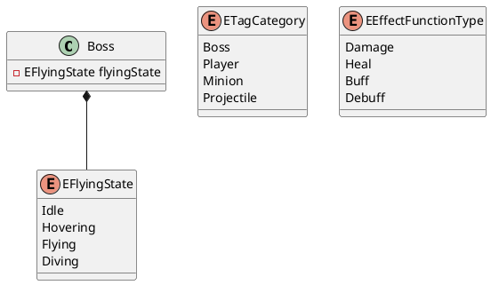

# Boss AI 시스템 아키텍처

## 시스템 개요

이 시스템은 Boss AI의 행동을 제어하기 위한 시스템으로, `EFlyingState`, `ETagCategory`, 그리고 `EEffectFunctionType` 세 가지 핵심 요소를 기반으로 동작합니다.  `EFlyingState` 컴포넌트는 Boss의 비행 상태를 관리하고, `ETagCategory`는 Boss와 다른 게임 요소들을 분류하는 데 사용되는 데이터이며, `EEffectFunctionType`는 Boss가 사용하는 효과의 기능을 정의하는 데 사용됩니다. 이 세 가지 요소는 상호작용하여 다양한 상황에 따라 Boss의 행동을 결정하고, 게임 플레이에 다채로움을 더합니다.

## 설계 패턴

* **Component Pattern:** `EFlyingState`는 Component 패턴을 사용하여 Boss 객체에 비행 상태를 추가합니다. 이를 통해 비행 상태와 관련된 로직을 분리하고 재사용성을 높입니다.  다른 상태(e.g., 공격 상태, 방어 상태)도 컴포넌트로 추가하여 확장 가능합니다.
* **Data-Driven Design:** `ETagCategory`와 `EEffectFunctionType`는 데이터 기반 설계를 적용한 예시입니다.  이러한 enum 또는 데이터 테이블을 이용하여 Boss의 행동 및 효과를 정의함으로써 코드 수정 없이 데이터 변경만으로 Boss의 특성을 조정할 수 있습니다.
* **Observer Pattern (추측):** `EEffectFunctionType`가 Notifies로 표시된 것으로 보아, 특정 이벤트 발생 시 다른 컴포넌트에 알림을 전달하는 Observer 패턴이 사용될 가능성이 있습니다. 예를 들어, 특정 효과 함수 실행 시 다른 시스템(e.g., UI, 사운드)에 알림을 보내 관련된 동작을 수행하도록 할 수 있습니다.

## 클래스 다이어그램

## 데이터 플로우

1. 게임 로직은 Boss의 현재 상태와 게임 환경 정보를 기반으로 `EFlyingState`를 변경합니다.
2. `EFlyingState`의 변경은 Boss의 애니메이션과 움직임에 영향을 줍니다.
3. Boss는 특정 조건(e.g., 체력, 시간, 플레이어와의 거리)에 따라 `EEffectFunctionType`에 정의된 효과를 사용합니다.
4. `EEffectFunctionType`의 실행 결과는 `ETagCategory`를 이용하여 분류된 대상에게 적용됩니다.  예를 들어, "Damage" 효과는 "Player" 태그를 가진 객체에 피해를 입힙니다.

## 확장성 분석

* **새로운 상태 추가:**  `EFlyingState`에 새로운 비행 상태를 추가하여 Boss의 행동을 쉽게 확장할 수 있습니다. Component 패턴을 통해 추가적인 상태 로직을 모듈화할 수 있습니다.
* **새로운 태그 및 효과 추가:**  `ETagCategory`와 `EEffectFunctionType`에 새로운 값을 추가하여 다양한 종류의 객체와 효과를 지원할 수 있습니다. 데이터 기반 설계 덕분에 코드 변경 없이 데이터 수정만으로 확장이 가능합니다.
* **다른 AI 시스템과의 연동:**  Observer 패턴을 활용하여 다른 AI 시스템이나 게임 시스템과 연동하여 Boss AI의 행동을 더욱 풍부하게 만들 수 있습니다.

**제약 사항:** 현재 아키텍처는 Boss의 비행 상태에 초점을 맞추고 있습니다. 지상에서의 움직임이나 다른 행동 패턴을 추가하려면 추가적인 컴포넌트와 로직이 필요할 수 있습니다.

## 성능 특성

* **Enum 사용:** `ETagCategory`와 `EEffectFunctionType`에 enum을 사용하여 비교 연산을 빠르게 수행할 수 있습니다.
* **Component 기반 설계:**  필요한 컴포넌트만 활성화하여 메모리 사용량을 최적화할 수 있습니다.
* **데이터 기반 설계:**  데이터 변경만으로 Boss의 행동을 수정할 수 있으므로 런타임 성능에 영향을 미치지 않습니다.

**최적화 포인트:**  `EEffectFunctionType`의 구현에 따라 성능 병목 현상이 발생할 수 있습니다. 복잡한 효과 함수의 경우 최적화를 고려해야 합니다. 또한, Observer 패턴을 사용할 경우 이벤트 처리 과정에서 성능 저하가 발생하지 않도록 주의해야 합니다.  프로파일링 툴을 이용하여 병목 현상을 분석하고 최적화하는 것이 중요합니다.
