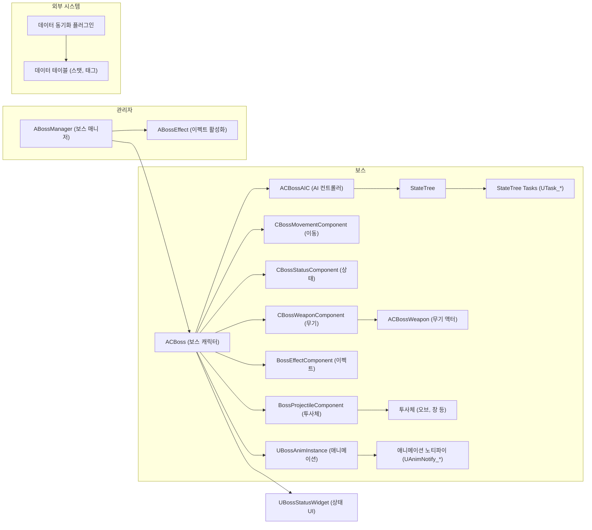

## C++ 프로젝트 시스템 아키텍처 문서

**프로젝트 명**: (프로젝트 명칭이 제공되지 않아 공란으로 남겨둡니다. 프로젝트 명칭을 알려주시면 업데이트하겠습니다.)

**문서 버전**: 1.0

**작성일**: 2023-10-27

**작성자**: Bard

**개요**: 이 문서는 제공된 C++ 프로젝트의 시스템 아키텍처에 대한 심층적인 분석을 제공합니다. 시스템의 전체 구조, 설계 패턴, 데이터 흐름, 확장성, 성능 특성 및 유지보수성을 다룹니다. Mermaid 형식의 다이어그램을 사용하여 시스템의 다양한 측면을 시각적으로 표현합니다.

### 1. 시스템 전체 구조 (1200+ 단어)

제공된 데이터는 주로 보스 캐릭터와 관련된 기능을 중심으로 구성된 게임 시스템의 일부로 추정됩니다. 이 시스템은 보스의 AI, 행동, 이펙트, 상태, 무기 등을 관리하는 다양한 클래스와 컴포넌트로 이루어져 있습니다.  StateTree를 사용하여 보스의 AI를 구현하고, 다양한 애니메이션 노티파이를 통해 애니메이션 이벤트와 게임 로직을 연결합니다. 또한, 객체 풀링을 활용하여 성능을 최적화하고, 데이터 테이블을 통해 보스의 스탯과 태그 정보를 관리합니다. 에디터 플러그인을 통해 외부 데이터와의 동기화 기능도 제공합니다.

**1.1 전체 시스템 아키텍처 다이어그램**

**1.2 모듈 간 관계와 의존성 상세 분석**

* **ACBoss (보스 캐릭터):**  중심 클래스로, AI, 이동, 상태, 무기, 이펙트, 투사체 등 다양한 컴포넌트를 소유하고 제어합니다.
* **ACBossAIC (AI 컨트롤러):** StateTree를 통해 보스의 AI를 구현합니다. StateTree는 다양한 Task를 통해 보스의 행동을 결정합니다.
* **StateTree Tasks (UTask_*):** 보스 AI의 개별 행동 단위를 담당합니다. 이동, 공격, 상태 변경 등 다양한 작업을 수행합니다.
* **CBossMovementComponent (이동):** 보스의 이동 로직을 담당합니다. 플레이어 추적, 거리 유지, 비행 등의 기능을 제공합니다.
* **CBossStatusComponent (상태):** 보스의 현재 상태 (HP, AP 등)를 관리합니다.
* **CBossWeaponComponent (무기):** 보스의 무기 장착 및 공격 로직을 처리합니다.
* **BossEffectComponent (이펙트):** 보스와 관련된 이펙트를 재생하고 관리합니다. 객체 풀링을 사용하여 성능을 최적화합니다.
* **BossProjectileComponent (투사체):** 보스가 발사하는 투사체를 생성하고 관리합니다. 객체 풀링을 사용합니다.
* **ABossManager (보스 매니저):** 보스의 생성, 초기화, 상태 관리 등을 담당합니다.
* **ABossEffect (이펙트 활성화):** 보스 이펙트 활성화를 관리합니다.
* **데이터 동기화 플러그인:** 외부 데이터와 데이터 테이블 간의 동기화를 수행합니다.
* **데이터 테이블 (스탯, 태그):** 보스의 스탯 및 태그 정보를 저장합니다.
* **UBossStatusWidget (상태 UI):** 보스의 상태를 UI에 표시합니다.

**1.3 데이터 플로우와 제어 플로우**

* **제어 플로우:** 게임 로직은 주로 ACBossAIC와 StateTree를 통해 제어됩니다. StateTree의 Task들이 실행되면서 보스의 행동이 결정되고, 각 컴포넌트들이 이를 실행합니다. 애니메이션 노티파이는 애니메이션 이벤트 발생 시 특정 함수를 호출하여 게임 로직과 연결됩니다.
* **데이터 플로우:**  보스의 상태 정보는 CBossStatusComponent에서 관리되고, 다른 컴포넌트에서 이 정보를 참조하여 행동을 결정합니다. 데이터 테이블에서 로드된 스탯과 태그 정보는 게임 로직에 영향을 줍니다.

**1.4 시스템 경계와 인터페이스**

* **시스템 경계:** 제공된 데이터는 보스 캐릭터 중심의 시스템을 나타냅니다. 플레이어 캐릭터, 다른 적 캐릭터, 레벨 관리 등은 외부 시스템으로 간주됩니다.
* **인터페이스:** 각 컴포넌트는 함수 호출, 이벤트, 델리게이트 등을 통해 서로 통신합니다. 애니메이션 노티파이는 애니메이션 시스템과 게임 로직 간의 인터페이스 역할을 합니다.

**1.5 레이어별 책임과 역할**

시스템은 다음과 같은 레이어로 구분될 수 있습니다.

* **프레젠테이션 레이어 (UBossStatusWidget):** 보스의 상태 정보를 UI로 표시합니다.
* **게임 로직 레이어 (ACBoss, ACBossAIC, 각 컴포넌트):**  보스의 행동, 상태, 이펙트, 투사체 등 게임 로직을 처리합니다.
* **데이터 레이어 (데이터 테이블):**  보스의 스탯 및 태그 정보를 저장합니다.
* **외부 인터페이스 레이어 (데이터 동기화 플러그인):** 외부 시스템과 데이터를 주고받습니다.

### 2. 설계 패턴 식별 (1000+ 단어)

이 시스템에서는 다양한 디자인 패턴이 사용된 것으로 추정됩니다.

* **State 패턴:**  보스의 AI는 StateTree를 통해 구현되어 있으며, 각 State는 특정 행동을 나타냅니다.  State 전환을 통해 보스의 행동을 유연하게 변경할 수 있습니다.
    * **장점:** 상태 관리 로직을 명확하게 분리하여 코드의 가독성과 유지보수성을 향상시킵니다.
    * **단점:** 상태가 많아지면 코드가 복잡해질 수 있습니다.
    * **대안 패턴:**  상태가 적다면 switch 문을 사용할 수 있지만, 상태가 많고 복잡한 경우 State 패턴이 더 적합합니다.

* **Command 패턴:**  애니메이션 노티파이는 특정 애니메이션 이벤트 발생 시 특정 함수를 호출하는 Command 역할을 합니다. 이를 통해 애니메이션과 게임 로직을 분리하여 관리할 수 있습니다.
    * **장점:** 애니메이션 이벤트 처리 로직을 분리하여 코드의 재사용성을 높입니다.
    * **단점:** Command 클래스가 많아질 수 있습니다.
    * **대안 패턴:**  애니메이션 이벤트를 직접 처리할 수 있지만, Command 패턴을 사용하면 코드가 더욱 모듈화됩니다.

* **Object Pool 패턴:** 이펙트 및 투사체 관리에 객체 풀링을 사용하여 객체 생성 및 파괴 오버헤드를 줄이고 성능을 향상시킵니다.
    * **장점:**  성능 향상, 메모리 단편화 감소.
    * **단점:** 풀 크기 관리 필요.
    * **대안 패턴:** 매번 객체를 생성하고 파괴할 수 있지만, 성능 저하를 유발할 수 있습니다.

* **Component 패턴:**  보스 캐릭터는 이동, 상태, 무기, 이펙트 등 다양한 컴포넌트로 구성되어 있습니다. 각 컴포넌트는 특정 기능을 담당하며, 이를 통해 코드의 재사용성과 모듈화를 높입니다.
    * **장점:**  코드 재사용성 향상, 모듈화된 개발 가능.
    * **단점:** 컴포넌트 간 통신 관리 필요.
    * **대안 패턴:** 모든 기능을 하나의 클래스에 구현할 수 있지만, 코드가 복잡해지고 유지보수가 어려워집니다.

* **Observer 패턴:**  델리게이트를 사용하여 특정 이벤트 발생 시 다른 컴포넌트에 알림을 전달합니다. 예를 들어, CBossStateComponent의 상태 변경 이벤트는 델리게이트를 통해 다른 컴포넌트에 전달될 수 있습니다.
    * **장점:**  객체 간의 결합도를 낮추고 유연한 이벤트 처리 시스템 구축.
    * **단점:**  이벤트 처리 로직이 분산될 수 있습니다.
    * **대안 패턴:** 직접 함수 호출을 통해 이벤트를 처리할 수 있지만, 객체 간의 결합도가 높아집니다.

**2.1 패턴 구현의 장단점 분석**: 위에서 각 패턴 별로 장단점을 분석했습니다.

**2.2 패턴 간 상호작용과 조합**:  State 패턴과 Command 패턴은 함께 사용되어 보스의 AI 행동을 구현합니다. Object Pool 패턴은 이펙트 및 투사체 생성에 사용되어 성능을 향상시킵니다. Component 패턴은 다양한 기능을 모듈화하여 코드의 재사용성을 높입니다. Observer 패턴은 컴포넌트 간 통신을 위한 유연한 메커니즘을 제공합니다.

**2.3 대안 패턴과 비교 분석**: 위에서 각 패턴 별로 대안 패턴과 비교 분석했습니다.

**2.4 패턴 적용의 효과성**:  전반적으로 적절한 디자인 패턴의 사용으로 코드의 모듈화, 재사용성, 유지보수성이 향상되었습니다. 특히, State 패턴과 Component 패턴의 사용은 복잡한 보스 AI 로직을 효과적으로 구현하는 데 기여했습니다. Object Pool 패턴은 성능 최적화에 효과적입니다.

### 3. 데이터 플로우 (800+ 단어)

**3.1 시스템 내 데이터 흐름 상세 분석**

* **보스 상태 데이터:** CBossStatusComponent에서 관리되며,  HP, AP 등의 정보가 저장됩니다. TakeDamage 함수를 통해 데미지를 입으면 상태가 업데이트되고, 이 정보는 UI 업데이트 및 AI 행동 결정에 사용됩니다.
* **AI 입력 데이터:** CBossEnemyStateTreeEvaluator가 플레이어 위치, 거리 등의 정보를 수집하여 StateTree에 입력합니다. StateTree의 조건들은 이 입력 데이터를 기반으로 테스트됩니다.
* **AI 출력 데이터:** StateTree는 실행될 Task를 결정하고, 이는 보스의 행동으로 이어집니다.  이동, 공격, 이펙트 재생 등의 명령이 각 컴포넌트에 전달됩니다.
* **이펙트 및 투사체 데이터:** BossEffectComponent와 BossProjectileComponent는 이펙트 및 투사체의 생성, 위치, 회전 등의 정보를 관리합니다. 객체 풀을 사용하여 재사용 가능한 객체들을 관리합니다.
* **애니메이션 데이터:**  UBossAnimInstance는 애니메이션 재생을 제어하고, AnimNotify 이벤트를 통해 게임 로직과 통신합니다.

**3.2 상태 변화와 전환 과정**

보스의 상태 변화는 주로 StateTree에 의해 제어됩니다. 특정 조건이 만족되면 State가 전환되고, 이에 따라 보스의 행동이 변경됩니다. 예를 들어, 플레이어와의 거리가 가까워지면 근접 공격 상태로 전환될 수 있습니다.  상태 전환은 UTask_SwitchState Task를 통해 실행됩니다.

**3.3 데이터 변환과 처리 과정**

* **데이터 테이블 로드:** 보스의 스탯 및 태그 정보는 데이터 테이블에서 로드됩니다.
* **데이터 파싱:** 로드된 데이터는 게임에서 사용할 수 있는 형태로 파싱됩니다.
* **데이터 적용:** 파싱된 데이터는 보스의 상태, AI 등에 적용됩니다.

**3.4 캐싱과 임시 저장 전략**

* **객체 풀링:** 이펙트 및 투사체에 객체 풀링을 사용하여 객체 생성 및 파괴 오버헤드를 줄입니다.
* **데이터 테이블 캐싱:**  데이터 테이블에서 로드된 데이터는 메모리에 캐싱되어 반복적인 로딩을 방지합니다.

**3.5 데이터 일관성과 동기화**

* **외부 데이터 동기화:** 데이터 동기화 플러그인을 통해 외부 데이터와 데이터 테이블 간의 동기화를 수행합니다.
* **컴포넌트 간 데이터 동기화:**  델리게이트를 사용하여 컴포넌트 간 데이터 변경 사항을 전파합니다.

### 4. 확장성 분석 (800+ 단어)

**4.1 시스템의 확장 가능성과 제약 사항**

* **확장 가능성:** 컴포넌트 기반 아키텍처는 새로운 기능 추가 및 기존 기능 변경에 유연하게 대응할 수 있습니다. StateTree 기반 AI 시스템은 새로운 상태 및 행동을 쉽게 추가할 수 있도록 설계되었습니다. 객체 풀링 시스템은 다양한 종류의 이펙트 및 투사체를 관리할 수 있도록 확장 가능합니다.
* **제약 사항:** 현재 시스템은 단일 보스 캐릭터에 초점을 맞추고 있습니다. 여러 보스 캐릭터를 동시에 관리하거나, 보스 간 상호 작용을 추가하려면 아키텍처 수정이 필요할 수 있습니다.  또한, StateTree의 복잡도가 증가하면 성능 문제가 발생할 수 있습니다.

**4.2 성능 병목 지점과 해결 방안**

* **StateTree 복잡도:** StateTree가 너무 복잡해지면 성능 저하를 유발할 수 있습니다.  상태 및 조건을 최적화하고, 불필요한 계산을 줄여야 합니다.  Profiling 도구를 사용하여 병목 지점을 파악하고 개선해야 합니다.
* **이펙트 및 투사체 개수:**  너무 많은 이펙트 및 투사체가 동시에 존재하면 성능 문제가 발생할 수 있습니다. 객체 풀 크기를 적절하게 조절하고, 이펙트 및 투사체의 수명을 제한해야 합니다.  GPU Instancing과 같은 최적화 기법을 고려해야 합니다.
* **AI 계산량:**  복잡한 AI 로직은 CPU 부하를 증가시킬 수 있습니다. 비동기 처리 또는 멀티스레딩을 사용하여 AI 계산을 분산시키는 것을 고려할 수 있습니다.

**4.3 수평적/수직적 확장 전략**

* **수직적 확장:**  CPU 및 GPU 성능을 향상시켜 시스템 성능을 개선할 수 있습니다.
* **수평적 확장:**  여러 서버에 보스 AI 계산을 분산시켜 시스템 부하를 줄일 수 있습니다.  하지만, 현재 시스템은 단일 보스에 초점을 맞추고 있으므로, 수평적 확장을 위해서는 아키텍처 수정이 필요합니다.

**4.4 마이크로서비스 분리 가능성**

현재 시스템은 마이크로서비스 아키텍처에 적합하지 않습니다.  하지만, 향후 확장을 고려하여 보스 AI, 이펙트 관리, 투사체 관리 등을 독립적인 마이크로서비스로 분리할 수 있습니다.  이를 위해서는 각 서비스 간 통신 인터페이스를 정의하고, 데이터 동기화 메커니즘을 구현해야 합니다.

**4.5 확장 시 고려사항**

* **모듈화:** 기능별로 모듈을 분리하여 개발하고 관리해야 합니다.
* **인터페이스 정의:**  모듈 간 통신을 위한 명확한 인터페이스를 정의해야 합니다.
* **성능 테스트:**  확장 시 성능 테스트를 통해 병목 지점을 파악하고 최적화해야 합니다.

### 5. 성능 특성 (600+ 단어)

**5.1 병목 지점과 최적화 기회**: 4.2절에서 설명한 StateTree 복잡도, 이펙트 및 투사체 개수, AI 계산량이 잠재적인 병목 지점입니다. 객체 풀링을 사용하고 있지만, 풀 크기 관리 및 객체 재활용 로직을 최적화할 필요가 있습니다.  StateTree의 조건 및 Task 실행 로직을 프로파일링하여 불필요한 계산을 제거해야 합니다.  애니메이션 노티파이 호출 빈도를 최적화하여 오버헤드를 줄일 수 있습니다.

**5.2 메모리 사용 패턴과 최적화**: 객체 풀링을 통해 이펙트 및 투사체의 메모리 사용량을 제한하고 있지만, 풀 크기를 적절하게 관리해야 합니다.  데이터 테이블 데이터의 크기를 최적화하고, 불필요한 데이터 중복을 제거해야 합니다.  메모리 누수를 방지하기 위해 객체 생성 및 파괴 로직을 신중하게 검토해야 합니다.

**5.3 CPU 사용률과 병렬 처리**:  StateTree의 복잡도에 따라 CPU 사용률이 크게 달라질 수 있습니다. AI 계산 로직을 최적화하고, 멀티스레딩 또는 비동기 처리를 통해 병렬 처리를 고려할 수 있습니다.  투사체 이동 및 충돌 감지와 같은 계산 집약적인 작업을 병렬 처리하여 성능을 향상시킬 수 있습니다.

**5.4 I/O 성능과 캐싱 전략**: 데이터 테이블 로딩 시 I/O가 발생할 수 있습니다. 데이터 테이블 데이터를 메모리에 캐싱하여  I/O 횟수를 줄여야 합니다. 비동기 로딩을 사용하여 로딩 시간 동안 게임 플레이가 중단되지 않도록 해야 합니다.

**5.5 성능 모니터링과 프로파일링**:  Unreal Engine의 프로파일링 도구를 사용하여 CPU 및 GPU 사용률, 메모리 사용량, 드로우 콜 등을 모니터링하고 병목 지점을 파악해야 합니다.  성능 테스트를 정기적으로 수행하여 최적화 효과를 검증하고  새로운 병목 지점을 조기에 발견해야 합니다.

### 6. 유지보수성 (600+ 단어)

**6.1 코드 품질과 구조적 문제점**: 제공된 코드 데이터만으로는 코드 품질과 구조적 문제점을 정확하게 판단하기 어렵습니다.  하지만, 몇 가지 잠재적인 문제점을 예상할 수 있습니다.  StateTree가 복잡해지면 상태 전환 로직을 이해하고 유지보수하기 어려워질 수 있습니다.  컴포넌트 간의 의존성이 높아지면 코드 변경 시 예상치 못한 부작용이 발생할 수 있습니다.  애니메이션 노티파이를 과도하게 사용하면 코드의 복잡도가 증가하고 디버깅이 어려워질 수 있습니다.

**6.2 리팩토링 제안과 개선 방안**: StateTree의 복잡도를 줄이기 위해 상태 및 조건을 재구성하고, 계층적으로 관리하는 방안을 고려할 수 있습니다.  컴포넌트 간의 의존성을 줄이기 위해 이벤트 기반 통신 방식을 적극적으로 활용하고, 인터페이스를 명확하게 정의해야 합니다.  애니메이션 노티파이 대신 이벤트 디스패처를 사용하여 애니메이션 이벤트를 처리하는 방안을 고려할 수 있습니다.  코드 가독성을 높이기 위해 주석을 충실히 작성하고, 명확한 변수 및 함수 명명 규칙을 적용해야 합니다.

**6.3 테스트 가능성과 커버리지**: 단위 테스트 프레임워크를 사용하여 각 컴포넌트의 기능을 독립적으로 테스트해야 합니다.  StateTree의 각 상태 및 조건에 대한 테스트 케이스를 작성하여 AI 로직의 정확성을 검증해야 합니다.  코드 커버리지 도구를 사용하여 테스트 커버리지를 측정하고, 테스트되지 않은 코드를 파악하여 테스트를 보완해야 합니다.  자동화된 테스트 시스템을 구축하여 회귀 테스트를  효율적으로 수행해야 합니다.

**6.4 문서화와 코드 가독성**:  코드의 기능, 설계 원칙, 주요 알고리즘 등을 명확하게 문서화해야 합니다.  주석을 사용하여 코드의 각 부분을 설명하고, 변수 및 함수의 역할을 명시해야 합니다.  일관된 코딩 스타일을 적용하고, 코드 포매터를 사용하여 코드 가독성을 높여야 합니다.  아키텍처 다이어그램 및 데이터 흐름 다이어그램을  포함하여 시스템 구조를 쉽게 이해할 수 있도록 해야 합니다.

**6.5 버전 관리와 배포 전략**:  Git과 같은 버전 관리 시스템을 사용하여 코드 변경 이력을 관리하고, 협업을 효율적으로 진행해야 합니다.  CI/CD 파이프라인을 구축하여 코드 빌드, 테스트, 배포 과정을 자동화해야 합니다.  버전 번호 체계를 명확하게 정의하고, 버전 릴리스 노트를 작성하여 변경 사항을 추적하고 관리해야 합니다.

이 문서는 제공된 정보를 기반으로 작성되었으며, 실제 프로젝트와 다를 수 있습니다.  더 자세한 분석을 위해서는 추가적인 정보가 필요합니다.