# ⚔️ 언리얼 엔진 C++ 보스 전투 시스템 포트폴리오 ⚔️

## ✨ 프로젝트 개요

이 프로젝트는 언리얼 엔진 5를 기반으로 개발된 **액션 어드벤처 게임**의 핵심 요소인 **보스 전투 시스템**을 구현한 것입니다. 고대 신화 속 보스를 모티브로 한 강력한 적과의 전투를 통해 플레이어에게 도전적이고 몰입감 넘치는 경험을 제공하는 것을 목표로 합니다.

### 🎮 게임 장르, 배경, 목표

*   **장르**: 3인칭 액션 어드벤처
*   **배경**: 고대 신화와 전설을 바탕으로 한 판타지 세계
*   **목표**: 플레이어는 주인공이 되어 강력한 보스 몬스터를 물리치고 세계를 구원하는 여정을 떠납니다. 각 보스는 고유한 공격 패턴과 약점을 가지고 있으며, 플레이어는 전략적인 전투를 통해 이를 극복해야 합니다.

### ⭐ 주요 기능 및 특징 (상세 설명)

*   **다양한 보스 패턴**: 각 보스는 고유한 공격 패턴, 스킬, 페이즈 변화를 가집니다.
*   **StateTree 기반 AI**: 복잡한 보스 AI를 효율적으로 관리하고 확장하기 위해 StateTree를 사용했습니다.
*   **애니메이션 노티파이**: 애니메이션과 게임 로직을 동기화하여 자연스럽고 반응성 높은 전투 경험을 제공합니다.
*   **이펙트 시스템**: 화려하고 강력한 시각 효과를 통해 전투의 몰입감을 높입니다.
*   **투사체 시스템**: 다양한 투사체를 생성하고 관리하여 보스의 공격 패턴을 다채롭게 만듭니다.
*   **장비 시스템**: 보스가 다양한 무기를 장착하고 활용할 수 있도록 합니다.
*   **상태 위젯**: 보스의 HP, 페이즈 정보 등을 표시하여 플레이어가 전투 상황을 파악하는 데 도움을 줍니다.
*   **데이터 동기화 플러그인**: GameplayTags 및 보스 스탯을 외부 데이터 소스(예: 스프레드시트)와 동기화하여 콘텐츠 업데이트를 용이하게 합니다.

### 🛠️ 기술적 특징 및 사용된 라이브러리/프레임워크

*   **언리얼 엔진 5**: 게임 엔진
*   **C++**: 주요 게임 로직 구현
*   **StateTree**: 보스 AI 구현
*   **애니메이션 노티파이**: 애니메이션 이벤트 처리
*   **Niagara**: 파티클 이펙트 시스템
*   **Object Pool**: 투사체 및 이펙트 성능 최적화
*   **HTTP API**: 외부 데이터 동기화
*   **GameplayTags**: 게임플레이 요소 태깅 및 관리

### 📋 클래스 구조 및 시스템 개요

```mermaid
classDiagram
    class ABossEffect {
        +ActivateEffect()
        +DeactivateEffect()
    }
    class ABossManager {
        +ResetBossCompletely()
        +OpenDoor()
    }
    class ABossProjectileActor {
        +FireProjectile()
    }
    class ABossProjectileOrb {
        +SpawnProjectile()
        +DestroyOrb()
    }
    class ACBoss {
        +TakeDamage()
        +PlayHitMotion()
    }
    class ACBossAIC {
        +OnPossess()
    }
    class ACBossWeapon {
        +OnBossBeginEquip()
        +OnBossUnequip()
    }
    class AFlySpline {
        +BuildCylinderAndRims()
    }
    class AGateOfBabylon {
        +ActivateGate()
        +DeactivateGate()
    }
    class AGateOfBabyonProjectile {
        +ActivateProjectile()
        +DeactivateProjectile()
    }
    class AHolySwordMagic {
        +StartFirstNiagara()
        +EnableCollision()
    }
    class AProjectile_LightSpear {
        +FireProjectile()
    }
    class UAnimNotify_ArmorDissolve {
        +Notify()
    }
    class UAnimNotify_BeginFlying {
        +Notify()
    }
    class UAnimNotify_BossWeaponCollision {
        +NotifyBegin()
        +NotifyEnd()
    }
    class UAnimNotify_ChaseRotation {
        +NotifyBegin()
        +NotifyTick()
        +NotifyEnd()
    }
    class UAnimNotify_DeadDissolve {
        +Notify()
    }
    class UAnimNotify_DropSwordMagic {
        +Notify()
    }
    class UAnimNotify_EndFlying {
        +Notify()
    }
    class UAnimNotify_GateOfBabylonSpawn {
        +Notify()
    }
    class UAnimNotify_Groggying {
        +NotifyBegin()
        +NotifyEnd()
    }
    class UAnimNotify_Landing {
        +Notify()
    }
    class UAnimNotify_LineTraceOnOff {
        +NotifyBegin()
        +NotifyEnd()
    }
    class UAnimNotify_OrbSpawn {
        +Notify()
    }
    class UAnimNotify_PaseChangeDissolve {
        +Notify()
    }
    class UAnimNotify_PlayEffect {
        +Notify()
    }
    class UAnimNotify_SelectCollisionOnOff {
        +NotifyBegin()
        +NotifyEnd()
    }
    class UAnimNotify_SpawnLightningSpear {
        +Notify()
    }
    class UAnimNotifyState_PaseChange {
        +NotifyBegin()
        +NotifyEnd()
    }
    class UBossAnimInstance {
        +NativeBeginPlay()
    }
    class UBossEffectExecute {
        +ExecuteEffect()
    }
    class UBossEffectManager {
        +PlayEffect()
        +StopAllEffects()
    }
    class UBossProjectileComponent {
        +ShotProjectile()
        +SpawnOrb()
        +DestroyOrb()
    }
    class UBossStatusWidget {
        +UpdateBossHP()
        +SwitchBossCompleteUI()
    }
    class UCBossDoAction {
        +DoAction()
    }
    class UCBossEquipment {
        +Equip()
        +Unequip()
    }
    class UCBossWeaponAsset {
        +GetBossWeapon()
    }
    class UDDTLoadingWidget {
        +PlayLoadingAnimation()
    }
    class UDDTMainThemeWidget {
        +PlayClickEvent()
    }
    class USTC_CheckPase {
        +TestCondition()
    }
    class USTC_DistanceCheck {
        +TestCondition()
    }
    class USTC_IsBossActionInProgress {
        +TestCondition()
    }
    class UTask_BossChase {
        +Tick()
        +EnterState()
    }
    class UTask_Dead {
        +EnterState()
    }
    class UTask_FlyKeepingDistance {
        +EnterState()
    }
    class UTask_FlySetLocation {
        +EnterState()
    }
    class UTask_Hovering {
        +EnterState()
    }
    class UTask_IncreaseAP {
        +EnterState()
    }
    class UTask_KeepingDistance {
        +EnterState()
    }
    class UTask_Log {
        +EnterState()
    }
    class UTask_PlayMontage {
        +EnterState()
    }
    class UTask_ResetAP {
        +EnterState()
    }
    class UTask_RotateTowardsPlayer {
        +Tick()
    }
    class UTask_SetCurrentAction {
        +EnterState()
    }
    class UTask_SetVectorTargetLocation {
        +Tick()
    }
    class UTask_SideMoveGetLocation {
        +EnterState()
    }
    class UTask_SwitchPase {
        +EnterState()
    }
    class UTask_SwitchState {
        +EnterState()
    }
    class UTask_TargetLocationFeet {
        +Tick()
    }
    class UTask_TargetLocatonGap {
        +Tick()
    }

    ABossManager -- ACBoss : Spawns
    ACBoss -- ACBossAIC : Controlled by
    ACBoss -- ACBossWeapon : Equips
    ACBossWeapon -- UCBossDoAction : Uses
    ACBoss -- UBossStatusWidget : Displays Status
    ACBoss -- UBossProjectileComponent : Uses Projectiles
    ACBoss -- UBossEffectComponent : Uses Effects
    ACBossAIC -- UCBossEnemyStateTreeEvaluator : Evaluates StateTree
    UCBossEnemyStateTreeEvaluator -- UTask_BossChase : Executes Tasks
    UCBossEnemyStateTreeEvaluator -- USTC_CheckPase : Checks Conditions
    UBossProjectileComponent -- ABossProjectileActor : Spawns
    UBossProjectileComponent -- ABossProjectileOrb : Spawns
    UBossEffectComponent -- ABossEffect : Plays
    AGateOfBabylon -- AGateOfBabyonProjectile : Spawns
    ACBoss -- UBossAnimInstance : Animates

```

## 📚 목차

1.  [프로젝트 개요](#-프로젝트-개요)
    *   [게임 장르, 배경, 목표](#-게임-장르-배경-목표)
    *   [주요 기능 및 특징](#-주요-기능-및-특징-상세-설명)
    *   [기술적 특징 및 사용된 라이브러리/프레임워크](#️-기술적-특징-및-사용된-라이브러리프레임워크)
    *   [클래스 구조 및 시스템 개요](#-클래스-구조-및-시스템-개요)
2.  [클래스별 상세 분석](#-클래스별-상세-분석)
    *   [ABossEffect](#abosseffect)
        *   [함수 `ABossEffect`](#함수-abosseffect)
        *   [함수 `Tick`](#함수-tick)
        *   [함수 `ActivateEffect`](#함수-activateeffect)
        *   [함수 `ActivateEffectAttachedToSocket`](#함수-activateeffectattachedtosocket)
        *   [함수 `DeactivateEffect`](#함수-deactivateeffect)
        *   [함수 `IsActive`](#함수-isactive)
        *   [함수 `GetCurrentEffectTag`](#함수-getcurrenteffecttag)
        *   [함수 `BeginPlay`](#함수-beginplay-1)
        *   [함수 `AttachToBoss`](#함수-attachtoboss)
        *   [함수 `AttachToSocket`](#함수-attachtosocket)
        *   [함수 `PlaceInWorld`](#함수-placeinworld)
    *   [ABossManager](#abossmanager)
        *   [함수 `ABossManager`](#함수-abossmanager-1)
        *   [함수 `Tick`](#함수-tick-1)
        *   [함수 `ResetBossCompletely`](#함수-resetbosscompletely)
        *   [함수 `OpenDoor`](#함수-opendoor)
        *   [함수 `FindBossInWorld`](#함수-findbossinworld)
        *   [함수 `ResetAllBossComponents`](#함수-resetallbosscomponents)
        *   [함수 `ResetBossStateTree`](#함수-resetbossstatetree)
        *   [함수 `BeginPlay`](#함수-beginplay-2)
        *   [함수 `OnTriggerBoxOverlapBegin`](#함수-ontriggerboxoverlapbegin)
    *   [ABossProjectileActor](#abossprojectileactor)
        *   [함수 `ABossProjectileActor`](#함수-abossprojectileactor-1)
        *   [함수 `Tick`](#함수-tick-2)
        *   [함수 `FireProjectile`](#함수-fireprojectile-1)
        *   [함수 `FireProjectileToLocation`](#함수-fireprojectiletolocation)
        *   [함수 `PlaySpawnEffect`](#함수-playspawneffect)
        *   [함수 `PlayDestroyEffect`](#함수-playdestroyeffect)
        *   [함수 `OnProjectileHit`](#함수-onprojectilehit)
        *   [함수 `BeginPlay`](#함수-beginplay-3)
    *   [ABossProjectileOrb](#abossprojectileorb)
        *   [함수 `ABossProjectileOrb`](#함수-abossprojectileorb-1)
        *   [함수 `Tick`](#함수-tick-3)
        *   [함수 `SpawnProjectile`](#함수-spawnprojectile-2)
        *   [함수 `DestroyOrb`](#함수-destroyorb-1)
        *   [함수 `OnOverlap`](#함수-onoverlap)
        *   [함수 `PlaySpawnSound`](#함수-playspawnsound)
        *   [함수 `PlayReturnToPoolSound`](#함수-playreturntopoolsound)
        *   [함수 `PlayCollisionSound`](#함수-playcollisionsound)
        *   [함수 `PlaySpawnEffect`](#함수-playspawneffect-1)
        *   [함수 `PlayReturnToPoolEffect`](#함수-playreturntopooleffect)
        *   [함수 `PlayCollisionEffect`](#함수-playcollisioneffect)
        *   [함수 `DestroyOrbWithDelay`](#함수-destroyorbwithdelay)
        *   [함수 `ActivateOrb`](#함수-activateorb)
        *   [함수 `BeginPlay`](#함수-beginplay-4)
    *   [ACBoss](#acboss)
        *   [함수 `ACBoss`](#함수-acboss-1)
        *   [함수 `Tick`](#함수-tick-4)
        *   [함수 `TakeDamage`](#함수-takedamage)
        *   [함수 `BeginPlay`](#함수-beginplay-5)
        *   [함수 `PlayHitMotion`](#함수-playhitmotion)
        *   [함수 `ShowBossStatusWidget`](#함수-showbossstatuswidget)
        *   [함수 `HPUpdate`](#함수-hpupdate)
        *   [함수 `RestartUI`](#함수-restartui)
        *   [함수 `PlayBossBGM`](#함수-playbossbgm)
        *   [함수 `StopBossBGM`](#함수-stopbossbgm)
        *   [함수 `LowerBossBGMVolume`](#함수-lowerbossbgmvolume)
    *   [ACBossAIC](#acbossaic)
        *   [함수 `ACBossAIC`](#함수-acbossaic-1)
        *   [함수 `OnPossess`](#함수-onpossess)
    *   [ACBossWeapon](#acbossweapon)
        *   [함수 `ACBossWeapon`](#함수-acbossweapon-1)
        *   [함수 `OnBossBeginEquip`](#함수-onbossbeginequip)
        *   [함수 `OnBossUnequip`](#함수-onbossunequip)
        *   [함수 `OnBossCollisions`](#함수-onbosscollisions)
        *   [함수 `OnSelectCollision`](#함수-onselectcollision)
        *   [함수 `OffBossCollisions`](#함수-offbosscollisions)
        *   [함수 `BossAttachToCollision`](#함수-bossattachtocollision)
        *   [함수 `StartCollisionAtSocket`](#함수-startcollisionatsocket)
        *   [함수 `EndCollisionToOwner`](#함수-endcollisiontoowner)
        *   [함수 `BeginPlay`](#함수-beginplay-6)
        *   [함수 `Tick`](#함수-tick-5)
        *   [함수 `BossAttachTo`](#함수-bossattachto)
        *   [함수 `OnBossComponentBeginOverlap`](#함수-onbosscomponentbeginoverlap)
        *   [함수 `OnBossComponentEndOverlap`](#함수-onbosscomponentendoverlap)
    *   [AFlySpline](#aflyspline)
        *   [함수 `AFlySpline`](#함수-aflyspline-1)
        *   [함수 `OnConstruction`](#함수-onconstruction)
        *   [함수 `BuildCylinderAndRims`](#함수-buildcylinderandrims)
        *   [함수 `GetHorizontalSplines`](#함수-gethorizontalsplines)
        *   [함수 `GetSplineAtIndex`](#함수-getsplineatindex)
        *   [함수 `BuildRim`](#함수-buildrim)
        *   [함수 `CreateHorizontalSplines`](#함수-createhorizontalsplines)
    *   [AGateOfBabylon](#agateofbabylon)
        *   [함수 `AGateOfBabylon`](#함수-agateofbabylon-1)
        *   [함수 `Tick`](#함수-tick-6)
        *   [함수 `ActivateGate`](#함수-activategate)
        *   [함수 `DeactivateGate`](#함수-deactivategate)
        *   [함수 `BeginPlay`](#함수-beginplay-7)
        *   [함수 `InitializeProjectilePool`](#함수-initializeprojectilepool)
        *   [함수 `GetProjectileFromPool`](#함수-getprojectilefrompool-1)
        *   [함수 `SpawnProjectile`](#함수-spawnprojectile-3)
        *   [함수 `UpdateLookAtPlayer`](#함수-updatelookatplayer)
    *   [AGateOfBabyonProjectile](#agateofbabyonprojectile)
        *   [함수 `AGateOfBabyonProjectile`](#함수-agateofbabyonprojectile-1)
        *   [함수 `Tick`](#함수-tick-7)
        *   [함수 `ActivateProjectile`](#함수-activateprojectile-1)
        *   [함수 `DeactivateProjectile`](#함수-deactivateprojectile-1)
        *   [함수 `BeginPlay`](#함수-beginplay-8)
        *   [함수 `OnBeginOverlap`](#함수-onbeginoverlap)
        *   [함수 `MoveToRandomLocationAroundPlayer`](#함수-movetorandomlocationaroundplayer)
    *   [AHolySwordMagic](#aholyswordmagic)
        *   [함수 `AHolySwordMagic`](#함수-aholyswordmagic-1)
        *   [함수 `BeginPlay`](#함수-beginplay-9)
        *   [함수 `Tick`](#함수-tick-8)
        *   [함수 `StartFirstNiagara`](#함수-startfirstniagara)
        *   [함수 `StartSecondNiagara`](#함수-startsecondniagara)
        *   [함수 `EnableCollision`](#함수-enablecollision)
        *   [함수 `DisableCollision`](#함수-disablecollision)
        *   [함수 `CheckNiagaraCompletion`](#함수-checkniagaracompletion)
        *   [함수 `ResetForPool`](#함수-resetforpool)
        *   [함수 `OnOverlapBegin`](#함수-onoverlapbegin)
    *   [AProjectile\_LightSpear](#aprojectile_lightspear)
        *   [함수 `AProjectile_LightSpear`](#함수-aprojectile_lightspear-1)
        *   [함수 `Tick`](#함수-tick-9)
        *   [함수 `FireProjectile`](#함수-fireprojectile-2)
        *   [함수 `PlayDestroyEffect`](#함수-playdestroyeffect-1)
        *   [함수 `OnProjectileHit`](#함수-onprojectilehit-1)
        *   [함수 `BeginPlay`](#함수-beginplay-10)
    *   [FEditorPlugin\_DataSyncModule](#feditorplugin_datasyncmodule)
        *   [함수 `StartupModule`](#함수-startupmodule)
        *   [함수 `ShutdownModule`](#함수-shutdownmodule)
        *   [함수 `SyncGameplayTags`](#함수-syncgameplaytags)
        *   [함수 `SyncBossStats`](#함수-syncbossstats)
        *   [함수 `MakeAPIRequest`](#함수-makeapirequest)
        *   [함수 `OnDataReceived`](#함수-ondatareceived)
        *   [함수 `UpdateGameplayTagsTable`](#함수-updategameplaytagstable)
        *   [함수 `UpdateBossStatsTableSimple`](#함수-updatebossstatstablesimple)
        *   [함수 `PluginButtonClicked`](#함수-pluginbuttonclicked)
        *   [함수 `OnSpawnPluginTab`](#함수-onspawnplugintab)
        *   [함수 `ParseGameplayTagData`](#함수-parsegameplaytagdata)
        *   [함수 `RegisterMenus`](#함수-registermenus)
        *   [함수 `RegisterToolbar`](#함수-registertoolbar)
        *   [함수 `CreatePluginUI`](#함수-createpluginui)
    *   [UAnimNotify\_ArmorDissolve](#uanimnotify_armordissolve)
        *   [함수 `GetNotifyName_Implementation`](#함수-getnotifyname_implementation)
        *   [함수 `Notify`](#함수-notify-1)
    *   [UAnimNotify\_BeginFlying](#uanimnotify_beginflying)
        *   [함수 `GetNotifyName_Implementation`](#함수-getnotifyname_implementation-1)
        *   [함수 `Notify`](#함수-notify-2)
    *   [UAnimNotify\_BossWeaponCollision](#uanimnotify_bossweaponcollision)
        *   [함수 `GetNotifyName_Implementation`](#함수-getnotifyname_implementation-2)
        *   [함수 `NotifyBegin`](#함수-notifybegin)
        *   [함수 `NotifyEnd`](#함수-notifyend)
    *   [UAnimNotify\_ChaseRotation](#uanimnotify_chaserotation)
        *   [함수 `GetNotifyName_Implementation`](#함수-getnotifyname_implementation-3)
        *   [함수 `NotifyBegin`](#함수-notifybegin-1)
        *   [함수 `NotifyTick`](#함수-notifytick)
        *   [함수 `NotifyEnd`](#함수-notifyend-1)
    *   [UAnimNotify\_DeadDissolve](#uanimnotify_deaddissolve)
        *   [함수 `GetNotifyName_Implementation`](#함수-getnotifyname_implementation-4)
        *   [함수 `Notify`](#함수-notify-3)
    *   [UAnimNotify\_DropSwordMagic](#uanimnotify_dropswordmagic)
        *   [함수 `GetNotifyName_Implementation`](#함수-getnotifyname_implementation-5)
        *   [함수 `Notify`](#함수-notify-4)
    *   [UAnimNotify\_EndFlying](#uanimnotify_endflying)
        *   [함수 `GetNotifyName_Implementation`](#함수-getnotifyname_implementation-6)
        *   [함수 `Notify`](#함수-notify-5)
    *   [UAnimNotify\_GateOfBabylonSpawn](#uanimnotify_gateofbabylonspawn)
        *   [함수 `GetNotifyName_Implementation`](#함수-getnotifyname_implementation-7)
        *   [함수 `Notify`](#함수-notify-6)
    *   [UAnimNotify\_Groggying](#uanimnotify_groggying)
        *   [함수 `GetNotifyName_Implementation`](#함수-getnotifyname_implementation-8)
        *   [함수 `NotifyBegin`](#함수-notifybegin-2)
        *   [함수 `NotifyEnd`](#함수-notifyend-2)
    *   [UAnimNotify\_Landing](#uanimnotify_landing)
        *   [함수 `GetNotifyName_Implementation`](#함수-getnotifyname_implementation-9)
        *   [함수 `Notify`](#함수-notify-7)
    *   [UAnimNotify\_LineTraceOnOff](#uanimnotify_linetraceonoff)
        *   [함수 `GetNotifyName_Implementation`](#함수-getnotifyname_implementation-10)
        *   [함수 `NotifyBegin`](#함수-notifybegin-3)
        *   [함수 `NotifyEnd`](#함수-notifyend-3)
    *   [UAnimNotify\_OrbSpawn](#uanimnotify_orbspawn)
        *   [함수 `GetNotifyName_Implementation`](#함수-getnotifyname_implementation-11)
        *   [함수 `Notify`](#함수-notify-8)
    *   [UAnimNotify\_PaseChangeDissolve](#uanimnotify_pasechangedissolve)
        *   [함수 `GetNotifyName_Implementation`](#함수-getnotifyname_implementation-12)
        *   [함수 `Notify`](#함수-notify-9)
    *   [UAnimNotify\_PlayEffect](#uanimnotify_playeffect)
        *   [함수 `GetNotifyName_Implementation`](#함수-getnotifyname_implementation-13)
        *   [함수 `Notify`](#함수-notify-10)
    *   [UAnimNotify\_SelectCollisionOnOff](#uanimnotify_selectcollisiononoff)
        *   [함수 `GetNotifyName_Implementation`](#함수-getnotifyname_implementation-14)
        *   [함수 `NotifyBegin`](#함수-notifybegin-4)
        *   [함수 `NotifyEnd`](#함수-notifyend-4)
    *   [UAnimNotify\_SpawnLightningSpear](#uanimnotify_spawnlightningspear)
        *   [함수 `GetNotifyName_Implementation`](#함수-getnotifyname_implementation-15)
        *   [함수 `Notify`](#함수-notify-11)
    *   [UAnimNotifyState\_PaseChange](#uanimnotifystate_pasechange)
        *   [함수 `GetNotifyName_Implementation`](#함수-getnotifyname_implementation-16)
        *   [함수 `NotifyBegin`](#함수-notifybegin-5)
        *   [함수 `NotifyEnd`](#함수-notifyend-5)
    *   [UBossAnimInstance](#ubossaniminstance)
        *   [함수 `NativeBeginPlay`](#함수-nativebeginplay)
    *   [UBossEffectExecute](#ubosseffectexecute)
        *   [함수 `ExecuteEffect`](#함수-executeeffect)
        *   [함수 `ExecuteEffects`](#함수-executefects)
        *   [함수 `ExecuteEffectWithDelay`](#함수-executeeffectwithdelay)
        *   [함수 `ExecuteEffectLoop`](#함수-executeeffectloop)
        *   [함수 `ExecuteEffectAtSocket`](#함수-executeeffectatsocket)
        *   [함수 `ExecuteEffectAttachedToSocket`](#함수-executeeffectattachedtosocket)
        *   [함수 `ExecuteEffectAtSocketWithDelay`](#함수-executeeffectatsocketwithdelay)
        *   [함수 `ExecuteEffectAtSocketLoop`](#함수-executeeffectatsocketloop)
        *   [함수 `ExecuteEffectAttachedToSocketLoop`](#함수-executeeffectattachedtosocketloop)
        *   [함수 `Begin_ExecuteEffect`](#함수-begin_executeeffect)
        *   [함수 `End_ExecuteEffect`](#함수-end_executeeffect)
    *   [UBossEffectManager](#ubosseffectmanager)
        *   [함수 `PlayEffect`](#함수-playeffect)
        *   [함수 `PlayEffectAttachedToSocket`](#함수-playeffectattachedtosocket)
        *   [함수 `StopAllEffects`](#함수-stopallevents)
        *   [함수 `StopEffect`](#함수-stopeffect)
        *   [함수 `SetMaxPoolSize`](#함수-setmaxpoolsize)
        *   [함수 `SetAutoExpandPool`](#함수-setautoexpandpool)
        *   [함수 `OnEffectFinished`](#함수-oneffectfinished)
        *   [함수 `GetActiveEffectCount`](#함수-getactiveeffectcount)
        *   [함수 `GetAvailableEffectCount`](#함수-getavailableeffectcount)
        *   [함수 `LoadDataFromTables`](#함수-loaddatafromtables)
        *   [함수 `InitializeEffectPool`](#함수-initializeeffectpool)
        *   [함수 `GetEffectFromPool`](#함수-geteffectfrompool)
        *   [함수 `ReturnEffectToPool`](#함수-returneffecttopool)
        *   [함수 `ExpandEffectPool`](#함수-expandeffectpool)
    *   [UBossProjectileComponent](#ubossprojectilecomponent)
        *   [함수 `ShotProjectile`](#함수-shotprojectile)
        *   [함수 `SpawnOrb`](#함수-spawnorb)
        *   [함수 `ShotProjectileToLocation`](#함수-shotprojectiletolocation)
        *   [함수 `DestroyOrb`](#함수-destroyorb-2)
        *   [함수 `SpawnOrbContinuously`](#함수-spawnorbcontinuously)
        *   [함수 `CancelOrbContinuousSpawning`](#함수-cancelorbcontinuousspawning)
        *   [함수 `SpawnProjectileContinuously`](#함수-spawnprojectilecontinuously)
        *   [함수 `CancelProjectileContinuousSpawning`](#함수-cancelprojectilecontinuousspawning)
        *   [함수 `SpawnHolySwordMagicRepeatedly`](#함수-spawnholyswordmagicrepeatedly)
        *   [함수 `CancelHolySwordMagicSpawning`](#함수-cancelholyswordmagicspawning)
        *   [함수 `ResetProjectileSystem`](#함수-resetprojectilesystem)
        *   [함수 `SetRectangleRange`](#함수-setrectanglerange)
        *   [함수 `ToggleRectangleRange`](#함수-togglerectanglerange)
        *   [함수 `TestRectangleRange`](#함수-testrectanglerange)
        *   [함수 `SpawnMagicCirclesAtCirclePositions`](#함수-spawnmagiccirclesatcirclepositions)
        *   [함수 `SpawnHolySwordMagicAtLocation`](#함수-spawnholyswordmagicatlocation)
        *   [함수 `SpawnHolySwordMagicAtCurrentPlayerLocation`](#함수-spawnholyswordmagicatcurrentplayerlocation)
        *   [함수 `SpawnSingleOrb`](#함수-spawnsingleorb)
        *   [함수 `SpawnSingleProjectile`](#함수-spawnsingleprojectile)
    *   [UBossStatusWidget](#ubossstatuswidget)
        *   [함수 `NativeConstruct`](#함수-nativeconstruct)
        *   [함수 `UpdateBossHP`](#함수-updatebossup)
        *   [함수 `SwitchBossCompleteUI`](#함수-switchbosscompleteui)
        *   [함수 `FadeInHandler`](#함수-fadeinhandler)
        *   [함수 `ShowCompleteUI`](#함수-showcompleteui)
        *   [함수 `FadeOutHandler`](#함수-fadeouthandler)
        *   [함수 `EndWidget`](#함수-endwidget)
        *   [함수 `RestartReady`](#함수-restartready)
        *   [함수 `SmoothUpdateDelayHP`](#함수-smoothupdatedelayhp)
    *   [UCBossDoAction](#ucbossdoaction)
        *   [함수 `DoAction`](#함수-doaction)
        *   [함수 `HitAction`](#함수-hitaction)
        *   [함수 `Begin_DoAction`](#함수-begin_doaction)
        *   [함수 `End_DoAction`](#함수-end_doaction)
        *   [함수 `OnBossWeaponBeginCollision`](#함수-onbossweaponbegincollision)
        *   [함수 `OnBossWeaponEndCollision`](#함수-onbossweaponendcollision)
        *   [함수 `OnBossWeaponBeginOverlap`](#함수-onbossweaponbeginoverlap)
        *   [함수 `OnBossWeaponEndOverlap`](#함수-onbossweaponendoverlap)
    *   [UCBossEquipment](#ucbossequipment)
        *   [함수 `Equip`](#함수-equip)
        *   [함수 `Begin_Equip`](#함수-begin_equip)
        *   [함수 `End_Equip`](#함수-end_equip)
        *   [함수 `Unequip`](#함수-unequip)
    *   [UCBossEnemyStateTreeEvaluator](#ucbossenemystatetreeevaluator)
        *   [함수 `Tick`](#함수-tick-10)
        *   [함수 `TreeStart`](#함수-treestart)
        *   [함수 `Get_Decision_Data`](#함수-get_decision_data)
    *   [UCBossWeaponAsset](#ucbossweaponasset)
        *   [함수 `GetBossWeapon`](#함수-getbossweapon)
        *   [함수 `GetBossEquipment`](#함수-getbossequipment)
        *   [함수 `GetBossDoAction`](#함수-getbossdoaction)
    *   [UDDTLoadingWidget](#uddtloadingwidget)
        *   [함수 `NativeConstruct`](#함수-nativeconstruct-1)
        *   [함수 `PlayLoadingAnimation`](#함수-playloadinganimation)
        *   [함수 `EndLoading`](#함수-endloading)
        *   [함수 `Reset`](#함수-reset)
        *   [함수 `StartLoading`](#함수-startloading)
    *   [UDDTMainThemeWidget](#uddtmainthemewidget)
        *   [함수 `NativeConstruct`](#함수-nativeconstruct-2)
        *   [함수 `NativeOnKeyDown`](#함수-nativeonkeydown)