# ⚔️ 언리얼 엔진 C++ 보스 전투 시스템 포트폴리오 ⚔️

## 🎉 프로젝트 개요 🎉

🎮 **장르**: 3인칭 액션 어드벤처 게임

🏞️ **배경**: 고대 신화 속 세계관을 배경으로, 강력한 보스 몬스터와의 전투를 중심으로 전개되는 게임입니다. 플레이어는 영웅이 되어 다양한 스킬과 전략을 활용하여 보스를 공략해야 합니다.

🎯 **목표**: 이 프로젝트는 언리얼 엔진 C++를 사용하여 고품질의 보스 전투 시스템을 구현하는 것을 목표로 합니다. 특히, StateTree 기반의 AI, 페이즈 전환 시스템, 투사체 시스템, 애니메이션 노티파이 시스템, 이펙트 관리 시스템 등 다양한 기술적 요소를 통합하여 몰입감 있는 전투 경험을 제공하는 데 중점을 두었습니다.

⭐ **주요 기능 및 특징 (상세 설명)**:

1.  **StateTree 기반 AI 시스템**:
    *   보스의 행동 패턴을 정의하고 관리하기 위해 StateTree를 사용했습니다. StateTree는 복잡한 AI 로직을 시각적으로 표현하고 관리할 수 있게 해주어, 개발 과정에서 AI의 동작을 쉽게 수정하고 확장할 수 있도록 합니다.
    *   각 State는 보스의 특정 행동 (예: 공격, 이동, 방어)을 나타내며, Transition은 특정 조건 (예: 플레이어와의 거리, 보스의 HP)에 따라 State 간 전환을 정의합니다.
    *   StateTree Evaluator를 통해 매 프레임마다 StateTree를 평가하고, 현재 State에 따라 보스의 행동을 결정합니다.
    *   **장점**:
        *   **유연성**: StateTree는 새로운 행동 패턴을 추가하거나 기존 행동 패턴을 수정하는 데 매우 유연합니다.
        *   **가시성**: StateTree는 AI 로직을 시각적으로 표현하므로, 개발자가 AI의 동작을 쉽게 이해하고 디버깅할 수 있습니다.
        *   **확장성**: StateTree는 복잡한 AI 로직을 계층적으로 구성할 수 있으므로, AI의 복잡도가 증가하더라도 쉽게 확장할 수 있습니다.
    *   **예시**:
        *   보스가 플레이어와의 거리가 멀어지면 원거리 공격 State로 전환하고, 가까워지면 근접 공격 State로 전환합니다.
        *   보스의 HP가 특정 값 이하로 떨어지면 페이즈 전환 State로 전환합니다.
    *   **코드 예제 (UCBossEnemyStateTreeEvaluator::Tick)**:

```cpp
void UCBossEnemyStateTreeEvaluator::Tick(float DeltaTime)
{
    Super::Tick(DeltaTime);

    // StateTree 평가 및 행동 결정
    if (StateTreeComponent)
    {
        StateTreeComponent->StepTree();
    }
}
```

2.  **페이즈 전환 시스템**:
    *   보스 전투를 더욱 흥미롭게 만들기 위해 페이즈 전환 시스템을 구현했습니다. 보스의 HP가 특정 값 이하로 떨어지거나 특정 조건을 만족하면 보스의 행동 패턴과 외형이 변화합니다.
    *   각 페이즈는 보스의 난이도와 공격 패턴을 조절하여, 플레이어에게 새로운 도전 과제를 제시합니다.
    *   페이즈 전환 시에는 애니메이션, 이펙트, 사운드 등을 사용하여 시각적, 청각적으로 변화를 강조합니다.
    *   **장점**:
        *   **전투 다양성**: 페이즈 전환은 전투의 단조로움을 줄이고, 플레이어에게 새로운 전략을 요구합니다.
        *   **난이도 조절**: 페이즈 전환을 통해 전투의 난이도를 동적으로 조절할 수 있습니다.
        *   **몰입감 향상**: 시각적, 청각적 효과를 통해 페이즈 전환을 강조하여 전투의 몰입감을 높입니다.
    *   **예시**:
        *   1페이즈: 보스가 일반적인 공격 패턴을 사용합니다.
        *   2페이즈: 보스의 공격 속도가 빨라지고, 새로운 공격 패턴을 추가합니다.
        *   3페이즈: 보스의 외형이 변화하고, 더욱 강력한 공격 패턴을 사용합니다.
    *   **코드 예제 (UTask_SwitchPase::EnterState)**:

```cpp
EStateTreeRunStatus UTask_SwitchPase::EnterState(FStateTreeExecutionContext& Context, const FStateTreeTransitionResult& Transition) const
{
    Super::EnterState(Context, Transition);

    // 보스 페이즈 전환 로직
    ACBoss* Boss = Cast<ACBoss>(Context.GetOwner());
    if (Boss)
    {
        Boss->SwitchToNextPhase();
    }

    return EStateTreeRunStatus::Succeeded;
}
```

3.  **투사체 시스템과 오브젝트 풀링**:
    *   보스의 다양한 공격 패턴을 구현하기 위해 투사체 시스템을 구축했습니다. 투사체는 보스의 공격을 나타내는 오브젝트로, 다양한 형태와 속성 (예: 속도, 데미지, 범위)을 가질 수 있습니다.
    *   투사체 시스템의 성능을 최적화하기 위해 오브젝트 풀링 기법을 사용했습니다. 오브젝트 풀링은 투사체를 생성하고 파괴하는 대신, 미리 생성된 투사체를 재사용하여 메모리 할당 및 해제 비용을 줄입니다.
    *   **장점**:
        *   **성능 향상**: 오브젝트 풀링은 투사체 시스템의 성능을 크게 향상시킵니다.
        *   **메모리 관리**: 오브젝트 풀링은 메모리 누수를 방지하고, 메모리 사용량을 최적화합니다.
        *   **유연성**: 투사체 시스템은 다양한 형태와 속성을 가진 투사체를 생성할 수 있도록 설계되었습니다.
    *   **예시**:
        *   보스가 화염구를 발사하거나, 레이저를 발사하는 공격 패턴을 구현합니다.
        *   보스가 여러 개의 투사체를 동시에 발사하는 공격 패턴을 구현합니다.
    *   **코드 예제 (UBossProjectileComponent::ShotProjectile)**:

```cpp
void UBossProjectileComponent::ShotProjectile(TSubclassOf<ABossProjectileActor> ProjectileClass, FVector StartLocation, FRotator StartRotation)
{
    // 오브젝트 풀에서 투사체 가져오기
    ABossProjectileActor* Projectile = GetBossProjectileFromPool(ProjectileClass);
    if (Projectile)
    {
        // 투사체 위치 및 회전 설정
        Projectile->SetActorLocation(StartLocation);
        Projectile->SetActorRotation(StartRotation);

        // 투사체 발사
        Projectile->FireProjectile();
    }
}
```

4.  **애니메이션 노티파이 시스템**:
    *   애니메이션 노티파이를 사용하여 애니메이션의 특정 시점에 이벤트 (예: 공격 시작, 이펙트 재생, 사운드 재생)를 트리거합니다.
    *   애니메이션 노티파이는 애니메이션과 게임 로직을 분리하여, 애니메이션의 변경이 게임 로직에 미치는 영향을 최소화합니다.
    *   **장점**:
        *   **애니메이션 동기화**: 애니메이션 노티파이는 애니메이션과 게임 로직을 정확하게 동기화합니다.
        *   **코드 유지보수성**: 애니메이션 노티파이는 애니메이션과 게임 로직을 분리하여, 코드의 유지보수성을 높입니다.
        *   **유연성**: 애니메이션 노티파이는 다양한 이벤트 (예: 공격 시작, 이펙트 재생, 사운드 재생)를 트리거할 수 있습니다.
    *   **예시**:
        *   보스가 공격 애니메이션을 재생할 때, 애니메이션 노티파이를 사용하여 공격 판정을 활성화합니다.
        *   보스가 피격 애니메이션을 재생할 때, 애니메이션 노티파이를 사용하여 피격 이펙트를 재생합니다.
    *   **코드 예제 (UAnimNotify_PlayEffect::Notify)**:

```cpp
void UAnimNotify_PlayEffect::Notify(USkeletalMeshComponent* MeshComp, UAnimSequenceBase* Animation)
{
    Super::Notify(MeshComp, Animation);

    // 이펙트 재생 로직
    if (MeshComp && MeshComp->GetOwner())
    {
        ACBoss* Boss = Cast<ACBoss>(MeshComp->GetOwner());
        if (Boss)
        {
            Boss->PlayEffect(EffectTag);
        }
    }
}
```

5.  **이펙트 관리 시스템**:
    *   보스 전투의 시각적 효과를 극대화하기 위해 이펙트 관리 시스템을 구축했습니다. 이펙트 관리 시스템은 다양한 이펙트 (예: 파티클, 사운드, 머티리얼)를 생성하고 관리합니다.
    *   이펙트 관리 시스템은 오브젝트 풀링 기법을 사용하여 이펙트의 성능을 최적화합니다.
    *   **장점**:
        *   **시각적 효과 극대화**: 이펙트 관리 시스템은 보스 전투의 시각적 효과를 극대화합니다.
        *   **성능 향상**: 오브젝트 풀링은 이펙트 시스템의 성능을 크게 향상시킵니다.
        *   **유연성**: 이펙트 관리 시스템은 다양한 이펙트 (예: 파티클, 사운드, 머티리얼)를 생성하고 관리할 수 있습니다.
    *   **예시**:
        *   보스가 공격할 때, 화려한 파티클 이펙트를 재생합니다.
        *   보스가 피격될 때, 피격 사운드를 재생합니다.
        *   보스의 HP가 낮아질수록, 보스의 외형이 점점 더 흉측하게 변화합니다.
    *   **코드 예제 (UBossEffectManager::PlayEffect)**:

```cpp
void UBossEffectManager::PlayEffect(FName EffectTag)
{
    // 이펙트 풀에서 이펙트 가져오기
    ABossEffect* Effect = GetEffectFromPool(EffectTag);
    if (Effect)
    {
        // 이펙트 활성화
        Effect->ActivateEffect();
    }
}
```

6.  **보스 상태 관리 시스템**:
    *   보스의 상태 (예: 일반, 그로기, 스턴, 사망)를 관리하기 위해 상태 관리 시스템을 구축했습니다. 상태 관리 시스템은 보스의 행동 패턴과 외형을 상태에 따라 변화시킵니다.
    *   **장점**:
        *   **행동 패턴 제어**: 상태 관리 시스템은 보스의 행동 패턴을 상태에 따라 제어합니다.
        *   **외형 변화**: 상태 관리 시스템은 보스의 외형을 상태에 따라 변화시킵니다.
        *   **유연성**: 상태 관리 시스템은 다양한 상태 (예: 일반, 그로기, 스턴, 사망)를 관리할 수 있습니다.
    *   **예시**:
        *   보스가 그로기 상태에 빠지면, 플레이어가 공격할 기회를 제공합니다.
        *   보스가 스턴 상태에 빠지면, 보스의 움직임을 멈추고 무방비 상태로 만듭니다.
        *   보스가 사망하면, 사망 애니메이션을 재생하고 보스를 제거합니다.
    *   **코드 예제 (CBossStateComponent::SetState)**:

```cpp
void CBossStateComponent::SetState(FName NewState)
{
    // 상태 변경 이벤트 발생
    OnStateChanged.Broadcast(CurrentState, NewState);

    // 현재 상태 업데이트
    CurrentState = NewState;
}
```

7.  **데이터 동기화 시스템**:
    *   게임 데이터 (예: 보스 스탯, 아이템 정보)를 중앙 서버와 동기화하기 위해 데이터 동기화 시스템을 구축했습니다. 데이터 동기화 시스템은 HTTP API를 사용하여 데이터를 주고받습니다.
    *   **장점**:
        *   **데이터 일관성**: 데이터 동기화 시스템은 게임 데이터의 일관성을 유지합니다.
        *   **확장성**: 데이터 동기화 시스템은 중앙 서버를 통해 데이터를 관리하므로, 게임의 규모가 커지더라도 쉽게 확장할 수 있습니다.
        *   **유연성**: 데이터 동기화 시스템은 다양한 데이터 (예: 보스 스탯, 아이템 정보)를 동기화할 수 있습니다.
    *   **예시**:
        *   보스의 스탯을 변경하면, 변경된 스탯이 중앙 서버에 저장되고, 다른 클라이언트에도 동기화됩니다.
        *   새로운 아이템을 추가하면, 아이템 정보가 중앙 서버에 저장되고, 모든 클라이언트에서 사용할 수 있게 됩니다.
    *   **코드 예제 (FEditorPlugin_DataSyncModule::SyncBossStats)**:

```cpp
void FEditorPlugin_DataSyncModule::SyncBossStats()
{
    // HTTP API 요청 생성
    FHttpRequestRef Request = FHttpModule::Get().CreateRequest();
    Request->SetVerb("GET");
    Request->SetURL("https://example.com/api/bossstats");
    Request->OnProcessRequestComplete().BindRaw(this, &FEditorPlugin_DataSyncModule::OnDataReceived);

    // HTTP 요청 전송
    Request->ProcessRequest();
}
```

8.  **UI 연동 시스템**:
    *   보스의 HP, 상태, 페이즈 등을 표시하기 위해 UI 연동 시스템을 구축했습니다. UI 연동 시스템은 위젯을 사용하여 게임 정보를 표시합니다.
    *   **장점**:
        *   **정보 제공**: UI 연동 시스템은 플레이어에게 게임 정보를 제공합니다.
        *   **가시성**: UI 연동 시스템은 게임 정보를 시각적으로 표현하여, 플레이어가 쉽게 이해할 수 있도록 합니다.
        *   **유연성**: UI 연동 시스템은 다양한 위젯을 사용하여 다양한 게임 정보를 표시할 수 있습니다.
    *   **예시**:
        *   보스의 HP를 HP 바 형태로 표시합니다.
        *   보스의 상태를 아이콘 형태로 표시합니다.
        *   보스의 페이즈를 텍스트 형태로 표시합니다.
    *   **코드 예제 (UBossStatusWidget::UpdateBossHP)**:

```cpp
void UBossStatusWidget::UpdateBossHP(float CurrentHP, float MaxHP)
{
    // HP 바 업데이트
    float HPPercentage = CurrentHP / MaxHP;
    HPBar->SetPercent(HPPercentage);
}
```

9.  **사운드 관리 시스템**:
    *   보스 전투의 분위기를 고조시키기 위해 사운드 관리 시스템을 구축했습니다. 사운드 관리 시스템은 다양한 사운드 (예: 배경 음악, 효과음)를 재생하고 관리합니다.
    *   **장점**:
        *   **분위기 고조**: 사운드 관리 시스템은 보스 전투의 분위기를 고조시킵니다.
        *   **정보 제공**: 사운드 관리 시스템은 플레이어에게 게임 정보를 제공합니다.
        *   **유연성**: 사운드 관리 시스템은 다양한 사운드 (예: 배경 음악, 효과음)를 재생하고 관리할 수 있습니다.
    *   **예시**:
        *   보스 전투 시작 시, 웅장한 배경 음악을 재생합니다.
        *   보스가 공격할 때, 강력한 효과음을 재생합니다.
        *   보스가 피격될 때, 피격 효과음을 재생합니다.
    *   **코드 예제 (ACBoss::PlayBossBGM)**:

```cpp
void ACBoss::PlayBossBGM()
{
    // 배경 음악 재생
    UGameplayStatics::PlaySound2D(this, BossBGM);
}
```

10. **렌더링 최적화**:
    *   보스 전투의 성능을 최적화하기 위해 다양한 렌더링 최적화 기법을 적용했습니다.
    *   **기법**:
        *   **오클루전 컬링**: 화면에 보이지 않는 오브젝트를 렌더링하지 않습니다.
        *   **LOD (Level of Detail)**: 오브젝트의 거리에 따라 디테일 수준을 조절합니다.
        *   **섀도우 캐스팅 최적화**: 섀도우 캐스팅에 필요한 리소스를 최소화합니다.
        *   **파티클 최적화**: 파티클의 개수와 디테일 수준을 조절합니다.
    *   **장점**:
        *   **프레임 속도 향상**: 렌더링 최적화는 프레임 속도를 향상시킵니다.
        *   **GPU 부하 감소**: 렌더링 최적화는 GPU 부하를 감소시킵니다.
        *   **메모리 사용량 감소**: 렌더링 최적화는 메모리 사용량을 감소시킵니다.

🛠️ **기술적 특징 및 사용된 라이브러리/프레임워크**:

*   **언리얼 엔진 5**: 게임 엔진으로 언리얼 엔진 5를 사용했습니다.
*   **C++**: 게임 로직 구현에 C++를 사용했습니다.
*   **StateTree**: AI 시스템 구현에 StateTree를 사용했습니다.
*   **HTTP API**: 데이터 동기화 시스템 구현에 HTTP API를 사용했습니다.
*   **위젯**: UI 시스템 구현에 위젯을 사용했습니다.
*   **오브젝트 풀링**: 투사체 및 이펙트 시스템 성능 최적화에 오브젝트 풀링을 사용했습니다.
*   **애니메이션 노티파이**: 애니메이션과 게임 로직 동기화에 애니메이션 노티파이를 사용했습니다.

📋 **클래스 구조 및 시스템 개요**:

```mermaid
classDiagram
    class ABossEffect {
        +ActivateEffect()
        +DeactivateEffect()
    }
    class ABossManager {
        +ResetBossCompletely()
        +OpenDoor()
    }
    class ABossProjectileActor {
        +FireProjectile()
    }
    class ABossProjectileOrb {
        +SpawnProjectile()
        +DestroyOrb()
    }
    class ACBoss {
        +TakeDamage()
        +PlayHitMotion()
    }
    class ACBossAIC {
        +OnPossess()
    }
    class ACBossWeapon {
        +OnBossBeginEquip()
        +OnBossUnequip()
    }
    class AFlySpline {
        +BuildCylinderAndRims()
    }
    class AGateOfBabylon {
        +ActivateGate()
        +DeactivateGate()
    }
    class AGateOfBabyonProjectile {
        +ActivateProjectile()
        +DeactivateProjectile()
    }
    class AHolySwordMagic {
        +StartFirstNiagara()
        +StartSecondNiagara()
    }
    class AProjectile_LightSpear {
        +FireProjectile()
    }
    class UAnimNotify_ArmorDissolve {
        +Notify()
    }
    class UAnimNotify_BeginFlying {
        +Notify()
    }
    class UAnimNotify_BossWeaponCollision {
        +NotifyBegin()
        +NotifyEnd()
    }
    class UAnimNotify_ChaseRotation {
        +NotifyBegin()
        +NotifyTick()
        +NotifyEnd()
    }
    class UAnimNotify_DeadDissolve {
        +Notify()
    }
    class UAnimNotify_DropSwordMagic {
        +Notify()
    }
    class UAnimNotify_EndFlying {
        +Notify()
    }
    class UAnimNotify_GateOfBabylonSpawn {
        +Notify()
    }
    class UAnimNotify_Groggying {
        +NotifyBegin()
        +NotifyEnd()
    }
    class UAnimNotify_Landing {
        +Notify()
    }
    class UAnimNotify_LineTraceOnOff {
        +NotifyBegin()
        +NotifyEnd()
    }
    class UAnimNotify_OrbSpawn {
        +Notify()
    }
    class UAnimNotify_PaseChangeDissolve {
        +Notify()
    }
    class UAnimNotify_PlayEffect {
        +Notify()
    }
    class UAnimNotify_SelectCollisionOnOff {
        +NotifyBegin()
        +NotifyEnd()
    }
    class UAnimNotify_SpawnLightningSpear {
        +Notify()
    }
    class UAnimNotifyState_PaseChange {
        +NotifyBegin()
        +NotifyEnd()
    }
    class UBossAnimInstance {
        +NativeBeginPlay()
    }
    class UBossEffectExecute {
        +ExecuteEffect()
    }
    class UBossEffectManager {
        +PlayEffect()
        +StopAllEffects()
    }
    class UBossProjectileComponent {
        +ShotProjectile()
        +SpawnOrb()
    }
    class UBossStatusWidget {
        +UpdateBossHP()
    }
    class UCBossDoAction {
        +DoAction()
    }
    class UCBossEquipment {
        +Equip()
        +Unequip()
    }
    class UCBossEnemyStateTreeEvaluator {
        +Tick()
    }
    class UTask_BossChase {
        +EnterState()
        +Tick()
    }
    class UTask_Dead {
        +EnterState()
    }
    class UTask_FlyKeepingDistance {
        +EnterState()
        +Tick()
    }
    class UTask_FlySetLocation {
        +EnterState()
    }
    class UTask_Hovering {
        +EnterState()
    }
    class UTask_KeepingDistance {
        +EnterState()
        +Tick()
    }
    class UTask_PlayMontage {
        +EnterState()
        +Tick()
    }
    class UTask_RotateTowardsPlayer {
        +Tick()
    }
    class UTask_SwitchPase {
        +EnterState()
    }
    class UTask_TargetLocationFeet {
        +Tick()
    }
    class UTask_TargetLocatonGap {
        +Tick()
    }

    ABossManager -- ACBoss : Manages
    ACBoss -- ACBossAIC : Controlled by
    ACBoss -- UBossStatusWidget : Displays status
    ACBoss -- UBossAnimInstance : Animates
    ACBoss -- UBossEffectComponent : Plays effects
    ACBoss -- UBossProjectileComponent : Fires projectiles
    ACBossAIC -- UCBossEnemyStateTreeEvaluator : Evaluates StateTree
    UBossEffectComponent -- UBossEffectManager : Manages effects
    UBossProjectileComponent -- ABossProjectileActor : Spawns projectiles
    UBossProjectileComponent -- ABossProjectileOrb : Spawns orbs
    UBossEnemyStateTreeEvaluator -- UTask_BossChase : Uses chase task
    UBossEnemyStateTreeEvaluator -- UTask_Dead : Uses dead task
    UBossEnemyStateTreeEvaluator -- UTask_FlyKeepingDistance : Uses fly keeping distance task
    UBossEnemyStateTreeEvaluator -- UTask_FlySetLocation : Uses fly set location task
    UBossEnemyStateTreeEvaluator -- UTask_Hovering : Uses hovering task
    UBossEnemyStateTreeEvaluator -- UTask_KeepingDistance : Uses keeping distance task
    UBossEnemyStateTreeEvaluator -- UTask_PlayMontage : Uses play montage task
    UBossEnemyStateTreeEvaluator -- UTask_RotateTowardsPlayer : Uses rotate towards player task
    UBossEnemyStateTreeEvaluator -- UTask_SwitchPase : Uses switch phase task
    UBossEnemyStateTreeEvaluator -- UTask_TargetLocationFeet : Uses target location feet task
    UBossEnemyStateTreeEvaluator -- UTask_TargetLocatonGap : Uses target location gap task
```



## 📚 목차 📚

1.  **프로젝트 개요**
    *   게임 장르, 배경, 목표
    *   주요 기능과 특징
    *   기술적 특징과 사용된 라이브러리/프레임워크
    *   클래스 구조와 시스템 개요
2.  **클래스별 상세 분석**
    *   `ABossEffect`
        *   클래스 목적 및 핵심 기능
        *   클래스 간 상호작용 및 의존성
        *   주요 메서드 및 프로퍼티 상세 설명
        *   실제 사용 예제 및 완전한 코드
        *   성능 특성 및 최적화 포인트
        *   다른 클래스와의 상호작용
    *   `ABossManager`
        *   클래스 목적 및 핵심 기능
        *   클래스 간 상호작용 및 의존성
        *   주요 메서드 및 프로퍼티 상세 설명
        *   실제 사용 예제 및 완전한 코드
        *   성능 특성 및 최적화 포인트
        *   다른 클래스와의 상호작용
    *   `ABossProjectileActor`
        *   클래스 목적 및 핵심 기능
        *   클래스 간 상호작용 및 의존성
        *   주요 메서드 및 프로퍼티 상세 설명
        *   실제 사용 예제 및 완전한 코드
        *   성능 특성 및 최적화 포인트
        *   다른 클래스와의 상호작용
    *   `ABossProjectileOrb`
        *   클래스 목적 및 핵심 기능
        *   클래스 간 상호작용 및 의존성
        *   주요 메서드 및 프로퍼티 상세 설명
        *   실제 사용 예제 및 완전한 코드
        *   성능 특성 및 최적화 포인트
        *   다른 클래스와의 상호작용
    *   `ACBoss`
        *   클래스 목적 및 핵심 기능
        *   클래스 간 상호작용 및 의존성
        *   주요 메서드 및 프로퍼티 상세 설명
        *   실제 사용 예제 및 완전한 코드
        *   성능 특성 및 최적화 포인트
        *   다른 클래스와의 상호작용
    *   `ACBossAIC`
        *   클래스 목적 및 핵심 기능
        *   클래스 간 상호작용 및 의존성
        *   주요 메서드 및 프로퍼티 상세 설명
        *   실제 사용 예제 및 완전한 코드
        *   성능 특성 및 최적화 포인트
        *   다른 클래스와의 상호작용
    *   `ACBossWeapon`
        *   클래스 목적 및 핵심 기능
        *   클래스 간 상호작용 및 의존성
        *   주요 메서드 및 프로퍼티 상세 설명
        *   실제 사용 예제 및 완전한 코드
        *   성능 특성 및 최적화 포인트
        *   다른 클래스와의 상호작용
    *   `AFlySpline`
        *   클래스 목적 및 핵심 기능
        *   클래스 간 상호작용 및 의존성
        *   주요 메서드 및 프로퍼티 상세 설명
        *   실제 사용 예제 및 완전한 코드
        *   성능 특성 및 최적화 포인트
        *   다른 클래스와의 상호작용
    *   `AGateOfBabylon`
        *   클래스 목적 및 핵심 기능
        *   클래스 간 상호작용 및 의존성
        *   주요 메서드 및 프로퍼티 상세 설명
        *   실제 사용 예제 및 완전한 코드
        *   성능 특성 및 최적화 포인트
        *   다른 클래스와의 상호작용
    *   `AGateOfBabyonProjectile`
        *   클래스 목적 및 핵심 기능
        *   클래스 간 상호작용 및 의존성
        *   주요 메서드 및 프로퍼티 상세 설명
        *   실제 사용 예제 및 완전한 코드
        *   성능 특성 및 최적화 포인트
        *   다른 클래스와의 상호작용
    *   `AHolySwordMagic`
        *   클래스 목적 및 핵심 기능
        *   클래스 간 상호작용 및 의존성
        *   주요 메서드 및 프로퍼티 상세 설명
        *   실제 사용 예제 및 완전한 코드
        *   성능 특성 및 최적화 포인트
        *   다른 클래스와의 상호작용
    *   `AProjectile_LightSpear`
        *   클래스 목적 및 핵심 기능
        *   클래스 간 상호작용 및 의존성
        *   주요 메서드 및 프로퍼티 상세 설명
        *   실제 사용 예제 및 완전한 코드
        *   성능 특성 및 최적화 포인트
        *   다른 클래스와의 상호작용
    *   `FEditorPlugin_DataSyncCommands`
        *   클래스 목적 및 핵심 기능
        *   클래스 간 상호작용 및 의존성
        *   주요 메서드 및 프로퍼티 상세 설명
        *   실제 사용 예제 및 완전한 코드
        *   성능 특성 및 최적화 포인트
        *   다른 클래스와의 상호작용
    *   `FEditorPlugin_DataSyncModule`
        *   클래스 목적 및 핵심 기능
        *   클래스 간 상호작용 및 의존성
        *   주요 메서드 및 프로퍼티 상세 설명
        *   실제 사용 예제 및 완전한 코드
        *   성능 특성 및 최적화 포인트
        *   다른 클래스와의 상호작용
    *   `FEditorPlugin_DataSyncStyle`
        *   클래스 목적 및 핵심 기능
        *   클래스 간 상호작용 및 의존성
        *   주요 메서드 및 프로퍼티 상세 설명
        *   실제 사용 예제 및 완전한 코드
        *   성능 특성 및 최적화 포인트
        *   다른 클래스와의 상호작용
    *   `UAnimNotify_ArmorDissolve`
        *   클래스 목적 및 핵심 기능
        *   클래스 간 상호작용 및 의존성
        *   주요 메서드 및 프로퍼티 상세 설명
        *   실제 사용 예제 및 완전한 코드
        *   성능 특성 및 최적화 포인트
        *   다른 클래스와의 상호작용
    *   `UAnimNotify_BeginFlying`
        *   클래스 목적 및 핵심 기능
        *   클래스 간 상호작용 및 의존성
        *   주요 메서드 및 프로퍼티 상세 설명
        *   실제 사용 예제 및 완전한 코드
        *   성능 특성 및 최적화 포인트
        *   다른 클래스와의 상호작용
    *   `UAnimNotify_BossWeaponCollision`
        *   클래스 목적 및 핵심 기능
        *   클래스 간 상호작용 및 의존성
        *   주요 메서드 및 프로퍼티 상세 설명
        *   실제 사용 예제 및 완전한 코드
        *   성능 특성 및 최적화 포인트
        *   다른 클래스와의 상호작용
    *   `UAnimNotify_ChaseRotation`
        *   클래스 목적 및 핵심 기능
        *   클래스 간 상호작용 및 의존성
        *   주요 메서드 및 프로퍼티 상세 설명
        *   실제 사용 예제 및 완전한 코드
        *   성능 특성 및 최적화 포인트
        *   다른 클래스와의 상호작용
    *   `UAnimNotify_DeadDissolve`
        *   클래스 목적 및 핵심 기능
        *   클래스 간 상호작용 및 의존성
        *   주요 메서드 및 프로퍼티 상세 설명
        *   실제 사용 예제 및 완전한 코드
        *   성능 특성 및 최적화 포인트
        *   다른 클래스와의 상호작용
    *   `UAnimNotify_DropSwordMagic`
        *   클래스 목적 및 핵심 기능
        *   클래스 간 상호작용 및 의존성
        *   주요 메서드 및 프로퍼티 상세 설명
        *   실제 사용 예제 및 완전한 코드
        *   성능 특성 및 최적화 포인트
        *   다른 클래스와의 상호작용
    *   `UAnimNotify_EndFlying`
        *   클래스 목적 및 핵심 기능
        *   클래스 간 상호작용 및 의존성
        *   주요 메서드 및 프로퍼티 상세 설명
        *   실제 사용 예제 및 완전한 코드
        *   성능 특성 및 최적화 포인트
        *   다른 클래스와의 상호작용
    *   `UAnimNotify_GateOfBabylonSpawn`
        *   클래스 목적 및 핵심 기능
        *   클래스 간 상호작용 및 의존성
        *   주요 메서드 및 프로퍼티 상세 설명
        *   실제 사용 예제 및 완전한 코드
        *   성능 특성 및 최적화 포인트
        *   다른 클래스와의 상호작용
    *   `UAnimNotify_Groggying`
        *   클래스 목적 및 핵심 기능
        *   클래스 간 상호작용 및 의존성
        *   주요 메서드 및 프로퍼티 상세 설명
        *   실제 사용 예제 및 완전한 코드
        *   성능 특성 및 최적화 포인트
        *   다른 클래스와의 상호작용
    *   `UAnimNotify_Landing`
        *   클래스 목적 및 핵심 기능
        *   클래스 간 상호작용 및 의존성
        *   주요 메서드 및 프로퍼티 상세 설명
        *   실제 사용 예제 및 완전한 코드
        *   성능 특성 및 최적화 포인트
        *   다른 클래스와의 상호작용
    *   `UAnimNotify_LineTraceOnOff`
        *   클래스 목적 및 핵심 기능
        *   클래스 간 상호작용 및 의존성
        *   주요 메서드 및 프로퍼티 상세 설명
        *   실제 사용 예제 및 완전한 코드
        *   성능 특성 및 최적화 포인트
        *   다른 클래스와의 상호작용
    *   `UAnimNotify_OrbSpawn`
        *   클래스 목적 및 핵심 기능
        *   클래스 간 상호작용 및 의존성
        *   주요 메서드 및 프로퍼티 상세 설명
        *   실제 사용 예제 및 완전한 코드
        *   성능 특성 및 최적화 포인트
        *   다른 클래스와의 상호작용
    *   `UAnimNotify_PaseChangeDissolve`
        *   클래스 목적 및 핵심 기능
        *   클래스 간 상호작용 및 의존성
        *   주요 메서드 및 프로퍼티 상세 설명
        *   실제 사용 예제 및 완전한 코드
        *   성능 특성 및 최적화 포인트
        *   다른 클래스와의 상호작용
    *   `UAnimNotify_PlayEffect`
        *   클래스 목적 및 핵심 기능
        *   클래스 간 상호작용 및 의존성
        *   주요 메서드 및 프로퍼티 상세 설명
        *   실제 사용 예제 및 완전한 코드
        *   성능 특성 및 최적화 포인트
        *   다른 클래스와의 상호작용
    *   `UAnimNotify_SelectCollisionOnOff`
        *   클래스 목적 및 핵심 기능
        *   클래스 간 상호작용 및 의존성
        *   주요 메서드 및 프로퍼티 상세 설명
        *   실제 사용 예제 및 완전한 코드
        *   성능 특성 및 최적화 포인트
        *   다른 클래